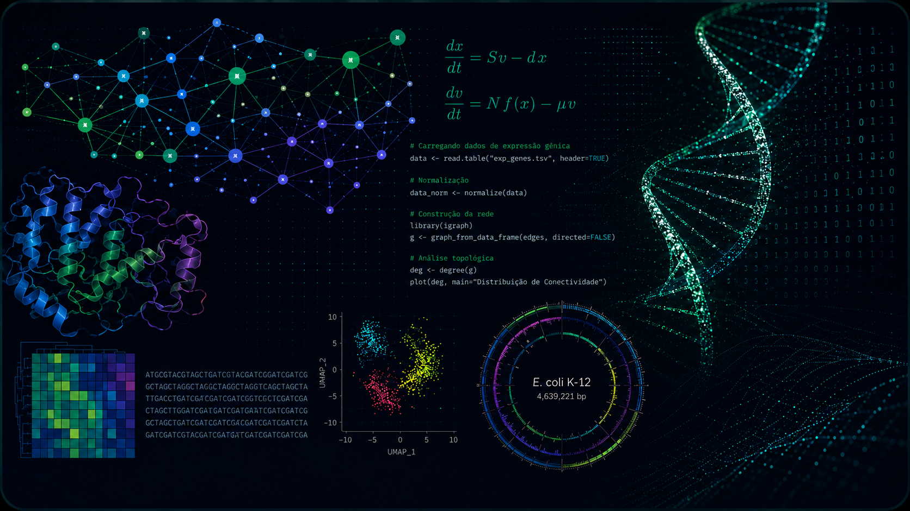

::: {.hero-section}
<!-- Coluna 1: Texto -->

  
CI0932   Departamento de Bioquímica e Biologia Molecular · Centro de Ciências · UFC

  <h1> [Biologia de Sistemas]{.hero-hl} </h1>
  <!-- 
Histórico, grafos, redes e modelos.
 -->
  
Prof. Nicholas Barroso

<!-- Coluna 2: Imagem -->

  

:::

## Recursos da disciplina

::: {.res-grid}

Módulos

<a class="stretched-link" href="modulos/modulos.qmd"><strong>Módulos dos assuntos tratados</strong></a>

9 módulos referentes ao conteúdo da disciplina.

Slides

<a class="stretched-link" href="slides/slides.qmd"><strong>Slides das aulas</strong></a>

10 apresentações, uma por aula. Melhor visualização com o celular na horizontal.

Roteiros

<a class="stretched-link" href="roteiros/roteiros.qmd"><strong>Roteiros práticos</strong></a>

12 práticas guiadas, com os arquivos de entrada necessários.

Listas

<a class="stretched-link" href="listas/listas.qmd"><strong>Listas de exercícios</strong></a>

Estudos dirigidos, lógica e biotecnologia.

Referências

<strong>Leituras e vídeos</strong>

Material complementar organizado por módulo.

em breve

:::

::: {.stats-bar}

<b>09</b>MÓDULOS

<b>10</b>AULAS EM SLIDES

<b>12</b>PRÁTICAS

<b>04</b>LISTAS

:::