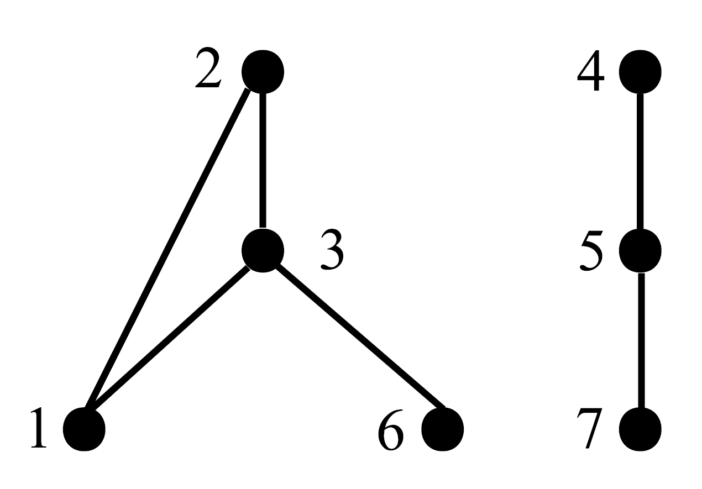
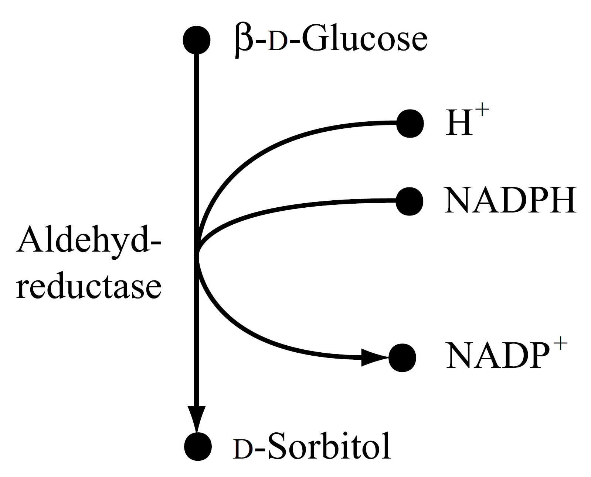
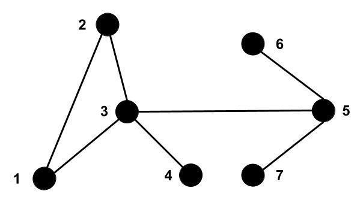

1. Diferentes redes biológicas são modeladas por diferentes tipos grafos. Quais tipos de grafos são normalmente usados para modelar as seguintes redes:
    - Redes de regulação de genes;
    - Redes de interação proteínas-proteína;
    - Redes metabólicas.

2. Considere o grafo não direcionado $G = (V,E)$ mostrado abaixo. Para cada vértice $v\ \in \ V$ faça o seguinte:
    - Calcule o grau de $v$.
    - Liste todos os vizinhos de $v$.
    - Encontre caminhos para todos os outros vértices que estão no mesmo componente conectado que o vértice $v$.

{fig-align="center" width=50% style="border: 3px solid black; border-radius: 8px;"}

3. Para o grafo mostrado acima, encontre uma representação gráfica diferente e mostre como ele é representado usando uma matriz de adjacência e uma representação de lista.
4. Faça um grafo com nove vértices, quatro deles de grau 2 e quatro de grau 1. Este grafo está conectado?
5. Um grafo sem loop, sem direção com n vértices tem no máximo $n*(n - 1)/2$. Esta afirmação é correta? Você pode provar isso?
6. Desenhe um grafo $G$, não-direcionado e conectado, com 10 vértices e 20 arestas.
7. As redes de metabólitos podem ser construídas a partir de redes metabólicas modeladas como grafos bipartidos removendo todos os vértices que representam reações e conectando substratos (vértices com uma aresta de saída à reação) com produtos (verticais com uma aresta de entrada da reação) diretamente. Construa uma rede de metabólitos a partir da rede metabólica mostrada abaixo.

{fig-align="center" width=50% style="border: 3px solid black; border-radius: 8px;"}

8. Um caminho Euleriano é um caminho $(v0,\ e1,\ v1,\ e2,\ v2,...,\ vk - 1,\ ek,\ vk)$ em um grafo não-direcionado que contém cada aresta do grafo exatamente uma vez. O grafo abaixo possui um caminho Euleriano? Qual a distância entre o vértices 1 e 6? Quais os caminhos (e o menor) entre os vértices 4 e 6?

{fig-align="center" width=50% style="border: 3px solid black; border-radius: 8px;"}

9. Defina as abordagens top-down, bottom-up e middle-out.
10. O que significa o escopo para um modelo e qual sua importância?
11. O que significa uma rede ser de mundo pequeno?
12. O que significa uma rede ter modularidade (relativo ao coeficiente de agrupamento)?
13. O que significa uma rede ser livre de escala?
14. O que são 'motivos de rede'?
15. Defina as seguintes centralidades e seus significados:
    - Centralidade de grau;
    - Centralidade de proximidade;
    - Centralidade de intermediação;
    - Centralidade de autovetor;
    - Centralidade de alavancagem;
    - Centralidade de difusão;
    - Centralidade de intermediação de fluxo.

16. Defina distância e menor caminho em uma rede.
17. Cite métodos de obtenção de dados para interação de proteínas, co-expressão e metabolismo.
18. Quais são os níveis de integração de dados? Explique cada um.
19. Porque quando há integração de dados há também redução de dimensionalidade?
