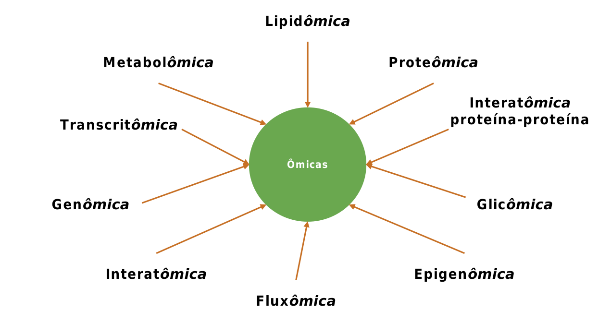
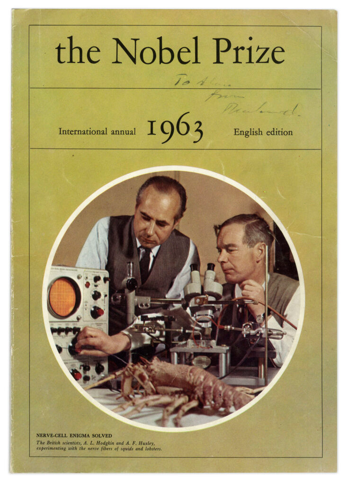

# Definição de Biologia de Sistemas

A **Biologia de Sistemas** é uma abordagem **holista** para o estudo de sistemas biológicos. Holismo é a ideia de que as propriedades de um sistema — sejam seres humanos ou outros organismos — não podem ser explicadas apenas pela soma dos seus componentes: o sistema como um todo determina como se comportam as partes.

O conceito de **holismo** foi proposto por **Jan Christiaan Smuts** (1926), que sustentava que as propriedades de um sistema não podem ser explicadas apenas pela soma de suas partes, pois o todo influencia o comportamento de cada componente.

Por consequência, a Biologia de Sistemas permite modelar e descobrir **propriedades emergentes**: características que **surgem das interações** entre os componentes de um sistema biológico e **não podem ser atribuídas a nenhuma parte isolada** (Kitano, 2002).

> “A biologia de sistemas não é apenas uma disciplina, mas uma revolução na forma como estudamos a vida.”  
> — *Hiroaki Kitano, 2002*

**Exemplo:**  
A rede metabólica da **glicólise** envolve 10 enzimas que convertem glicose em piruvato. O fluxo energético emerge **somente** da interação coordenada entre elas (Almaas et al., 2004, *Nature*).

---

## Área e campo de estudo

A Biologia de Sistemas é uma **área multidisciplinar**, que combina **Biologia + Computação + Matemática**, dedicada ao estudo da interação entre os componentes de um sistema biológico.

---

# Holismo x Reducionismo

Esse paradigma é usualmente empregado como contraponto ao chamado **reducionismo**.

> *“O reducionismo é a abordagem que busca compreender sistemas biológicos complexos dissecando-os em suas partes componentes, partindo do pressuposto de que entender cada parte levará à compreensão do todo.”*  
> — Kitano, H. (2002). Systems Biology: A Brief Overview. *Science*, 295(5560), 1662–1664. https://doi.org/10.1126/science.1069492

O **reducionismo** dissecta sistemas em partes para compreendê-los, assumindo que o entendimento de cada elemento levará à compreensão do todo. Já o **holismo** foca na rede de interações e nas propriedades emergentes.

| Abordagem | Foco | Exemplo |
|-----------|------|---------|
| Reducionismo | Componentes isolados | Estudo da função de uma única enzima |
| Holismo | Interações e redes | Modelagem de todo o metabolismo celular |

---

# Protocolos operacionais (ciclo de trabalho)

A Biologia de Sistemas segue, frequentemente, um **ciclo iterativo** de modelagem:

1. **Teoria**
2. **Modelagem** (analítica ou computacional)
3. **Validação experimental**
4. **Refinamento do modelo ou teoria**

**Exemplo:**  
O ciclo teoria–modelagem–validação foi usado para desenvolver linhagens de *Saccharomyces cerevisiae* produtoras do precursor da artemisinina, integrando **dados transcriptômicos** e **modelagem de fluxo metabólico** (Ro et al., 2006, *Nature*).

---

# Teoria de Sistemas Dinâmicos aplicada à Biologia Molecular

O foco na **dinâmica e na interação** dos indivíduos nos sistemas estudados é a principal diferença conceitual entre a Biologia de Sistemas e a Bioinformática.

**Exemplo:**  
Modelos dinâmicos do ciclo celular em leveduras (Tyson et al., 2002, *Current Biology*) explicam como falhas em pontos de checagem levam ao câncer, orientando o desenho de terapias-alvo.

---

# Fenômeno sócio-científico e disciplinas associadas

A Biologia de Sistemas também pode ser entendida como um **fenômeno sócio-científico**, definido pela estratégia de integrar dados complexos da interação em sistemas biológicos, provenientes de diversas fontes, usando ferramentas e pessoal interdisciplinar.

{.r-stretch fig-align="center"}

---

# Histórico

## Ludwig von Bertalanffy

{.r-stretch fig-align="center"}

**Ludwig von Bertalanffy**, biólogo austríaco, desenvolveu a **Teoria Geral dos Sistemas** em trabalhos publicados entre **1950 e 1968**, formando a base conceitual da Biologia de Sistemas.

- Um **sistema** é um conglomerado coeso de partes **inter-relacionadas** e interdependentes, que pode ser natural ou feito pelo homem.
- Todo sistema é delineado por seus **limites espaciais e temporais**, cercado e influenciado por seu **ambiente**, descrito por sua estrutura e propósito, e expresso em seu funcionamento.
- Um sistema pode ser mais do que a soma de suas partes ao expressar **sinergia** ou **comportamento emergente**.

## Conceitos-chave em Teoria de Sistemas

| Conceito | Definição | Exemplo biológico |
|----------|-----------|---------|
| **Sistema** | Entidade organizada composta de partes inter-relacionadas e interdependentes; alternativamente, um conjunto de componentes interconectados (genes, proteínas, células etc.) que atuam como uma unidade funcional, exibindo propriedades que não existem nos elementos isolados | Rede metabólica |
| **Fronteiras** | Limites que definem o sistema e o diferenciam de outros sistemas e do ambiente; limites físicos ou funcionais que regulam trocas com o ambiente | Membrana celular; organoides tumorais mantêm fronteiras que simulam microambientes tumorais, permitindo estudos de invasão (Drost & Clevers, 2018, *Nature Reviews Cancer*) |
| **Homeostase** | Tendência de um sistema a ser resiliente frente a fatores externos, mantendo suas características por meio de mecanismos de feedback | Regulação do pH sanguíneo: sistemas tampão (ex.: bicarbonato) e trocas gasosas nos pulmões mantêm o pH em ~7,4 mesmo sob variação metabólica (Hamm et al., 2015, *Physiological Reviews*) |
| **Adaptação** | Tendência de um sistema auto-adaptativo de se ajustar internamente para se proteger e manter seu propósito; ajuste estrutural ou funcional em resposta a mudanças ambientais | Bactérias resistentes a antibióticos: alterações no transcritoma (ex.: *upregulation* de bombas de efluxo) surgem como adaptação a drogas (Blair et al., 2015, *Nature Reviews Microbiology*) |
| **Transações Recíprocas** | Interações circulares ou cíclicas em que sistemas se envolvem de tal forma que influenciam uns aos outros; interações bidirecionais que criam ciclos de dependência | Eixo intestino-cérebro: metabólitos bacterianos (ex.: butirato) modulam a síntese de serotonina no hospedeiro, influenciando o comportamento (Sharon et al., 2016, *Cell*) |
| **Retroalimentação** | Sinal pelo qual os sistemas se autocorrigem com base em reações de outros sistemas do ambiente; mecanismo de autorregulação em que a saída do sistema controla sua própria atividade (positiva: amplifica; negativa: atenua) | Feedback negativo na insulina: glicose alta → secreção de insulina → captação de glicose → redução da secreção (Saltiel & Kahn, 2001, *Nature*) |
| **Taxa de Transferência** | Taxa de transferência de energia ou matéria entre o sistema e o ambiente durante o funcionamento do sistema; velocidade de fluxo de matéria/energia/informação, crítica para a função do sistema | Fotossíntese: a taxa de fixação de CO₂ em plantas C4 é maior que em C3, devido a diferenças na anatomia foliar (Wang et al., 2016, *Plant Cell*) |

---

# Pioneiros e Modelos Históricos

## Alan Hodgkin & Andrew Huxley (1952)

{.r-stretch fig-align="center"}
{.r-stretch fig-align="center"}

Em 1952, Hodgkin e Huxley publicaram um marco da Biologia de Sistemas: um **modelo matemático quantitativo** que descreve a geração e propagação do **potencial de ação** em neurônios do axônio gigante da lula (*Loligo pealei*).

- **Metodologia**: combinaram experimentos eletrofisiológicos (técnica de *voltage clamp*) com **equações diferenciais**, modelando a dinâmica dos canais iônicos de sódio (Na⁺) e potássio (K⁺) e prevendo como variações de voltagem controlam o fluxo de íons.

{.r-stretch fig-align="center"}

- **Impacto científico**:
  - Fundamentaram a **neurociência computacional** — as equações de Hodgkin-Huxley são a base para simulações de redes neuronais modernas, incluindo estudos sobre epilepsia e Parkinson (Dayan & Abbott, 2001).
  - Inspiraram o desenvolvimento de interfaces cérebro-máquina e próteses neurais (Nicolelis, 2003).
  - Receberam o **Prêmio Nobel de Fisiologia/Medicina em 1963** por revelar os mecanismos iônicos envolvidos na excitação e inibição de neurônios.
  - Modelos derivados são usados hoje para otimizar a estimulação cerebral profunda em pacientes com Parkinson (Mainen & Sejnowski, 1996).

## Alan Turing (1952)

{.r-stretch fig-align="center"}

Matemático inglês, Turing criou o **modelo de reação-difusão**, propondo que padrões biológicos como listras (pelagem de animais) ou manchas (conchas de moluscos) surgem da interação entre dois morfógenos (moléculas sinalizadoras) com propriedades distintas:

- **Ativador**: auto-reforça sua própria produção.
- **Inibidor**: suprime o ativador e se difunde mais rapidamente.

Seu modelo matemático descreve como pequenas perturbações em um sistema homogêneo levam a padrões espaciais estáveis (Turing, 1952).

**Impacto na Biologia de Sistemas:**

- Padrões em desenvolvimento embrionário, como a formação de dígitos em membros de vertebrados (Sheth et al., 2012, *Science*).
- Engenharia de tecidos para regeneração de estruturas padronizadas (cartilagem, folículos capilares).
- Síntese de padrões em biologia sintética: células geneticamente modificadas produzindo padrões de Turing *in vitro* (Sick et al., 2020, *Nature Chemical Biology*).
- Aplicações em agricultura, como a manipulação de padrões florais para aumentar a atratividade a polinizadores (Reichelt & Burdet, 2023, *Plant Biotechnology Journal*).
- Ferramentas computacionais derivadas, como o *Morpheus* (Starruß et al., 2014), que usam as equações de Turing para prever padrões em tecidos.

Aplicado hoje em **engenharia de tecidos** e **biologia sintética**.

## Denis Noble (1960)

{width="100%" height="800px" style="object-fit: contain;"}

Biólogo inglês; sua principal contribuição foi o **modelo matemático da função cardíaca** (1960). Usou modelos de computador de órgãos e sistemas de órgãos para interpretar a função molecular ao nível de todo o organismo, utilizando supercomputadores para a criação de um "coração virtual". Contribuiu para difundir internacionalmente o uso de modelos computacionais para simular quantitativamente funções fisiológicas ao nível do genoma.

{width="100%" height="800px" style="object-fit: contain;"}

Em seu livro *The Music of Life: Biology Beyond the Genome* (2006), propôs uma mudança de paradigma — do reducionismo da Biologia Molecular à visão multinível e sistêmica da Biologia de Sistemas — introduzindo o conceito de ***middle-out***, em contraponto ao *bottom-up* e ao *top-down*.

## Mihajlo Mesarović (1966)

{width="100%" height="800px" style="object-fit: contain;"}

Engenheiro sérvio-americano e teórico de sistemas. Em 1966, publicou o artigo seminal *"Systems Theory and Biology"* (Springer-Verlag), no qual propôs a Biologia de Sistemas como uma **disciplina formal**, aplicando a Teoria Geral dos Sistemas (de Bertalanffy) à biologia.

**Contribuições-chave do trabalho de 1966:**

- **Definição inovadora**: sistemas biológicos devem ser estudados como redes hierárquicas de interações, em que o comportamento global emerge de múltiplos níveis (moléculas → células → organismos), com **controle multinível**.
- **Abordagem matemática**: introduziu modelos dinâmicos para descrever sistemas vivos, antecipando conceitos como o controle hierárquico (ex.: regulação metabólica) e propriedades emergentes (ex.: padrões de desenvolvimento embrionário).
- **Impacto**: influenciou a criação de modelos computacionais em biologia, como os atuais GSMMs (*Genome-Scale Metabolic Models*).

## Biologia de Sistemas: oscilações no uso e consolidação

A disciplina passou por dois momentos distintos, impulsionados por avanços tecnológicos e mudanças de paradigma:

1. **Fase de "desuso" (décadas de 1970–1990)**
   - Dominância do reducionismo, com o foco da comunidade científica voltado à Biologia Molecular (ex.: sequenciamento de DNA individual, PCR).
   - Limitações tecnológicas: dificuldade em gerar e processar dados complexos, sem técnicas ômicas ou computação poderosa.
   - Entre 1975 e 1995, o termo "Biologia de Sistemas" teve poucas citações (Kitano, 2002).

2. **Fase de "reuso" e expansão (a partir dos anos 2000)**
   - Revolução das ômicas: sequenciamento de genomas completos (ex.: Projeto Genoma Humano, 2003) e técnicas de alto rendimento (microarrays, espectrometria de massas).
   - Avanços computacionais: modelagem de redes em larga escala (ex.: modelos metabólicos *Genome-Scale*) e *machine learning* aplicado a dados biológicos (ex.: predição de interações proteicas).

O número de artigos com "Biologia de Sistemas" no título aumentou **20 vezes entre 2000 e 2010** (PubMed).

## Hiroaki Kitano: pioneiro na popularização da Biologia de Sistemas

{fig-align="center"}
{fig-align="center"}

**Contexto da popularização (2002)**: Kitano foi autor do artigo *"Systems Biology: A Brief Overview"* (*Science*, 2002), que definiu os pilares da disciplina — a Biologia de Sistemas busca entender os sistemas vivos como redes dinâmicas de interações, integrando modelagem computacional e experimentos (DOI: 10.1126/science.1069492). Fundou também o **Systems Biology Institute (SBI)**, instituto líder em pesquisas interdisciplinares em Tóquio, Japão, focado em modelagem de redes biológicas e inteligência artificial aplicada à biologia.

**Contribuições-chave:**

- **CellDesigner**: software para modelagem de redes biológicas, usado em estudos de câncer e vias metabólicas.
- **SBML** (*Systems Biology Markup Language*): padrão computacional para representar modelos biológicos, adotado globalmente.
- **Prêmios**: recebeu o *Nature Award for Mentoring in Science* (2015) por promover colaborações entre biólogos e engenheiros.

**Aplicação prática:** Kitano desenvolveu modelos de redes de sinalização em tumores, mostrando como falhas em vias como PI3K-AKT geram resistência a terapias (Kitano, 2004, *Cancer Research*).

---

# Abordagens de Modelagem

As três abordagens de modelagem em Biologia de Sistemas — *top-down*, *middle-out* e *bottom-up* — diferem no ponto de partida e na direção da integração de dados.

## Top-down

Abordagem que parte de **dados experimentais em larga escala (ômicos)** para reconstruir modelos integrados de sistemas biológicos, priorizando uma visão global (genoma, proteoma, metaboloma) antes de investigar componentes individuais.

Fluxo típico: dados ômicos → rede de interações → modelo matemático → hipóteses testáveis → validação experimental.

**Limitações:**

- **Dependência da qualidade dos dados**: ruído em dados ômicos pode gerar modelos imprecisos.
- **Complexidade computacional**: modelos de genoma completo exigem supercomputadores (ex.: modelo *Recon3D* humano).

**Exemplo — modelagem do câncer de mama:**  
Rede de interações proteicas combinada a vias metabólicas desreguladas (ex.: via PI3K-AKT). Entrada: dados de sequenciamento de tumor (genômica) e perfis de expressão gênica (transcriptômica). Saída: identificação de alvos terapêuticos, como inibidores de AKT (Thiele et al., 2013, *Nature Biotechnology*).

## Middle-out

Abordagem que permite iniciar a modelagem em **qualquer nível** (molécula, célula, órgão), explorando causalidades circulares entre escalas. Não é reducionista, como o *bottom-up*, nem puramente holista, como o *top-down*. Um modelo *middle-out* pode iniciar em vias metabólicas (nível bioquímico) e escalar para redes de sinalização celular (nível celular), sem assumir prioridade causal entre os níveis.

## Bottom-up

Destina-se a elaborar modelos detalhados que podem ser simulados sob diferentes condições. Combina todas as informações específicas do organismo em um modelo completo de escala genômica, proporcionando uma visão integrativa das interações biológicas que ocorrem dentro dos seres vivos. É a abordagem usada, por exemplo, em **modelos metabólicos de escala genômica**.

---

# Aplicações da Biologia de Sistemas

## Criação de modelos metabólicos

- Projeto ***Yeast8***: modelo do metabolismo de *Saccharomyces cerevisiae* que prevê como deleções genéticas afetam a produção de etanol; usado pela Novozymes para otimização de cepas industriais destinadas a biocombustíveis (Lu et al., 2019, *Nature Communications*). Ferramenta associada: *COBRA Toolbox*, para simulações (Schellenberger et al., 2011).
- Modelos metabólicos reduziram em **70%** o tempo para desenvolver linhagens produtoras de insulina humana em *E. coli* (Burgard et al., 2003).

## Medicina P4

Personalizada, Preditiva, Preventiva e Participativa. Exemplo — câncer de mama triplo-negativo:

- **Personalizada**: sequenciamento do tumor para identificar mutações em *BRCA1*.
- **Preditiva**: modelos de risco baseados em transcriptômica (ex.: assinatura de 70 genes, *MammaPrint*).
- **Preventiva**: uso de inibidores de PARP em pacientes com predisposição genética.
- **Participativa**: plataformas como *PatientsLikeMe*, que integram dados de pacientes para refinamento de terapias (Chen et al., 2021, *Nature Reviews Drug Discovery*).

A medicina P4 já reduz custos hospitalares em até **30%** ao evitar terapias inefficazes (Hood & Flores, 2012).

## Estudo do câncer

Projeto ***Cancer Cell Map Initiative* (CCMI)**: mapeou redes de interação proteica em tumores para identificar "nós críticos" (ex.: proteína *MYC*), levando a inibidores de MYC em testes clínicos para leucemia (Krogan et al., 2020, *Science*). Ferramenta associada: *Cytoscape*, para visualização de redes. Modelos de câncer de pâncreas preveem resistência à gemcitabina com **92% de acurácia** (Rahman et al., 2022).

## Interações hospedeiro-patógeno

COVID-19 e ACE2: a modelagem sistêmica revelou que a proteína **TMPRSS2** facilita a entrada do SARS-CoV-2 nas células. Inibidores de TMPRSS2 (ex.: camostat) reduziram infecções *in vitro* (Hoffmann et al., 2020, *Cell*). Ferramenta associada: *PerturbNet*, para simular interações vírus-célula (Bojkova et al., 2021). Em 2009, modelos da gripe H1N1 levaram 6 meses para identificar alvos terapêuticos; em 2020, o SARS-CoV-2 foi mapeado em apenas 3 semanas.

---

# Referências

1. BRUGGEMAN, F. J.; WESTERHOFF, H. V. The nature of systems biology. *Trends in Microbiology*, v. 15, n. 1, p. 45–50, 2007.
2. KITANO, H. Systems biology: a brief overview. *Science*, v. 295, n. 5560, p. 1662–1665, 2002. DOI: 10.1126/science.1069492.
3. MESAROVIĆ, M. D. (Ed.). *Systems Theory and Biology*. Berlin: Springer-Verlag, 1966. (Obra seminal que definiu a disciplina)
4. BERTALANFFY, L. von. *General System Theory: Foundations, Development, Applications*. New York: Braziller, 1968.
5. NOBLE, D. *The Music of Life: Biology Beyond the Genome*. Oxford: Oxford University Press, 2006. (Abordagem *middle-out*)
6. LU, H. et al. A consensus *S. cerevisiae* metabolic model Yeast8. *Nature Communications*, v. 10, 3586, 2019. DOI: 10.1038/s41467-019-11581-3.
7. ORTH, J. D. et al. What is flux balance analysis? *Nature Biotechnology*, v. 28, n. 3, p. 245–248, 2010. DOI: 10.1038/nbt.1614.
8. RO, D.-K. et al. Production of the antimalarial drug precursor artemisinic acid in yeast. *Nature*, v. 440, n. 7086, p. 940–943, 2006. DOI: 10.1038/nature04640.
9. BRO, C. et al. *In silico* aided metabolic engineering of *Saccharomyces cerevisiae* for improved bioethanol production. *Metabolic Engineering*, v. 8, n. 2, p. 102–111, 2006. DOI: 10.1016/j.ymben.2005.09.007.
10. HOOD, L.; FLORES, M. A personal view on systems medicine. *Nature Reviews Genetics*, v. 13, n. 9, p. 647–650, 2012. DOI: 10.1038/nrg3368.
11. KROGAN, N. J. et al. The Cancer Cell Map Initiative. *Science*, v. 369, n. 6509, eaba4902, 2020. DOI: 10.1126/science.aba4902.
12. HOFFMANN, M. et al. SARS-CoV-2 cell entry depends on ACE2 and TMPRSS2. *Cell*, v. 181, n. 2, p. 271–280, 2020. DOI: 10.1016/j.cell.2020.02.052.
13. HODGKIN, A. L.; HUXLEY, A. F. A quantitative description of membrane current and its application to conduction and excitation in nerve. *The Journal of Physiology*, v. 117, n. 4, p. 500–544, 1952. DOI: 10.1113/jphysiol.1952.sp004764.
14. TURING, A. M. The chemical basis of morphogenesis. *Philosophical Transactions of the Royal Society B*, v. 237, n. 641, p. 37–72, 1952. DOI: 10.1098/rstb.1952.0012.
