# Teoria de Grafos

## Grafo versus Gráfico

<!--
Achei excelente essa maneira de colocar as figuras, talvez eu possa usar para colocar minha foto no index do site. Ele coloca as figuras na coluna a direita uma em cima da outra.
:::{.column-margin}
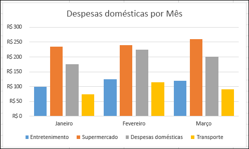{width=100% style="border: 3px solid black; border-radius: 8px;"}

{width=100% style="border: 3px solid black; border-radius: 8px;"}
:::
--->

:::{fig-align="center"}

<!--Aqui é usada uma tabela para colocar as figuras com seus captions. Também achei interessante--->
| | |
| :-: | :-: |
| {width=90% style="border: 3px solid black; border-radius: 8px;"} | {width=90% style="border: 3px solid black; border-radius: 8px;"} |
| **Gráfico** | **Grafo** |
:::

<center>**Primeiramente, não confundir GRAFO com GRÁFICO.**</center>

## Pontes de Kaliningrado
**É possível andar pela cidade atravessando cada ponte exatamente uma vez?**
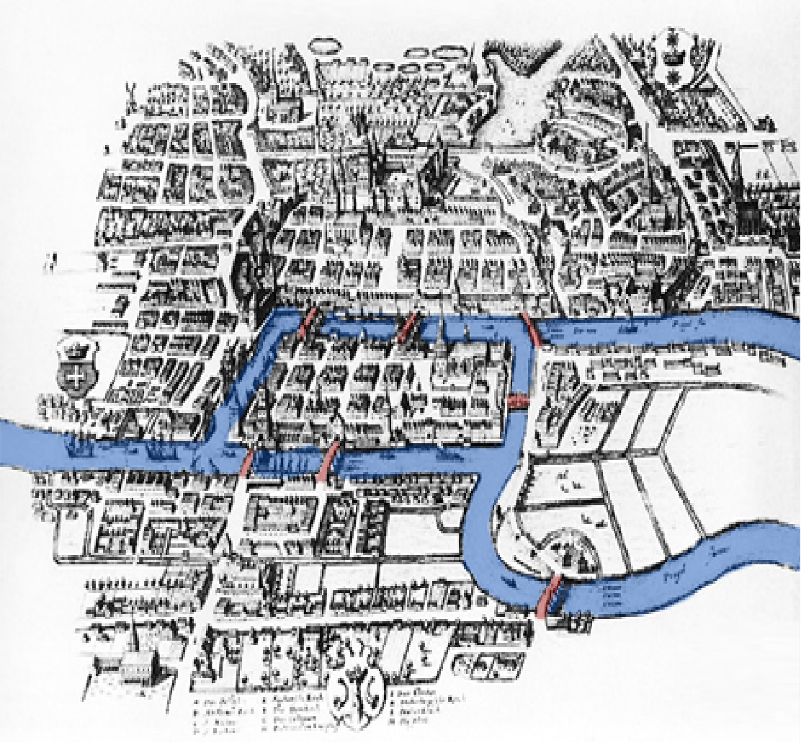{width=90% style="border: 3px solid black; border-radius: 8px;"}

## **Leonhard Euler**

Matemático e físico suíço.
Tentou responder a questão sobre as pontes de Kaliningrado.
Para tanto desenvolveu a **Teoria dos Grafos**.

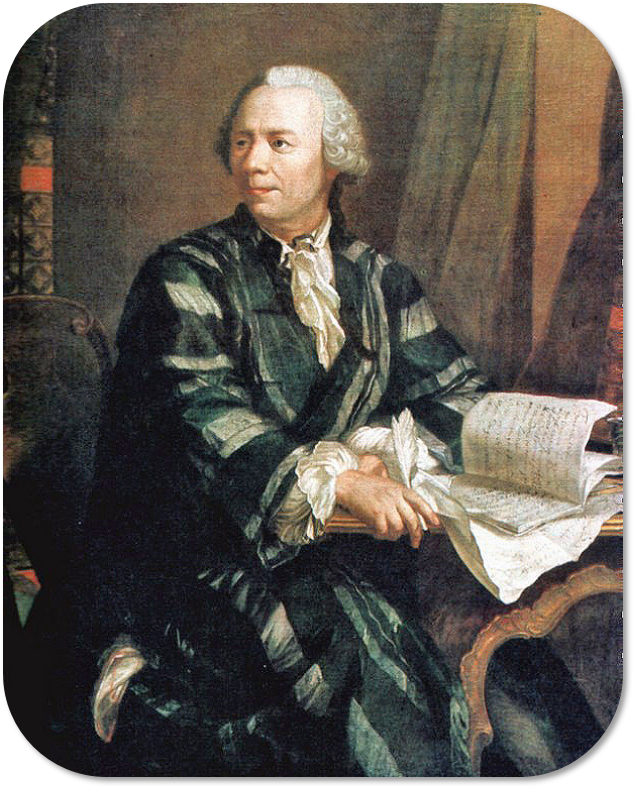{style="display:block; margin-left:auto; margin-right:auto; border-radius:2px; padding:15px; background:white; box-shadow:0 4px 8px rgba(0,0,0,0.2); border:1px solid #ddd; width:250px;"}


## Pontes de Kaliningrado: Resolução
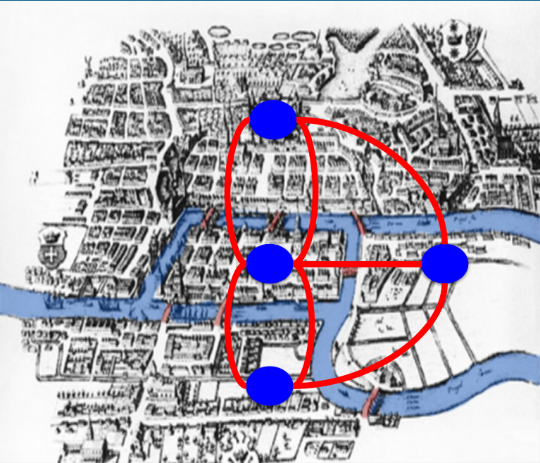{width=90% style="border: 3px solid black; border-radius: 8px;"}

**É possível andar pela cidade atravessando cada ponte exatamente uma vez?**

## Grafo

### Definição 1
Um grafo é uma representação matemática de um objeto consistindo de **vértices (nós)** e **arestas** representando elementos e conexões, respectivamente.

**G = (V, E)**
O grafo G é um conjunto formado por um conjunto de vértices V e um conjunto de arestas E.

### Definição 2

**G = (V, E)**
O grafo G é um conjunto formado por um conjunto de vértices **V = {v₁, v₂, v₃, ..., vₙ}** e um conjunto de arestas **E = {(v₁, v₂), (v₃, vₙ), ..., (vₓ, v₂)}**.

### Definição 2 expandida

**G = (V, E)**
O grafo G é um conjunto formado por conjunto de vértices V e um conjunto de arestas E.  
Um grafo é uma representação matemática de um objeto consistindo de vértices (nós) e arestas representando elementos e conexões, respectivamente.

---

## Vértices ou nós
- São os elementos do grafo. Os elementos podem ser qualquer coisa:
  - Pessoas
  - Lugares
  - Genes
  - Animais
  - Proteínas
  - ...

## Arestas
As arestas indicam relações entre os elementos. O significado da relação pode mudar dependendo dos elementos.  
Por isso as arestas podem ser:

- **Não-direcionadas** ― : (v₁, v₂) = (v₂, v₁)  
  Quando a ligação não exibe precedência, somente relação.

- **Direcionadas** → : (v₁, v₂) ≠ (v₂, v₁)  
  Quando a ligação entre os dados indica precedência ou ordem:
  - causa e efeito;
  - antes ou depois;
  - substrato → produto.

**Por consequência:**

* Grafos com arestas direcionadas são **grafos direcionados**.

<center>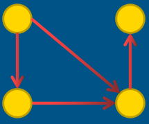</center>

* Grafos com arestas não-direcionadas são **grafos não-direcionados**.

<center>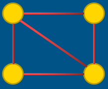</center>

---

## Grafo conectado e não-conectado

- Um grafo não-direcionado é **conectado** quando possui pelo menos um vértice e existe um caminho entre cada par de vértices.
- Em um grafo conectado, não há vértices inacessíveis.
- Um grafo não direcionado que não está conectado é chamado **desconectado**.
- Um gráfico não direcionado G é, portanto, desconectado se existir dois vértices em G, de modo que nenhum caminho em G tenha esses vértices como pontos finais.
- Um grafo com apenas um vértice está conectado.
- Um gráfico sem arestas entre dois ou mais vértices é desconectado.

---

## Algumas definições

### Adjacência
Se os vértices compartilham da mesma aresta então eles são **adjacentes** entre si.

<center>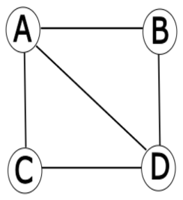</center>

### Grau
O grau de um vértice é o número de arestas que incidem nele.

Exemplo:

<center>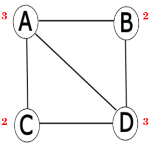</center>

### Grau (grafos direcionados)
Para o grafo direcionado, o grau de vértice pode ser dividido em:
- **Grau de entrada**
- **Grau de saída**

Exemplo:

<center>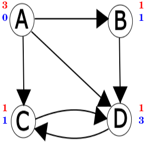</center>

### Laço
Quando uma aresta começa e termina em um mesmo vértice ela é chamada de **laço** (loop).

<center>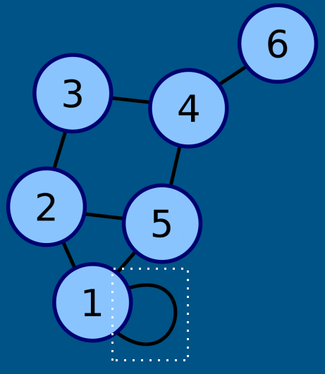</center>

### Layout
É a posição dos vértices e o desenho das arestas.

---

## Subgrafo

**G’ = (V’, E’)** onde V’ é um subconjunto de V e E’ é um subconjunto de E.  
Isso implica que E’ só possui arestas que começam e terminam em vértices que estão em V’.

### Subgrafo Induzido
Se G’ é um subgrafo de G e E’ possui **todas as arestas de E que ligam os vértices de V’**, então esse subgrafo é chamado de **grafo induzido**.

Exemplo:

<center>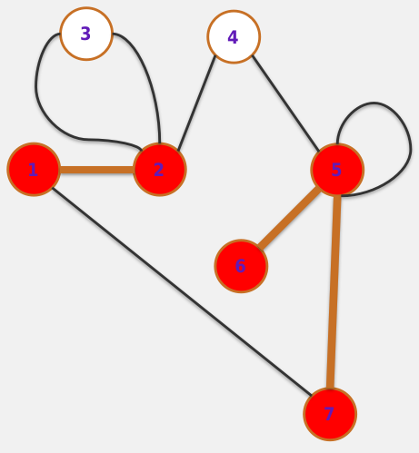</center><center>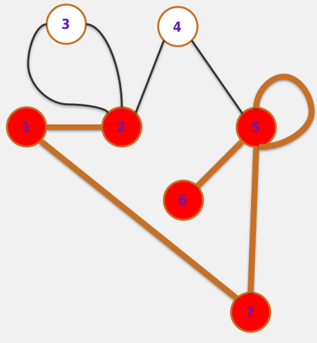</center>

<center>
Vértices: 1, 2, 5, 7, 6, 3, 4
</center>
---

## Isomorfismo

Dois grafos G₁ e G₂ são **isomorfos** se existir um mapeamento bijetivo entre os vértices de V₁ e V₂ com a propriedade de que quaisquer dois vértices u, v ∊ V₁ são adjacentes se, e somente se, os dois vértices correspondentes no outro grafo também forem adjacentes.

**Traduzindo:** se um grafo possui os mesmo vértices que outro grafo e esses vértices mantém a adjacência nos dois grafos.

<center>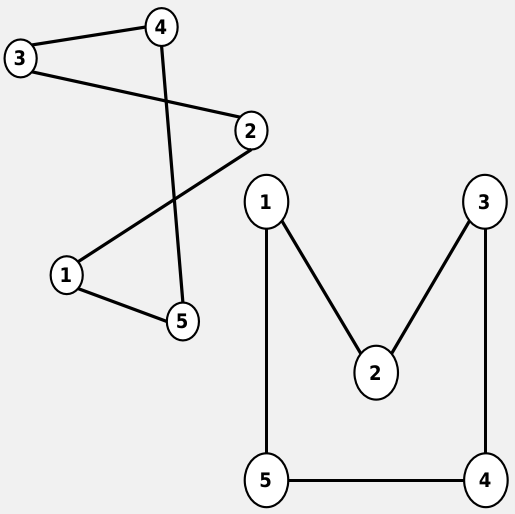</center>

---

## Passeio & Caminho & Trilha

### Passeio (Walk)
Um passeio de distância k em um grafo é uma sequência alternante de vértices e arestas v₀, e₀, v₁, e₁, v₂, e₂, … , vₖ₋₁, eₖ₋₁, vₖ, que começa e termina em vértices.

### Caminho (Path)
Um caminho é um passeio no qual todos os vértices (exceto, possivelmente, o primeiro e o último) são distintos.

### Trilha ou Trajeto (Trail)
Trilha é um passeio onde todas as arestas são distintas.

---

## Caminhos especiais

### Caminho simples
Um caminho em que todos os vértices são diferentes.

### Caminho Euleriano
Um Caminho Euleriano é um caminho em um grafo que visita cada aresta apenas uma vez.

### Caminho Hamiltoniano
Um caminho hamiltoniano é um caminho que permite passar por todos os vértices de um grafo G, não repetindo nenhum, ou seja, passar por todos uma só vez por cada.

---

## Comprimento e Ciclo

### Comprimento
É dado pelo número de arestas atravessadas de um vértice inicial a um vértice final.

### Ciclo
Um caminho em que o vértice de início e o vértice de término são o mesmo.

---

## Distância

A **distância** entre dois vértices é o comprimento do menor caminho entre eles ou ∞ se não existir um menor caminho.

### Menor caminho
É um caminho de tamanho mínimo entre dois vértices. Pode existir vários (passando por diferentes vértices) menores caminhos entre dois vértices.

**Exemplo**:  
Fazer a distância entre 6 e 2 passando por 5 e por 3.  
Depois fazer a distância entre 6 e 1 passando por 5 e por 3.

<center></center>

---

## Outros tipos de grafos

### Grafos Mistos
Um grafo que possui arestas direcionadas e não direcionadas.

<center>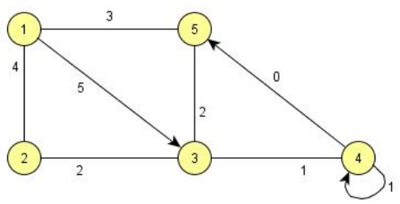</center><center>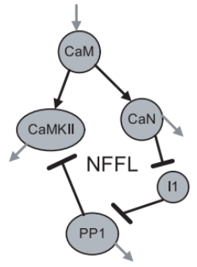</center>

### Multigrafo
É um grafo onde dois vértices podem ser ligados por mais de uma aresta.  
Nesse caso o pseudografo seria um grafo dirigido com pares de arestas paralelas dirigidas conectando cidades para mostrar que é possível voar para e a partir destas locações.

<center>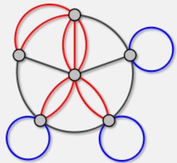</center>

### Grafo Valorado ou Ponderado
São grafos nos quais as arestas possuem valores associados dando peso a cada conexão/interação.

<center>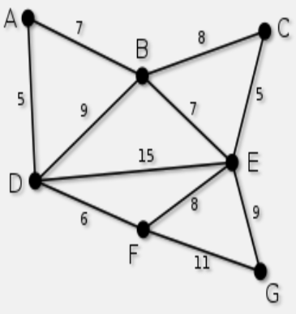</center>

### Hipergrafo
No hipergrafo, uma única aresta pode ligar mais de dois vértices.

<center>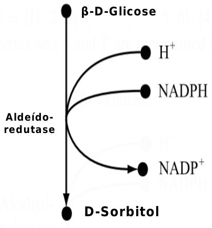</center>

### Grafos Bipartidos
Os hipergrafos podem ser representados por grafos bipartidos. Grafos bipartidos são aqueles que podem ser divididos em dois subgrafos disjuntos.

<center>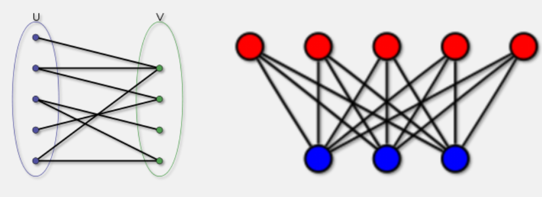</center>
<center>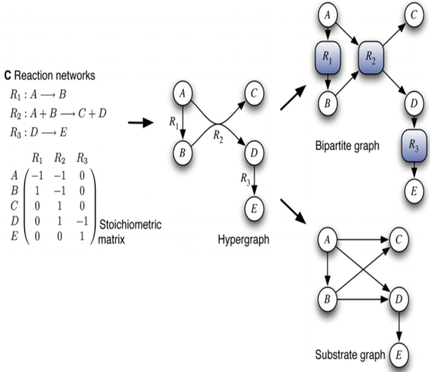</center>
---

## Árvores

As árvores desempenham um papel importante na biologia, onde representam, por exemplo, as relações evolutivas entre as espécies como uma **árvore filogenética**.
- Uma **árvore** é um grafo acíclico conectado e não-direcionado.
- Os vértices de uma árvore com grau 1 são suas **folhas**.
- Todos os outros vértices são **vértices internos**.
- Uma **árvore enraizada** consiste de uma árvore G = (V, E) e um vértice distinto r ∈ V chamado de **raiz**.
- A **profundidade** de um vértice é o comprimento do caminho entre a raiz e este vértice.
- A **altura** de uma árvore é a profundidade máxima de um vértice.
- Uma **árvore binária** é uma árvore onde cada vértice tem no máximo grau 3.

<center>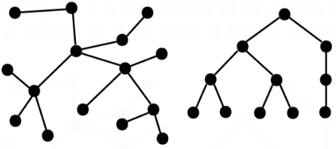</center>

---

## Representações de grafos

### Matriz de adjacência

<center>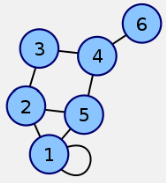{width=50% style="border: 3px solid black; border-radius: 8px;"}</center>


<br>Matriz de adjacência com os vértices: 1, 2, 5, 4, 3, 6

```{dot}
graph G {
  1 -- 1
  1 -- 2
  1 -- 5
  2 -- 3
  2 -- 5
  3 -- 4
  4 -- 5
  4 -- 6
}
```

<!--
$$
\begin{array}{cc}
& \\
\text{LINHAS} & 
\begin{bmatrix}
2 & 1 & 0 & 0 & 1 & 0 \\
1 & 0 & 1 & 0 & 1 & 0 \\
0 & 1 & 0 & 1 & 0 & 0 \\
0 & 0 & 1 & 0 & 1 & 1 \\
1 & 1 & 0 & 1 & 0 & 0 \\
0 & 0 & 0 & 1 & 0 & 0 \\
\end{bmatrix} \\
& \text{COLUNAS} \\
\end{array}
$$

$$
\begin{array}{cc}
& \\
\text{LINHAS} & 
\begin{bmatrix}
2 & 1 & 0 & 0 & 1 & 0 \\
1 & 0 & 1 & 0 & 1 & 0 \\
0 & 1 & 0 & 1 & 0 & 0 \\
0 & 0 & 1 & 0 & 1 & 1 \\
1 & 1 & 0 & 1 & 0 & 0 \\
0 & 0 & 0 & 1 & 0 & 0 \\
\end{bmatrix} \\
& \text{COLUNAS} \\
\end{array}
$$

--->

$$
\left[
\begin{array}{c|cccccc}
  & 1 & 2 & 3 & 4 & 5 & 6 \\
\hline
1 & 2 & 1 & 0 & 0 & 1 & 0 \\
2 & 1 & 0 & 1 & 0 & 1 & 0 \\
3 & 0 & 1 & 0 & 1 & 0 & 0 \\
4 & 0 & 0 & 1 & 0 & 1 & 1 \\
5 & 1 & 1 & 0 & 1 & 0 & 0 \\
6 & 0 & 0 & 0 & 1 & 0 & 0 \\
\end{array}
\right]
$$


<!--
```{=latex}
$$
\begin{pmatrix}
0 & 1 & 2 & 3 & 4 & 5 & 6 \\
1 & 2 & 1 & 0 & 0 & 1 & 0 \\
2 & 1 & 0 & 1 & 0 & 1 & 0 \\
3 & 0 & 1 & 0 & 1 & 0 & 0 \\
4 & 0 & 0 & 1 & 0 & 1 & 1 \\
5 & 1 & 1 & 0 & 1 & 0 & 0 \\
6 & 0 & 0 & 0 & 1 & 0 & 0 \\
\end{pmatrix}
$$
```
--->
<!--
```{=html}
<style>
.matrix-container {
  display: inline-block;
  position: relative;
  margin: 30px 0;
}

.matrix-labels {
  display: grid;
  grid-template-columns: auto 1fr;
  grid-template-rows: auto 1fr;
}

.row-labels {
  grid-column: 1;
  grid-row: 2;
  display: flex;
  flex-direction: column;
  justify-content: space-around;
  padding-right: 10px;
  font-weight: bold;
}

.col-labels {
  grid-column: 2;
  grid-row: 1;
  display: flex;
  justify-content: space-around;
  padding-bottom: 10px;
  font-weight: bold;
}

.matrix {
  grid-column: 2;
  grid-row: 2;
  display: inline-block;
  border: 2px solid #333;
  padding: 10px;
  border-radius: 5px;
}

.matrix table {
  border-collapse: collapse;
}

.matrix td {
  width: 35px;
  height: 35px;
  text-align: center;
  border: 1px solid #ccc;
  padding: 5px;
}

.matrix tr:first-child td {
  border-top: 2px solid #333;
}

.matrix tr:last-child td {
  border-bottom: 2px solid #333;
}

.matrix td:first-child {
  border-left: 2px solid #333;
}

.matrix td:last-child {
  border-right: 2px solid #333;
}
</style>

<div class="matrix-container">
  <div class="matrix-labels">
    <div class="col-labels">
      <span>1</span>
      <span>2</span>
      <span>3</span>
      <span>4</span>
      <span>5</span>
      <span>6</span>
    </div>
    <div class="row-labels">
      <span>1</span>
      <span>2</span>
      <span>3</span>
      <span>4</span>
      <span>5</span>
      <span>6</span>
    </div>
    <div class="matrix">
      <table>
        <tr><td>2</td><td>1</td><td>0</td><td>0</td><td>1</td><td>0</td></tr>
        <tr><td>1</td><td>0</td><td>1</td><td>0</td><td>1</td><td>0</td></tr>
        <tr><td>0</td><td>1</td><td>0</td><td>1</td><td>0</td><td>0</td></tr>
        <tr><td>0</td><td>0</td><td>1</td><td>0</td><td>1</td><td>1</td></tr>
        <tr><td>1</td><td>1</td><td>0</td><td>1</td><td>0</td><td>0</td></tr>
        <tr><td>0</td><td>0</td><td>0</td><td>1</td><td>0</td><td>0</td></tr>
      </table>
    </div>
  </div>
</div>
```
--->
### Lista de adjacência

<center>{width=50% style="border: 3px solid black; border-radius: 8px;"}</center>


```{dot}
graph G {
  1 -- 1
  1 -- 2
  1 -- 5
  2 -- 3
  2 -- 5
  3 -- 4
  4 -- 5
  4 -- 6
}
```

Lista de adjacência:

- **1** = {1, 2, 5}
- **2** = {1, 3, 5}
- **3** = {2, 4}
- **4** = {3, 5, 6}
- **5** = {1, 2, 4}
- **6** = {4}

