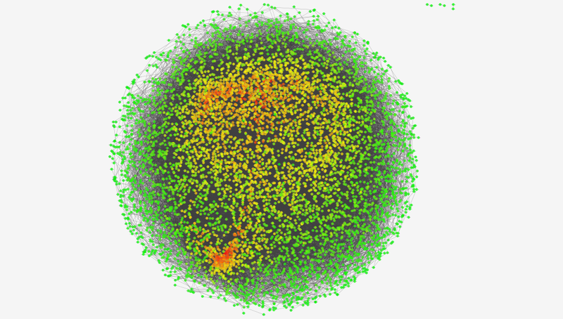
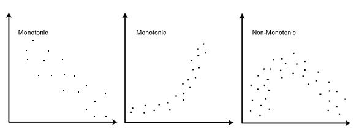
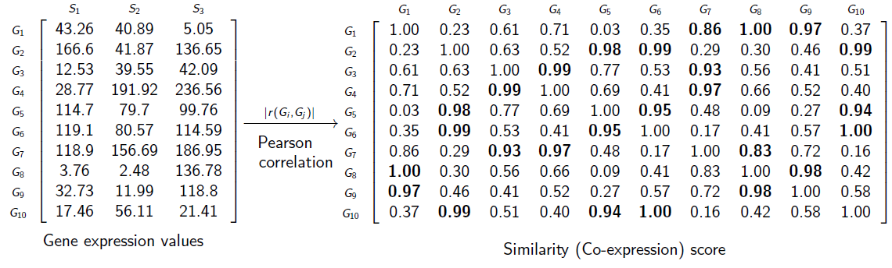
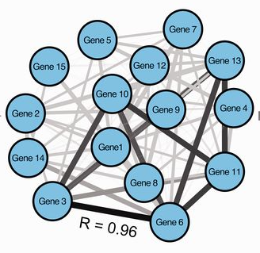
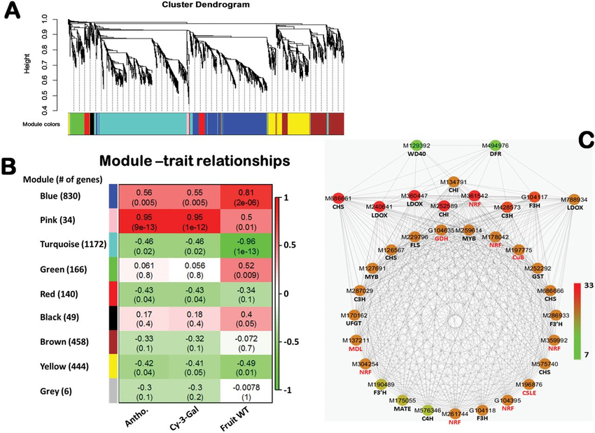
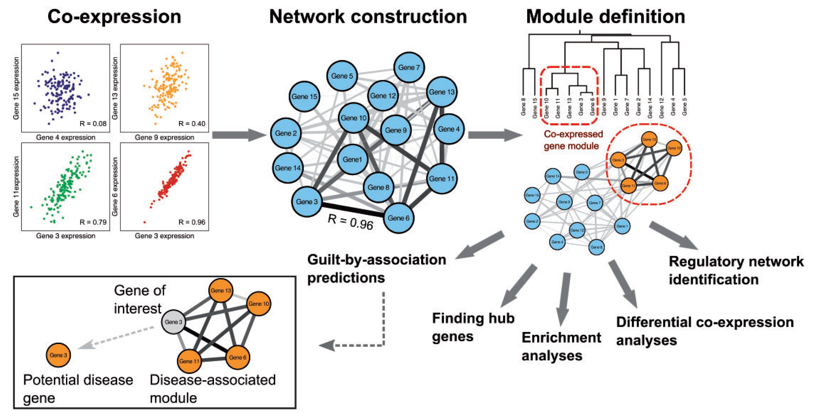
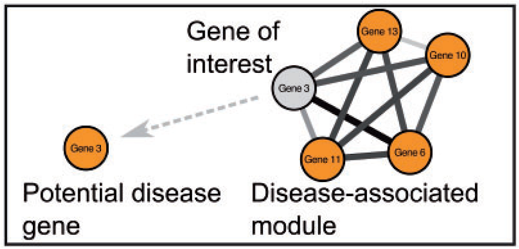

## Rede de Co-expressão

É uma rede de genes que possuem a tendência de serem co-expressos (**ativados** ou **reprimidos**) através de um grupo de amostras.

## Características das Redes de Co-expressão

São grafos **não-direcionados**:

- **Vértices**: genes.
- **Arestas**: relação de co-expressão.

## Construção das Redes

Para construir redes de co-expressão, precisamos de várias amostras. **Por quê?** Uma rede de co-expressão gênica pode ser construída procurando pares de genes que mostram **padrão de expressão similar entre amostras** — dois genes co-expressos podem subir ou descer juntos nas amostras.

## Aplicações

Podem ser usadas para:

- Priorização de genes associados a doenças.
- Anotação funcional de genes.
- Identificação de correlação.

## Limitações

Normalmente não são capazes de:

- Conferir informação sobre causalidade — genes podem estar ativos durante uma resposta biológica, mas não necessariamente com efeito causativo entre o gene e a resposta.
- Fazer diferença entre genes **regulatórios** e genes **regulados**.

---

## Construção de Redes de Co-expressão

É feita em três passos:

1. **Definir relações entre os genes.**
2. **Construir a rede.**
3. **Definição de módulos.**

## Passo 1: Definir relações entre genes

- As relações entre os genes são baseadas em **medidas de correlação**.
- As medidas de correlação fazem a comparação do padrão de um par de genes através das amostras.
- Existem várias medidas de correlação:
  - Correlação de Pearson.
  - Correlação de Spearman.

### Correlação de Pearson

É uma medida da correlação **linear** entre duas variáveis X e Y — uma relação é linear quando a mudança em uma variável é associada a uma mudança proporcional na outra. O coeficiente de correlação de Pearson é a covariância das duas variáveis dividida pelo produto de seus desvios-padrão:

$$\rho_{X,Y} = \frac{\text{Cov}(X,Y)}{\sigma_X \sigma_Y}$$

| Símbolo | O que é | Significado |
|:---:|:---:|:---:|
| $\rho_{X,Y}$ | ρ | Coeficiente de correlação de Pearson |
| $\text{Cov}(X,Y)$ | Covariância entre X e Y | Mede como as duas variáveis variam juntas |
| $\sigma_X$ | Desvio padrão da variável X | Dispersão de X em torno da média |
| $\sigma_Y$ | Desvio padrão da variável Y | Dispersão de Y em torno da média |

### Correlação de Spearman

- Vê a correlação entre duas variáveis.
- A relação entre as variáveis é **monotônica** (linear ou não), o que é menos restritivo do que a relação exigida pela correlação de Pearson — isto é, verifica se elas crescem ou diminuem juntas.
- Em uma relação monotônica, as variáveis tendem a mudar juntas, mas não necessariamente a uma taxa constante.

{.r-stretch fig-align="center"}
{.r-stretch fig-align="center"}

## Passo 2: Construir a rede

As associações de co-expressão são usadas para reconstruir a rede. **Vértices** são genes, e **arestas** são a presença da correlação (podem, além da presença, refletir a **força da correlação**).

{.r-stretch fig-align="center"}

## Tipos de Redes de Co-expressão

- Redes com sinal e sem sinal.
- Redes ponderadas e não-ponderadas.

### Redes com Sinal *vs.* Sem Sinal

Numa rede de co-expressão baseada em correlação, as medidas de correlação têm valores entre -1 (correlação negativa perfeita) e 1 (correlação positiva perfeita).

**Rede sem sinal:**
- Usa os valores absolutos da correlação — teremos somente a informação de correlação, mas não saberemos se os genes são positiva ou negativamente co-expressos.
- Ainda assim, teremos a relação de crescerem juntos, decrescerem juntos, ou aumentarem e diminuírem ao mesmo tempo na mesma proporção.

**Rede com sinal:**
- Resolve esse problema escalonando os valores de correlação entre 0 e 1:
  - **< 0,5**: correlação negativa.
  - **= 0,5**: neutra/fraca.
  - **> 0,5**: correlação positiva.
- Um valor escalonado próximo de 0 indica uma correlação forte e negativa — característica particularmente interessante quando o transcrito exerce sua função principalmente através da regulação negativa de outros genes.
- Na rede com sinal, só teremos relações de crescer ou diminuir juntos.

### Redes Ponderadas *vs.* Não-Ponderadas

**Rede ponderada:**
- Todos os genes são conectados uns aos outros.
- As conexões têm valores de peso contínuos entre 0 e 1, que indicam a força de co-regulação entre os genes.

**Rede não-ponderada:**
- A interação entre pares de genes é binária (0 ou 1: não-conectados e conectados, respectivamente).
- Pode ser criada a partir de uma rede ponderada, considerando conectados os pares acima de um certo limiar de correlação, e desconectados todos os demais.

{.r-stretch fig-align="center"}

*(van Dam, S.; Võsa, U.; van der Graaf, A.; Franke, L.; de Magalhães, J. P. (2017). Gene co-expression analysis for functional classification and gene-disease predictions. Briefings in Bioinformatics.)*

## Passo 3: Definição de Módulos

- Módulos de genes co-expressos são identificados usando técnicas de agrupamento (clusterização).
- O agrupamento é usado para formar grupos de genes com padrões de expressão similares entre as amostras.
- Os módulos podem, subsequentemente, ser interpretados por **Análise de Enriquecimento Funcional** — um método que identifica e ranqueia categorias funcionais super-representadas em uma lista de genes.

### Considerações sobre Heterogeneidade

É importante considerar a heterogeneidade das amostras. Análises de co-expressão enfrentam um *trade-off*: redes **multitecido/multicondição** diluem o sinal e escondem módulos específicos, enquanto redes de **tecido/condição única** reduzem o tamanho da amostra e perdem poder estatístico para detectar módulos compartilhados.

**Solução:**
- **Métodos gerais (sem distinção)**: ideais para identificar módulos de co-expressão comuns/compartilhados.
- **Co-expressão diferencial (comparativa)**: ideal para identificar módulos específicos/exclusivos.

### Identificando Módulos

O pacote de *clustering* mais usado para a análise de redes de co-expressão é a **WGCNA** (*Weighted Gene Co-expression Network Analysis* — Análise Ponderada de Rede de Correlação de Genes).

- Essa ferramenta, fácil de usar, constrói módulos de co-expressão usando o agrupamento hierárquico em uma rede de correlação criada a partir de dados de expressão.
- O agrupamento hierárquico divide iterativamente cada cluster em subclusters, criando uma árvore com ramificações representando módulos de co-expressão.
- Os módulos são definidos cortando os ramos a uma certa altura (valor de corte) definida pelo usuário.

{.r-stretch fig-align="center"}
{.r-stretch fig-align="center"}

*(El-Sharkawy, I.; Liang, D.; Xu, K. (2015). Transcriptome analysis of an apple (Malus × domestica) yellow fruit somatic mutation identifies a gene network module highly associated with anthocyanin and epigenetic regulation. Journal of Experimental Botany, 66.)*

---

## Redes de Co-expressão Diferencial

**Além da co-expressão tradicional: análise diferencial de redes**

- **O que faz**: mapeia genes que alteram dinamicamente seus parceiros de co-expressão conforme a condição (tecidos, doenças ou estágios de desenvolvimento).
- **Importância biológica**: genes com conexões flexíveis têm maior potencial regulatório e são chaves para explicar diferenças fenotípicas.
- **Validação multi-ômica**: o papel regulatório desses genes é investigado integrando-se:
  - Interações Proteína-Proteína (PPI)
  - Perfil de Metilação do DNA (Metiloma)
  - Redes Regulatórias de Fatores de Transcrição (TF-alvo)

## Identificando Hubs

**Priorização e papel dos genes hub em redes de co-expressão**

- **Desafio**: módulos de clustering costumam ser extensos, exigindo a identificação dos genes que melhor explicam o comportamento do grupo.
- **Solução**: identificação de genes hub — nós altamente conectados e biologicamente mais relevantes para a topologia da rede.
- **Classificação topológica**:
  - **Hubs Intramodulares**: exercem centralidade dentro de um módulo específico.
  - **Hubs Intermodulares**: atuam como pontes e reguladores globais entre diferentes módulos da rede.

{.r-stretch fig-align="center"}

São usadas medidas de centralidade para identificar os hubs.

## Análise de Enriquecimento

Dentro de um módulo, são encontrados os termos funcionais mais frequentes. Assim, pode-se ter uma ideia de qual função, dentro de um módulo na rede, pode ser mais frequente e representativa daquele módulo.

## Predição de Culpados por Associação (GBA)

**Significado biológico e o princípio GBA:**

- **Enriquecimento funcional**: principal método para traduzir uma lista de genes em uma função biológica compreensível (o "papel" do módulo).
- **Princípio GBA** (*Guilt by Association* — "Culpado por Associação"): premissa de que genes co-expressos participam do mesmo processo biológico.
- **Anotação funcional**: permite inferir a função de genes desconhecidos (mal anotados) com base nos genes bem conhecidos do mesmo grupo.
- **Aplicações clínicas**: identifica novos genes candidatos para doenças, se o módulo como um todo apresentar forte ligação com uma patologia.

{.r-stretch fig-align="center"}

## Considerações Técnicas

**Dados de RNA-seq:**

- A maneira mais comum de construir redes de co-expressão a partir de dados de RNA-seq é fundir todas as isoformas de um gene em uma única versão, construindo a rede a partir do nível de genes.
- O ideal, e mais interessante, seria usar as isoformas de *splicing* para construir a rede.
- **Problema**: usar todas as isoformas de um gene aumenta muito o tamanho da rede de co-expressão, o que aumenta o tempo de análise.

## Ferramentas

Para todos os passos descritos, existem ferramentas prontas disponíveis:

- **Pré-processamento**: WGCNA, para construção da rede.
- **Identificação de módulos**: WGCNA ou clusterMaker2 (Cytoscape).
- **Análise de hubs**: CytoHubba ou igraph.
- **Enriquecimento funcional**: clusterProfiler ou g:Profiler.
- **Visualização final**: Cytoscape ou ggplot2/ggraph.
