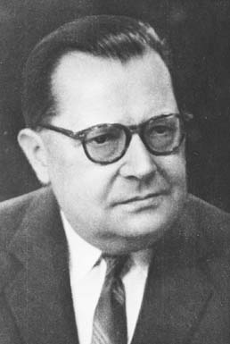
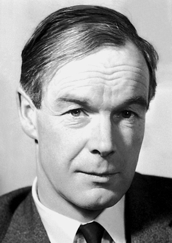
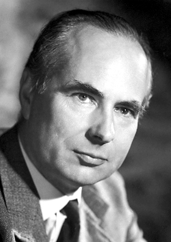
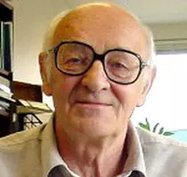
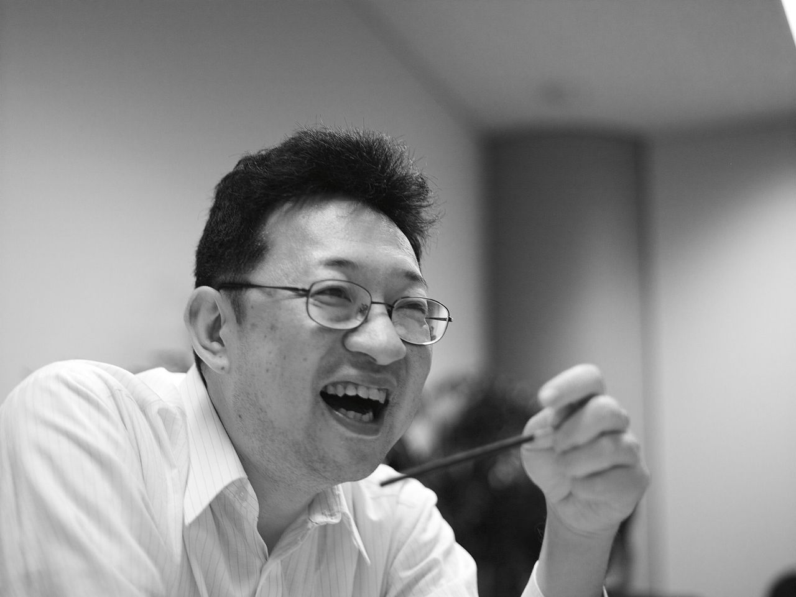

# Definição de Biologia de Sistemas

<!-- ```{r}
#| echo: false
#| fig-width: 6
DiagrammeR::grViz("digraph G { A -> B; B -> C; A -> C; }")
``` -->

:::: {.columns}
::: {.column width="40%"}
::: {.callout}
Abordagem  _holista_  para o estudo de sistemas biológicos
:::
:::
::: {.column width="60%"}
Holismo é a ideia de que as propriedades de um sistema, quer se trate de seres humanos ou outros organismos, não podem ser explicadas apenas pela soma dos seus componentes. O sistema como um todo determina como se comportam as partes.
:::
::::

# Holismo

O holismo, conceito proposto por Jan Christiaan Smuts, sustenta que as propriedades de um sistema não podem ser explicadas apenas pela soma de suas partes, pois o todo influencia o comportamento de cada componente (SMUTS, 1926).

# Por consequência

Biologia de Sistemas permite modelar e descobrir <span style="color:#4169E1; font-weight:bold;">propriedades emergentes</span>.

# Propriedades emergentes

Propriedades emergentes são aquelas que surgem das interações entre os componentes de um sistema biológico e não podem ser atribuídas a nenhuma parte isolada (KITANO, 2002).

*KITANO, H. Systems biology: a brief overview. Science, v. 295, n. 5560, p. 1662–1664, 2002.*

# Área da ciência que Modela Complexos Sistemas Biológicos

**Área multidisciplinar** <br>
<span style="color:#00ff00; font-weight:bold;">Biologia</span>  +  <span style="color:#e69138; font-weight:bold;">Computação</span>  +  <span style="color:#ff0000; font-weight:bold;">Matemática</span>

# Campo de estudos

O estudo da interação entre os componentes de um sistema biológico.

# Paradigma

:::: {.columns}
::: {.column width="40%"}
**Holismo _versus_ Reducionismo**
:::
::: {.column width="60%"}
Usualmente usado como contraponto a o que é chamado de  _reducionismo_.
:::
::::


::: {.callout}
_“O <span style="color:#ff9900; font-weight:bold;">reducionismo</span> é a abordagem que busca compreender sistemas biológicos complexos dissecando-os em suas partes componentes, partindo do pressuposto de que entender cada parte levará à compreensão do todo.”_

**Kitano, H. (2002). Systems Biology: A Brief Overview. Science, 295(5560), 1662–1664. https://doi.org/10.1126/science.1069492**
:::

# Protocolos operacionais


::: {.columns}
::: {.column}
Técnicas que funcionam como um ciclo quando há modelagem.
:::

::: {.column}
1. Teoria
2. Modelagem analítica  ou  computacional
3. Validação experimental
4. Refinamento do modelo ou teoria.
:::
:::


::: {.callout}
__O ciclo teoria-modelagem-validação foi usado para desenvolver linhagens de leveduras produtoras de artemisinina (Ro et al., 2006, _Nature_), integrando dados transcriptômicos e modelagem de fluxo metabólico.__

Ro, DK., Paradise, E., Ouellet, M. et al. Production of the antimalarial drug precursor artemisinic acid in engineered yeast. Nature 440, 940–943 (2006). https://doi.org/10.1038/nature04640
:::

# Aplicação da Teoria de Sistemas Dinâmicos na Biologia Molecular


::: {.columns}
::: {.column}
- O foco na dinâmica e interação dos _indivíduos_ nos sistemas estudados é a principal diferença conceitual entre a biologia de sistemas e a bioinformática.
:::

::: {.column}

::: {.callout}
Modelos dinâmicos do ciclo celular em leveduras (Tyson et al., 2002, Current Biology) explicam como falhas em pontos de checagem levam a câncer, guiando terapias-alvo.
:::
:::
:::


# Fenômeno sócio-científico
Definido pela estratégia de integrar dados complexos da interação, em sistemas biológicos, de diversas fontes usando ferramentas e pessoal interdisciplinar.

# Disciplinas associadas

{.r-stretch fig-align="center"}


# Histórico

# Ludwig von Bertalanffy


::: {.columns}

::: {.column}

{.r-stretch fig-align="center"}

:::

::: {.column}

* Biólogo Austríaco
* Desenvolveu a  <span style="color:#4169E1; font-weight:bold;">Teoria Geral dos Sistemas</span> .
  * Trabalhos entre 1950 e 1968
* A base para o conceito de Biologia de Sistemas.
:::

:::

- Um sistema é um conglomerado coeso de partes <span style="color:#4169E1; font-weight:bold;">inter-relacionadas</span> e interdependentes que pode ser natural ou feito pelo homem.

- Todo sistema é delineado por seus limites espaciais e temporais, cercados e influenciados por seu <span style="color:#4169E1; font-weight:bold;">ambiente</span>, descritos por sua estrutura e propósito ou natureza e expressos em seu funcionamento.

- Um sistema pode ser mais do que a soma de suas partes se expressar <span style="color:#4169E1; font-weight:bold;">sinergia</span> ou <span style="color:#4169E1; font-weight:bold;">comportamento emergente</span>.

# Teoria Geral do Sistemas

::: {.columns}
::: {.column}
{.r-stretch fig-align="center"}
:::
::: {.column}
<span style="color:#00000; font-weight:bold;">CONCEITOS CHAVE EM TEORIA DE SISTEMAS</span>

Sistema

Fronteiras

Homeostase

Adaptação

Transações Recíprocas

Retroalimentação

Taxa de transferência
:::
:::

# CONCEITOS CHAVE EM TEORIA DE SISTEMAS

::: {.columns}
::: {.column}
- <span style="color:#4169E1; font-weight:bold;">Sistema</span>
- Fronteiras
- Homeostase
- Adaptação
- Transações Recíprocas
- Retroalimentação
- Taxa de transferência
:::
::: {.column}
- Uma entidade organizada composta de partes interrelacionadas e interdependentes.

- **Alternativamente:** Conjunto de componentes interconectados (genes, proteínas, células etc.) que atuam como uma unidade funcional, exibindo propriedades que não existem nos elementos isolados.
:::
:::


::: {.callout}
<span style="color:#4169E1; font-weight:bold;">Rede metabólica da glicólise:</span> as 10 enzimas envolvidas convertem glicose em piruvato, mas o fluxo energético só emerge da interação entre elas (Almaas et al., 2004, Nature).
:::

# CONCEITOS CHAVE EM TEORIA DE SISTEMAS

::: {.columns}
::: {.column}
- Sistema
- <span style="color:#4169E1; font-weight:bold;">Fronteiras</span>
- Homeostase
- Adaptação
- Transações Recíprocas
- Retroalimentação
- Taxa de transferência
:::
::: {.column}
- Limites que definem o sistema e o diferenciam de outros sistemas e do ambiente.

- **Alternativamente:** Limites físicos ou funcionais que definem o sistema (ex.: membrana celular) e regulam trocas com o ambiente.
:::
:::


::: {.callout}
<span style="color:#4169E1; font-weight:bold;">Organoides tumorais</span>: Culturas 3D de células cancerosas mantêm fronteiras que simulam microambientes tumorais, permitindo estudos de invasão (Drost & Clevers, 2018, Nature Reviews Cancer).
:::

# CONCEITOS CHAVE EM TEORIA DE SISTEMAS

::: {.columns}
::: {.column}
- Sistema
- Fronteiras
- <span style="color:#4169E1; font-weight:bold;">Homeostase</span>
- Adaptação
- Transações Recíprocas
- Retroalimentação
- Taxa de transferência
:::
::: {.column}
- A tendência de um sistema a ser resiliente em face de fatores externos a fim de manter suas características.

- **Alternativamente**: Capacidade do sistema de manter equilíbrio dinâmico frente a perturbações, via mecanismos de feedback.
:::
:::

::: {.callout}
<span style="color:#4169E1; font-weight:bold;">Regulação do pH sanguíneo</span>: Sistemas tampão (ex.: bicarbonato) e trocas gasosas nos pulmões mantêm pH ~7,4 mesmo sob variações metabólica (Hamm et al., 2015, Physiological Reviews).
:::

# CONCEITOS CHAVE EM TEORIA DE SISTEMAS

::: {.columns}
::: {.column}
- Sistema
- Fronteiras
- Homeostase
- <span style="color:#4169E1; font-weight:bold;">Adaptação</span>
- Transações Recíprocas
- Retroalimentação
- Taxa de transferência
:::
::: {.column}
- A tendência de um sistema auto-adaptativo de se ajustar internamente para se proteger e manter o seu propósito

- **Alternativamente**: Ajuste estrutural ou funcional do sistema em resposta a mudanças ambientais, garantindo sobrevivência.
:::
:::


::: {.callout}
<span style="color:#4169E1; font-weight:bold;">Bactérias resistentes a antibióticos</span>:  Alterações no transcritoma (ex.: _upregulation_ de bombas de efluxo) surgem como adaptação a drogas (Blair et al., 2015, Nature Reviews Microbiology)
:::

# CONCEITOS CHAVE EM TEORIA DE SISTEMAS

::: {.columns}
::: {.column}
- Sistema
- Fronteiras
- Homeostase
- Adaptação
- <span style="color:#4169E1; font-weight:bold;">Transações Recíprocas</span>
- Retroalimentação
- Taxa de transferência
:::
::: {.column}
- Interações circulares ou cíclicas em que os sistemas se envolveam, de tal forma que influenciam uns aos outros.

- **Alternativamente**: Interações bidirecionais entre sistemas, onde mudanças em um afetam o outro, criando ciclos de dependência.
:::
:::


::: {.callout}
<span style="color:#4169E1; font-weight:bold;">Eixo intestino-cérebro</span>: Metabólitos bacterianos (ex.: butirato) modulam a síntese de serotonina no hospedeiro, influenciando comportamento (Sharon et al., 2016, Cell).
:::

# CONCEITOS CHAVE EM TEORIA DE SISTEMAS

::: {.columns}
::: {.column}
- Sistema
- Fronteiras
- Homeostase
- Adaptação
- Transações Recíprocas
- <span style="color:#4169E1; font-weight:bold;">Retroalimentação</span>
- Taxa de transferência
:::
::: {.column}
- O sinal pelo qual os sistemas se auto-corrigem baseados em reações de outros sistemas no ambiente.

- **Alternativamente**: Mecanismo de autorregulação onde a saída do sistema controla sua própria atividade (positiva: amplifica; negativa: atenua).
:::
:::


::: {.callout}
<span style="color:#4169E1; font-weight:bold;">Feedback negativo na insulina</span>: Glicose alta → secreção de insulina → captação de glicose → redução da secreção (Saltiel & Kahn, 2001, *Nature*).
:::

# CONCEITOS CHAVE EM TEORIA DE SISTEMAS

::: {.columns}
::: {.column}
- Sistema
- Fronteiras
- Homeostase
- Adaptação
- Transações Recíprocas
- Retroalimentação
- <span style="color:#4169E1; font-weight:bold;">Taxa de transferência</span>
:::
::: {.column}
- Taxa de transferência de energia ou matéria entre o sistema e o ambiente durante o tempo em que o sistema funciona.

- **Alternativamente**: Velocidade de fluxo de matéria/energia/informação entre o sistema e o ambiente, critical para sua função.
:::
:::


::: {.callout}
<span style="color:#4169E1; font-weight:bold;">Fotossíntese</span>: A taxa de fixação de CO₂ em plantas C4 é maior que em C3 devido a diferenças na anatomia foliar (Wang et al., 2016, Plant Cell).
:::


# Alan Hodgkin e Andrew Huxley{.smaller}


::: {.columns}

::: {.column}
{.r-stretch fig-align="center"}
:::

::: {.column}
{.r-stretch fig-align="center"}
:::

:::

**Modelagem Matemática do Impulso Nervoso (1952)**

**Contexto**:

Em 1952, **Hodgkin** e **Huxley** publicaram um marco da biologia de sistemas: um modelo matemático quantitativo que descreve a geração e propagação do potencial de ação em neurônios do axônio gigante da lula (*Loligo pealei*).

**Metodologia**:

Combinaram experimentos eletrofisiológicos (com técnicas de voltage clamp) com equações diferenciais.

Modelaram a dinâmica dos canais iônicos de sódio (Na⁺) e potássio (K⁺), prevendo como variações de voltagem controlam o fluxo de íons.


# {.smaller}
::: {.columns}
::: {.column}
{.r-stretch fig-align="center"}
:::
::: {.column}
**Impacto Científico**:

**Fundamentos da Neurociência Computacional**:
Seu modelo (equações de Hodgkin-Huxley) é a base para simulações de redes neuronais modernas, incluindo estudos sobre epilepsia e Parkinson (Dayan & Abbott, 2001).

**Biotecnologia**:
Inspirou o desenvolvimento de interfaces cérebro-máquina e próteses neurais (Nicolelis, 2003).

**Prêmio Nobel (1963)**:
Receberam o Nobel de Fisiologia/Medicina por revelar os "mecanismos iônicos envolvidos na excitação e inibição de neurônios".

**Exemplo Atual**:
Modelos derivados são usados para otimizar estimulação cerebral profunda em pacientes com Parkinson (Mainen & Sejnowski, 1996).
:::
:::

# Alan Turing{.smaller}

:::{.columns}
:::{.column}
{.r-stretch fig-align="center"}
:::
:::{.column}
* Matemático inglês;
* O Modelo de Reação-Difusão (1952)
  * Artigo Original: Turing propôs que padrões como listras (ex.: pelagem de animais) ou manchas (ex.: conchas de moluscos) surgem da interação entre dois morfógenos (moléculas sinalizadoras) com propriedades distintas:
    * **Ativador**: Auto-reforça sua própria produção.
    * **Inibidor**: Suprime o ativador e difunde-se mais rapidamente
* Seu modelo matemático descreve como pequenas perturbações em um sistema homogêneo levam a padrões espaciais estáveis (Turing, 1952).
:::
:::

# Alan Turing{.smaller}

:::{.columns}
:::{.column}
{.r-stretch fig-align="center"}
:::
:::{.column}
* Impacto na Biologia de Sistemas:
  * Padrões em Desenvolvimento Embrionário: Ex.: Formação de dígitos em membros de vertebrados (Sheth et al., 2012, Science).
* Engenharia de tecidos para regeneração de estruturas padronizadas (cartilagem, folículos capilares).
* Síntese de Padrões em Biologia Sintética:
  * Células geneticamente modificadas para produzir padrões Turing  *in vitro* (Sick et al., 2020, Nature Chemical Biology).
:::
:::

# Alan Turing
:::{.columns}
:::{.column}
{fig-align="center"}
:::
:::{.column}
* **Agricultura**: Manipulação de padrões florais para aumentar atratividade a polinizadores (Reichelt & Burdet, 2023, Plant Biotechnology Journal).
* **Ferramentas Computacionais Derivadas**:  Softwares como Morpheus (Starruß et al., 2014) usam as equações de Turing para prever padrões em tecidos.
:::
:::

# Denis Noble

* Biólogo inglês;
* **Principal contribuição**: modelo matemático da função cardíaca (1960).
* Usou modelos de computador de órgãos e sistemas de órgãos para interpretar a função molecular ao nível de todo o organismo.
* Utilizou supercomputadores para a criação de um coração virtual.
* Contribuiu para difundir a nível internacional o uso de modelos computacionais para simular quantitativamente funções fisiológicas ao nível do genoma.

{.r-stretch fig-align="center"}

# 
::::{.columns}
::::{.column}
{.r-stretch fig-align="center"}
::::
::::{.column}
* Música da Vida
  * Uma mudança de paradigma: do reducionismo da Biologia Molecular aos multiníveis e sistemas da Biologia de Sistemas.
  * Fez a introdução do conceito de *middle-out*.
    * Em contraponto ao *bottom-up* e ao *top-down*.
::::
::::

# Abordagens

* *Top-down*
* *Middle-out*
* *Bottom-up*

<span style="color:#222222">Abordagem que parte de dados experimentais em larga escala (ômicos) para reconstruir modelos integrados de sistemas biológicos, priorizando uma visão global (genoma, proteoma, metaboloma) antes de investigar componentes individuais.</span>

# Top-down{.smaller}

::::{.callout}
<span style="color:#222222">Dados ômicos → Rede de interações → Modelo matemático → Hipóteses testáveis → Validação experimental</span>
::::

* **Limitações da Abordagem**
  * **Dependência da qualidade dos dados**: Ruído em dados ômicos pode gerar modelos imprecisos.
  * **Complexidade computacional**: Modelos de genoma completo exigem supercomputadores (ex.: modelo _Recon3D_ humano).

* **Modelagem**:
  * **Modelagem do Câncer de Mama**<br>
Rede de interações proteicas + vias metabólicas desreguladas (ex.: via PI3K-AKT).
  * **Entrada → Dados ômicos**: Sequenciamento de tumor (genômica) + perfis de expressão gênica (transcriptômica).
  * **Saída**:
    * Identificação de alvos terapêuticos (ex.: inibidores de AKT). Fonte: Thiele et al., 2013 (Nature Biotechnology).

# Middle-out

* Abordagem que permite iniciar modelagens em qualquer nível (molécula, célula, órgão), explorando causalidades circulares entre escalas. Não é reducionista (como bottom-up) nem puramente holista (como top-down).
* Um modelo MWO pode iniciar em vias metabólicas (nível bioquímico) e escalar para redes de sinalização celular (nível celular), sem assumir prioridade causal.

# Bottom-up

* Destina-se a elaborar modelos detalhados que podem ser simulados em diferentes condições.
* Esta abordagem combina todas as informações específicas do organismo em um modelo completo de escala genômica para proporcionar uma visão integrativa das interações biológicas que ocorrem dentro dos seres vivos.

# Mihajlo Mesarovic

::: {.columns}
::: {.column}
{.r-stretch fig-align="center"}
:::
::: {.column}
* Engenheiro sérvio
* Em 1966, Mesarović (engenheiro e teórico de sistemas sérvio-americano) publicou o artigo seminal:
  * "Systems Theory and Biology" (Springer-Verlag), onde propôs a Biologia de Sistemas como uma disciplina formal, aplicando a Teoria Geral dos Sistemas (de Ludwig von Bertalanffy) à biologia.
:::
:::

# Mihajlo Mesarovic{.smaller}

::: {.columns}
::: {.column}
{fig-align="center"}
:::
::: {.column}
* **Contribuições Chave no Trabalho de 1966**:
  * **Definição Inovadora**:
    * Mesarović argumentou que sistemas biológicos devem ser estudados como redes hierárquicas de interações, onde o comportamento global emerge de múltiplos níveis (moléculas → células → organismos).
  * **Abordagem Matemática**:
    * Introduziu modelos dinâmicos para descrever sistemas vivos, antecipando conceitos como:
      * _Controle hierárquico_ (ex.: regulação metabólica).
      * _Propriedades emergentes_ (ex.: padrões de desenvolvimento embrionário).
  * **Impacto**:
      * Seu trabalho influenciou a criação de modelos computacionais em biologia, como os atuais GSMMs (_Genome-Scale Metabolic Models_).
:::
:::

# Biologia de Sistemas: Oscilações no Uso e Consolidação{.smaller}

A disciplina passou por dois momentos distintos, impulsionados por avanços tecnológicos e mudanças de paradigma:

::: {.columns}

::: {.column}
1. **Fase de "Desuso"(Décadas de 1970–1990)**
  * Causas:
    * Dominância do reducionismo: Foco da comunidade científica na Biologia Molecular (ex.: sequenciamento de DNA individual, PCR).
    * Limitações tecnológicas: Dificuldade em gerar/processar dados complexos (sem técnicas ômicas ou computação poderosa).
    * Exemplo: Entre 1975 e 1995, o termo "Biologia de Sistemas" teve poucas citações (Kitano, 2002).
:::

::: {.column}
2. **Fase de "Reuso" e Expansão (A partir dos anos 2000)**
  * Gatilhos:
    * Revolução das ômicas:
      * Sequenciamento de genomas completos (ex.: Projeto Genoma Humano, 2003).
      * Técnicas de alto rendimento (microarrays, espectrometria de massas).
    * Avancos computacionais:
      * Modelagem de redes em larga escala (ex.: modelos metabólicos _Genome-Scale_).
      * *Machine learning* aplicado a dados biológicos (ex.: predição de interações proteicas).
:::
:::


::: {.callout}
O número de artigos com "Biologia de Sistemas" no título aumentou 20× entre 2000 e 2010 (PubMed).
:::


# Hiroaki Kitano: Pioneiro na Popularização da Biologia de Sistemas

::: {.columns}
::: {.column}
{fig-align="center"}
:::
::: {.column}
{fig-align="center"}
:::
:::


# Hiroaki Kitano: Pioneiro na Popularização da Biologia de Sistemas{.smaller}

1. **Contexto da Popularização (2002)**
  * Publicação Seminal: Kitano foi autor do artigo "Systems Biology: A Brief Overview" (_Science_, 2002), que definiu os pilares da disciplina: "A biologia de sistemas busca entender os sistemas vivos como redes dinâmicas de interações, integrando modelagem computacional e experimentos."
  * **DOI**: [10.1126/science.1069492](https://doi.org/10.1126/science.1069492).
* **Criação do Systems Biology Institute (SBI)**:
  * Instituto líder em pesquisas interdisciplinares (Tóquio, Japão), focado em modelagem de redes biológicas e inteligência artificial aplicada à biologia.


# Hiroaki Kitano: Pioneiro na Popularização da Biologia de Sistemas{.smaller}

2. **Contribuições Chave**
* **Ferramentas e Plataformas**:
  * **CellDesigner**: Software para modelagem de redes biológicas (usado em estudos de câncer e vias metabólicas).
  * **SBML (Systems Biology Markup Language)**: Padrão computacional para representar modelos biológicos, adotado globalmente.
* **Prêmios e Reconhecimento**:
  * **Nature Award for Mentoring in Science**  (2015) por promover colaborações entre biólogos e engenheiros.

3. **Aplicação Prática**
* Modelagem do Câncer: Kitano desenvolveu modelos de redes de sinalização em tumores, mostrando como falhas em vias como PI3K-AKT geram resistência a terapias (_Kitano, 2004, Cancer Research_).

# Aplicações

1. **Criação de Modelos Metabólicos**
* Projeto _Yeast 8_: Modelo do metabolismo de _Saccharomyces cerevisiae_ que prevê como deleções genéticas afetam a produção de etanol.
  * Aplicação: Otimização de cepas para biocombustíveis pela empresa Novozymes (Lu et al., 2019, _Nature Communications_).
  * Ferramenta: _COBRA Toolbox_ para simulações (_Schellenberger et al., 2011_).
* Modelos metabólicos reduziram em 70% o tempo para desenvolver linhagens produtoras de insulina humana em _E. coli_ (Burgard et al., 2003).

# Aplicações

2. **Medicina P4**
* Câncer de Mama Triplo-Negativo:
  * Personalizada: Sequenciamento do tumor para identificar mutações em _BRCA1_.
  * Preditiva: Modelos de risco baseados em transcriptômica (ex.: assinatura de 70 genes,  _MammaPrint_).
  * Preventiva: Uso de inibidores de PARP em pacientes com predisposição genética.
  * Participativa: Plataformas como **PatientsLikeMe** integram dados de pacientes para refinamento de terapias.
  * Fonte: _Chen et al., 2021, Nature Reviews Drug Discovery_.
* "A medicina P4 já reduz custos hospitalares em até 30% ao evitar terapias inefficazes (Hood & Flores, 2012)."

# Aplicações

3. **Estudo do Câncer**
* Projeto Cancer Cell Map Initiative (CCMI):
  * Mapeou redes de interação proteica em tumores para identificar "nós críticos" (ex.: proteína _MYC_).
  * Resultado: Inibidores de _MYC_ em testes clínicos para leucemia (Krogan et al., 2020, _Science_).
* Ferramenta: _Cytoscape_ para visualização de redes.
* "Modelos de câncer de pâncreas preveem resistência a gemcitabina com 92% de acurácia (Rahman et al., 2022)."

# Aplicações

4. **Interações Hospedeiro-Patógeno**
* COVID-19 e ACE2:
  * Modelagem sistêmica revelou que a proteína TMPRSS2 facilita a entrada do SARS-CoV-2.
  * Terapia: Inibidores de TMPRSS2 (ex.: camostat) reduziram infecções _in vitro_ (Hoffmann et al., 2020, _Cell_).
* Ferramenta: _PerturbNet_ para simular interações vírus-célula (_Bojkova et al., 2021_).
* "Em 2009, modelos de gripe H1N1 levaram 6 meses para identificar alvos; em 2020, o SARS-CoV-2 foi mapeado em 3 semanas."


# Referências {.scrollable}

1. MESAROVIĆ, M. D. (Ed.). Systems Theory and Biology. Berlin: Springer-Verlag, 1966. (Obra seminal que definiu a disciplina)

2. BERTALANFFY, L. von. General System Theory: Foundations, Development, Applications. New York: Braziller, 1968.

3. NOBLE, D. The Music of Life: Biology Beyond the Genome. Oxford: Oxford University Press, 2006. (Abordagem _middle-out_)

4. KITANO, H. Systems biology: a brief overview. Science, v. 295, n. 5560, p. 1662-1664, 2002. DOI:10.1126/science.1069492. (Artigo-chave para popularização)

5. LU, H. et al. A consensus _S. cerevisiae_  metabolic model Yeast8. Nature Communications, v. 10, 3586, 2019. DOI:10.1038/s41467-019-11581-3. (Modelo metabólico de referência)

6. ORTH, J. D. et al. What is flux balance analysis? Nature Biotechnology, v. 28, n. 3, p. 245-248, 2010. DOI:10.1038/nbt.1614.

7. RO, D.-K. et al. Production of the antimalarial drug precursor artemisinic acid in yeast. Nature, v. 440, n. 7086, p. 940-943, 2006. DOI:10.1038/nature04640. (Engenharia metabólica com sistemas)

8. BRO, C. et al. _In silico_ aided metabolic engineering of _Saccharomyces cerevisiae_ for improved bioethanol production. Metabolic Engineering, v. 8, n. 2, p. 102-111, 2006. DOI:10.1016/j.ymben.2005.09.007.

9. HOOD, L.; FLORES, M. A personal view on systems medicine. Nature Reviews Genetics, v. 13, n. 9, p. 647-650, 2012. DOI:10.1038/nrg3368. (Conceito de Medicina P4)

10. KROGAN, N. J. et al. The Cancer Cell Map Initiative. Science, v. 369, n. 6509, eaba4902, 2020. DOI:10.1126/science.aba4902.

11. HOFFMANN, M. et al. SARS-CoV-2 cell entry depends on ACE2 and TMPRSS2. Cell, v. 181, n. 2, p. 271-280, 2020. DOI:10.1016/j.cell.2020.02.052.

12. HODGKIN, A. L.; HUXLEY, A. F. A quantitative description of membrane current and its application to conduction and excitation in nerve. The Journal of Physiology, v. 117, n. 4, p. 500-544, 1952. DOI:10.1113/jphysiol.1952.sp004764. (Modelo pioneiro)

13. TURING, A. M. The chemical basis of morphogenesis. Philosophical Transactions of the Royal Society B, v. 237, n. 641, p. 37-72, 1952. DOI:10.1098/rstb.1952.0012. (Padrões de Turing)

<!-- Isso deu certo. -->
<!-- 
<style>
.fade-light {
  opacity: 0.4 !important;
  transition: opacity 0.5s ease;
}

.highlight {
  color: #ff6b6b !important;
  font-weight: bold !important;
  background-color: rgba(255, 107, 107, 0.1) !important;
  padding: 0.1em 0.3em !important;
  border-radius: 4px !important;
  transition: all 0.3s ease;
}

/* Para garantir que o item destacado fique com opacidade total */
.highlight {
  opacity: 1 !important;
}
</style>

## Alternando Destaque
### Passo 0: Item 1 e Item 2 aparecem
- Item 1
- Item 2


## Alternando Destaque

### Passo 1: Item 1 destacado, Item 2 claro
::: {.fragment .highlight fragment-index="1"}
- Item 1 (DESTACADO)
:::

::: {.fragment .fade-light fragment-index="2"}
- Item 2 (mais claro)
:::

### Passo 2: Item 1 claro, Item 2 destacado
::: {.fragment .fade-light fragment-index="3"}
- Item 1 (mais claro)
:::

::: {.fragment .highlight fragment-index="4"}
- Item 2 (DESTACADO)
::: -->