# Biologia de Sistemas

# 02 - Grafos

Nicholas Barroso

---

# Teoria de Grafos

---

# Grafo versus Gráfico

::: {layout-ncol=2 layout-lcol=0.6}

:::

---

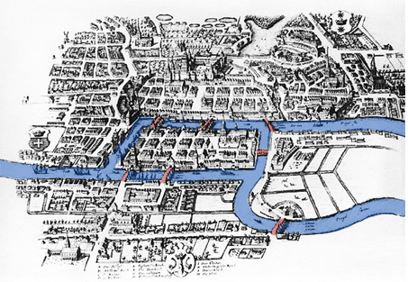

É possível andar pela cidade atravessando cada ponte   _exatamente uma vez_  ?

---

# Pontes de Kaliningrado

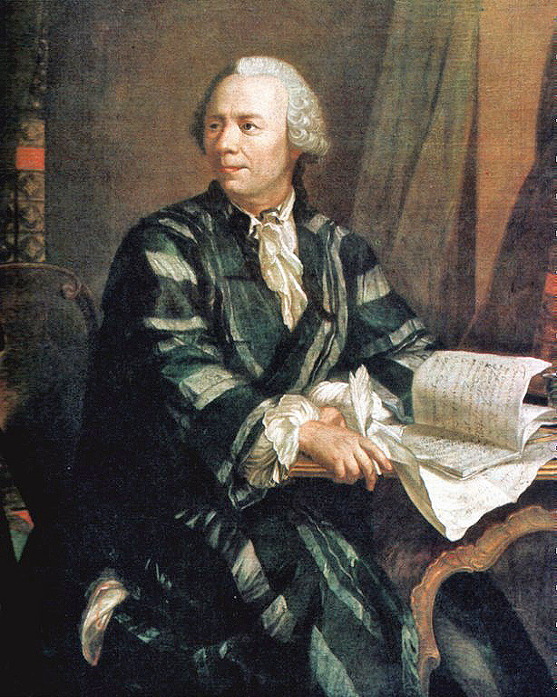

Leonhard Euler

Matemático e físico Suíço

Tentou responder a questão sobre as pontes de Kaliningrado.

Para tanto desenvolveu a  Teoria dos Grafos .

---

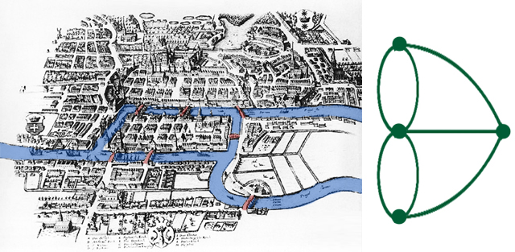

É possível andar pela cidade atravessando cada ponte   _exatamente uma vez_  ?

---

É possível andar pela cidade atravessando cada ponte   _exatamente uma vez_  ?

---

Um grafo é uma representação matemática de um objeto consistindo de  vértices    (nós) e  arestas  representando elementos e conexões, respectivamente.

V: Vértices (ex.: genes, proteínas, metabólitos).

E: Arestas (ex.: interações, reações químicas).

# Grafo

# Definição 1

---

_G = (V,E)_

O grafo  _G_  é um  conjunto  formado por um conjunto de vértices  _V_  e um conjunto de arestas  _E_

Exemplo

Grafo de Regulação Gênica:

V = {GeneA, GeneB, GeneC}

E = {GeneA → GeneB, GeneB → GeneC}.

# Grafo

# Definição 2

---

_G = (V,E)_

O grafo  _G_  é um conjunto formado por um conjunto de vértices V = {v1,v2,v3,...,vn} e um conjunto de arestas E = {(v1,v2),(v3,vn),...,(vx,vz)}

# Grafo

# Definição 2 expandida

---

# Algumas definições

---

# Vértices ou nós

São os elementos do grafo. Os elementos podem significar qualquer coisa

Pessoas

Lugares

Genes

Animais

Proteínas

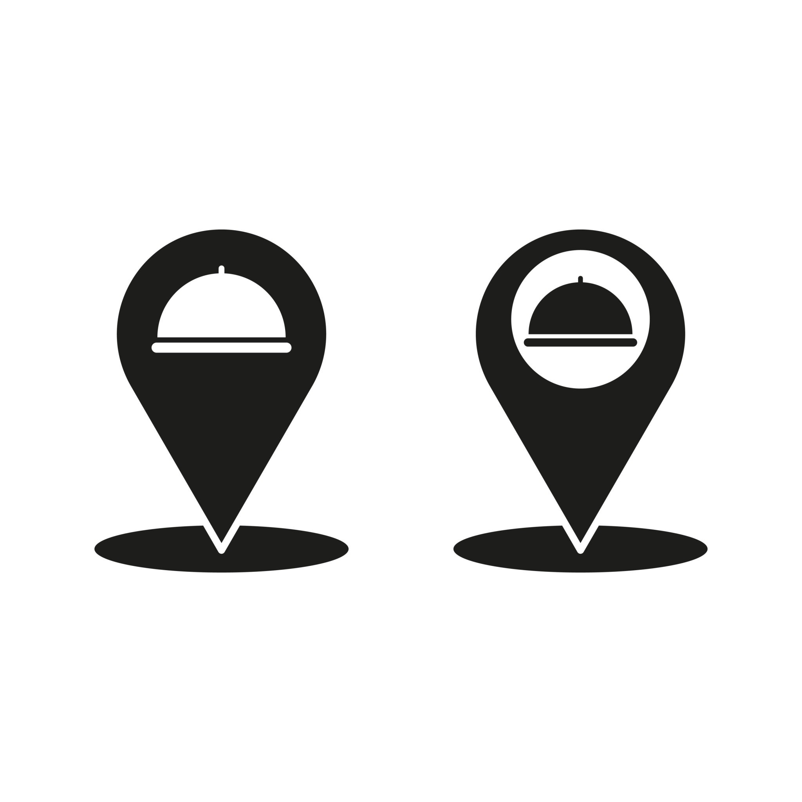

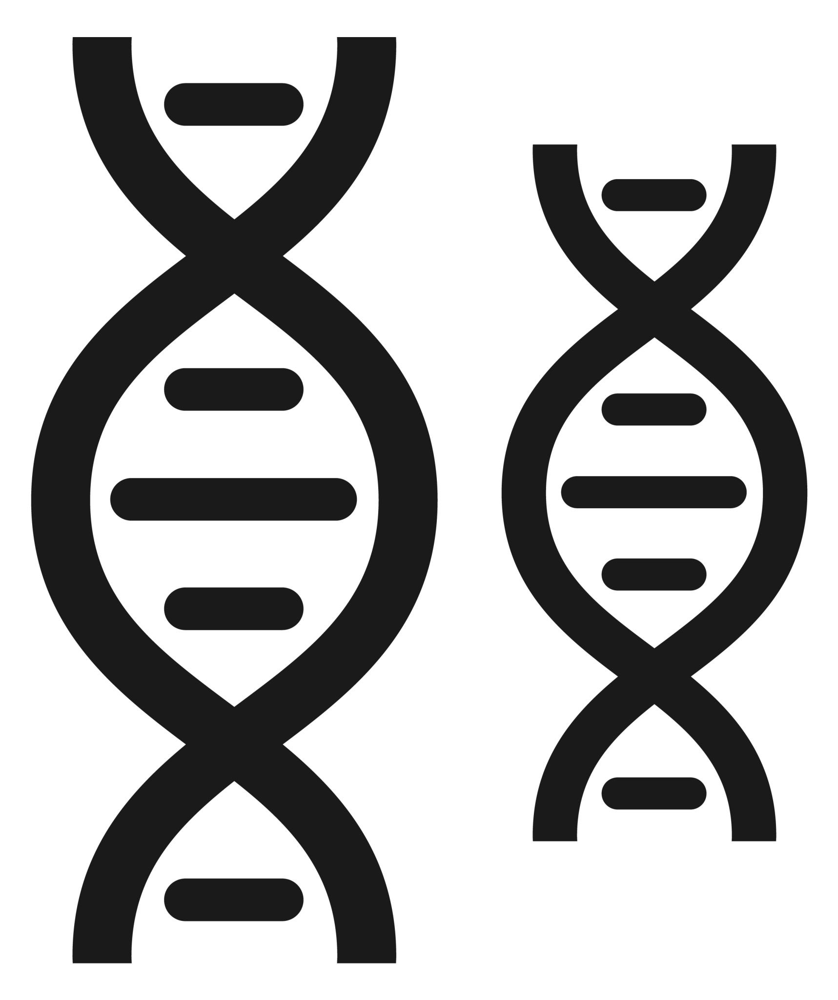

Sua representação gráfica pode ser um ponto ou um círculo que pode, ou não, conter algum símbolo interno.

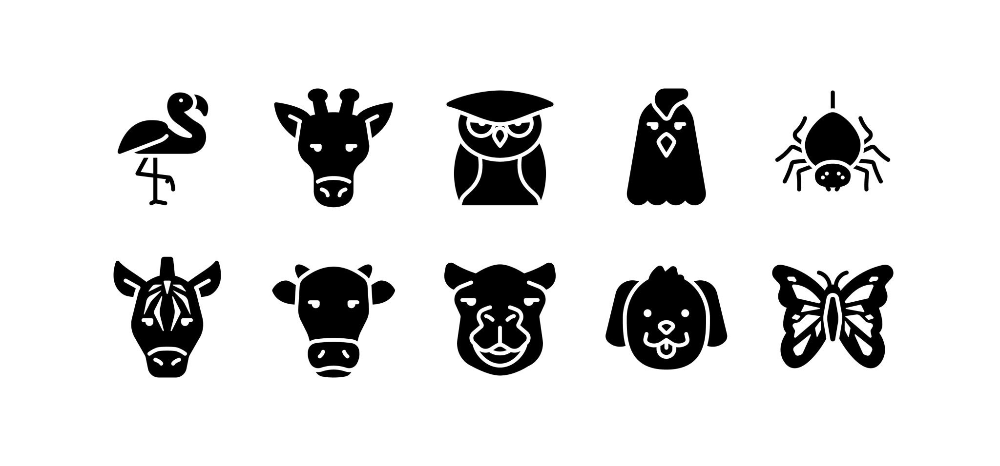

---

# Arestas

* As arestas indicam  relações  entre os elementos. O significado da relação pode mudar dependendo dos elementos.
* Por isso as arestas podem ser:
* Não-direcionadas:  (v1,v2)  =  (v2,v1), relações simétrica.
  * Quando a ligação não exibe precedência, somente relação.
  * Complexo proteico onde A interage com B e vice-versa.
* Direcionadas:   (v  1  ,v  2  )   ≠   (v  2  ,v  1  )
  * Quando a ligação entre os dados indica precedência ou ordem
    * causa e efeito;
    * antes ou depois;
    * substrato → produto.
    * GeneX ativa a expressão de GeneY (GeneX → GeneY).

---

# Arestas (cont.)

Não-direcionadas

Relação sem precedência

Direcionadas

Relação com precedência

---

Grafos com arestas direcionadas são  grafos direcionados .

Grafos com arestas não-direcionadas são  grafos não-direcionados .

# Por consequência

# O grafos podem ser classificados de acordo com os tipos das suas arestas

---

Um grafo não-direcionado é conectado quando possui pelo menos um vértice e existe um caminho entre cada par de vértices.

Em um grafo conectado, não há vértices inacessíveis.

Um grafo não direcionado que não está conectado é chamado desconectado.

Um grafo não direcionado G é, portanto, desconectado se existir dois vértices em G, de modo que nenhum caminho em G tenha esses vértices como pontos finais.

Um grafo com apenas um vértice está conectado.

Um gráfico sem arestas entre dois ou mais vértices é desconectado.

# Grafo

# Conectado e não-conectado

---

Conectado:  Todos os vértices estão ligados (ex.: rede metabólica essencial).

Desconectado:  Componentes isolados (ex.: vias metabólicas independentes).

Exemplo:

Rede de Coexpressão Gênica:  Se desconectada, indica grupos de genes com funções distintas.

# Grafo

# Conectado e não-conectado

---

# Adjacência entre vértices

# Se os vértices compartilham da mesma aresta então eles são adjacentes entre si.

Exemplo: Proteína A e B são adjacentes se interagem.

---

# Grau

# O grau de um vértice é o número de arestas que incidem nele.

---

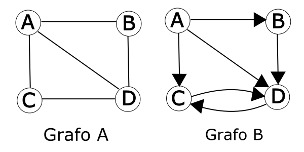

# Grau

# Para o grafo direcionado, o grau de vértice pode ser dividido em grau de entrada e grau de saída.

---

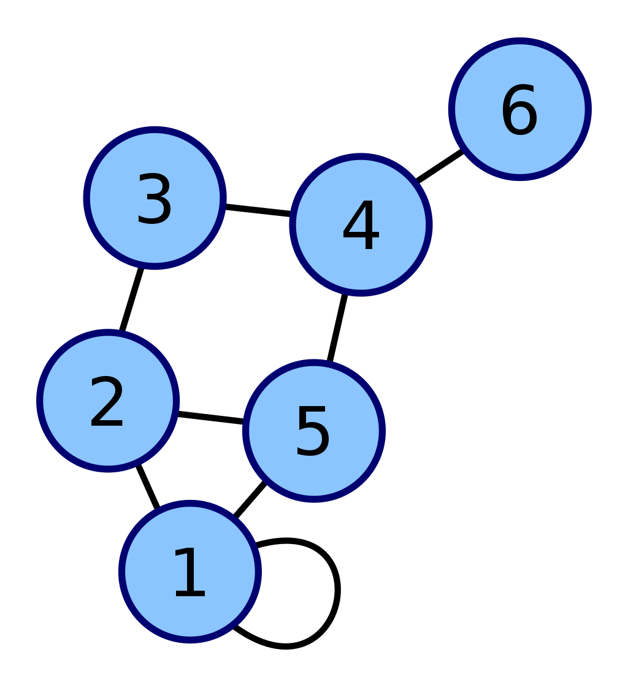

# Laço

# Quando uma aresta começa e termina em um mesmo vértice ela é chamada de laço (loop)

Exemplo: Autofosforilação de uma quinase (ex.: receptor EGFR).

---

# Layout

Layout é um mapeamento dos vértices e arestas de um grafo G=(V,E) em posições geométricas (coordenadas), seguindo regras que podem:

Minimizar cruzamentos de arestas.

Destacar hierarquias ou comunidades.

Facilitar a identificação de padrões.

# Disposição visual dos vértices (nós) e arestas (conexões) no espaço (geralmente em 2D ou 3D) para representar a estrutura do grafo de forma clara e interpretável. O layout não altera a estrutura matemática do grafo, mas influencia diretamente a compreensão humana das relações entre os elementos.

---

# Layout

Por que o Layout é Importante?

Clareza:  Evita sobreposição de arestas (ex.: em redes densas como interações proteicas).

Análise:  Layouts específicos revelam propriedades (ex.: hubs em redes livres de escala).

Comunicação:  Facilita a apresentação de dados complexos em artigos ou relatórios.

---

# Layout (cont.)

| Tipo de Layout | Características | Aplicação em Biotecnologia |
| :-: | :-: | :-: |
| Force-Directed | Arestas como molas, vértices se repelem | Redes de coexpressão gênica (identifica módulos funcionais). |
| Hierárquico | Vértices em camadas (top-down) | Cascatas de sinalização celular (ex.: via MAPK). |
| Circular | Vértices em um círculo | Interações proteína-DNA para destacar elementos centrais. |
| Radial | Vértices dispostos em anéis concêntricos | Árvores filogenéticas (evolução de patógenos). |

::: {.notes}

Ferramentas para Layout de Grafos

    Cytoscape: Oferece algoritmos como Prefuse Force-Directed para redes biológicas.

    Gephi: Usa Force Atlas 2 para layouts dinâmicos.

    Python (NetworkX + Matplotlib): Permite customização via spring_layout ou circular_layout.

Dica: Em biotecnologia, escolha o layout com base no objetivo:

    Se quer identificar comunidades, use force-directed.

    Se quer mostrar fluxos, use hierárquico.

:::

---

G’ = (V’, E’) onde V’ é um subconjunto de V e E’ é um subconjunto de E.

Isso implica que E’ só possui arestas que começam e terminam em vértices que estão em V’.

# Subgrafo

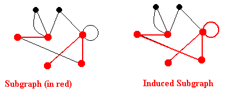

---

Se G’  é um subgrafo de G e E’ possui todas as arestas de E que ligam os vértices de V’, então esse subgrafo é chamado de grafo induzido.

# Subgrafo Induzido

---

E’={1,2; 5,6; 5,7}

E’={1,2; 1,7; 5,5; 5,6; 5,7}

---

Dois grafos G1=(V1,E1) e G2=(V2,E2) são isomorfos se existir uma bijeção (mapeamento um-para-um) entre seus vértices que preserve as adjacências.

Ou seja:

Cada vértice em G1​ tem um correspondente único em G2.

Duas arestas são conectadas em G1​ se e somente se suas correspondentes em G2 também estiverem conectadas.

Em outras palavras: Os grafos têm a mesma "forma" ou topologia, mas podem diferir nos rótulos dos vértices/arestas.

# Isomorfismo

---

Homologia Estrutural:  Identifica padrões conservados na evolução (ex.: redes de interação proteica em eucariotos vs. bactérias).

Engenharia Metabólica:  Redes isomorfas em microrganismos podem ser "copiadas" para organismos-modelo.

Descoberta de Drogas:  Alvos farmacológicos em uma espécie podem ser inferidos a partir de redes isomorfas em outras.

# Por que Isomorfismo é Importante na Biologia?

---

# Passeio &
Caminho &
Trilha

---

# Passeio - Walk

Um  passeio  de distância  _k_  em um grafo é uma sequência alternante de vértices e arestas v0, e0, v1, e1, v2, e2, … , vk-1, ek-1, vk, que começa e termina em vértices.

---

# Passeio - Walk (cont.)

Um  passeio (  _walk_  )  de comprimento  _k_  em um grafo é uma sequência alternada de vértices e arestas:

_v_  _0_  _, e_  _0_  _, v_  _1_  _, v_  _2_  _, ..., v_  _k-1_  _, e_  _k-1_  _, v_  _k_

onde:

Cada aresta  _e_  _i_  conecta os vértices  _v_  _i_  e  _v_  _i+1_ .

Vértices e arestas podem se repetir.

Começa e termina em vértices

---

# Passeio - Walk (cont.)

---

# Tipos de Passeio

* Trilha  ( _Trail_ ): Passeio sem arestas repetidas (vértices podem repetir).
  * Exemplo:  _A,_  _ _  _e_  _1_  _,_  _ _  _B,_  _ _  _e_  _2_  _,_  _ _  _C,_  _ _  _e_  _3_  _,_  _ _  _A,_  _ _  _e_  _4_  _,_  _ _  _D_  ( _usa cada aresta apenas uma vez_ ).
* Caminho  ( _Path_ ): Passeio sem vértices repetidos ( _e, portanto, sem arestas repetidas_ ).
  * Exemplo:  _A,_  _ _  _e_  _1_  _,_  _ _  _B,_  _ _  _e_  _2_  _,_  _ _  _C_  ( _vértices distintos_ ).
* Ciclo  ( _Cycle_ ): Passeio fechado (v0=vk​) sem repetir arestas e com vértices distintos ( _exceto o primeiro/último_ ).
  * Exemplo:  _A,_  _ _  _e_  _1_  _,_  _ _  _B,_  _ _  _e_  _2_  _,_  _ _  _C,_  _ _  _e_  _3_  _,_  _ _  _A_ .
  * Exemplo: Ciclo de Krebs (rede metabólica circular).

---

# Caminhos especiais

---

Sequência de vértices conectados por arestas, sem repetição de vértices ou arestas.

Exemplo:  Em uma rede metabólica, um caminho simples pode representar uma rota linear de reações enzimáticas (e.g., Glicose → Glicose-6P → Frutose-6P).

# Caminho simples

---

# Caminho Euleriano

Caminho que passa por   _todas as arestas_   do grafo exatamente uma vez.

Exemplo:  Modelar a trajetória de um metabólito que percorre todas as reações de uma via sem repetições (raro em redes biológicas devido a ciclos).

---

# Caminho Hamiltoniano

Caminho que visita todos os vértices exatamente uma vez.

Exemplo:  Identificar uma ordem de ativação de proteínas em uma cascata de sinalização (e.g., Receptor → Kinase A → Kinase B → TF).

---

# Comprimento

É dado pelo número de arestas  _atravessadas_  de um vértice inicial a um vértice final.

A distância entre dois vértices é o comprimento do  menor caminho  entre eles ou ∞ se não existir um menor caminho.

---

# Menor caminho

É um caminho de tamanho mínimo entre dois vértices.

Pode existir vários menores caminhos entre dois vértices      (passando por diferentes vértices)  .

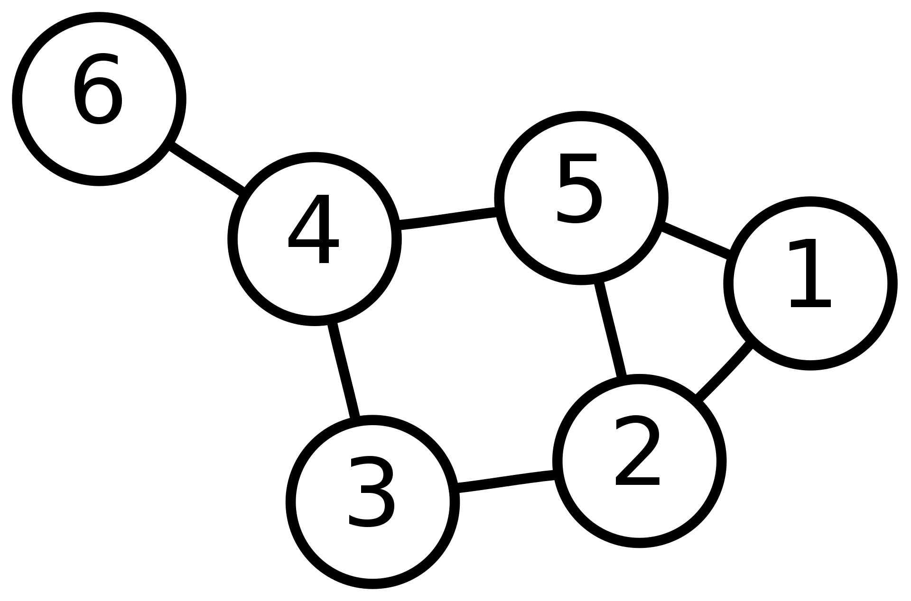

::: {.notes}

Fazer a distância entre 6 e 2 passando por 5 e por 3.
Depois fazer a distância entre 6 e 1 passando por 5 e por 3.

:::

---

# Outros tipos de grafos

---

# Grafos Mistos

Um grafo que possui arestas direcionadas e não direcionadas.

Exemplo:  Rede de sinalização com interações bidirecionais (e.g., feedback) e unidirecionais (e.g., fosforilação).

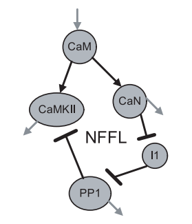

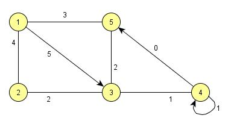

---

# Multigrafo

É um grafo onde dois vértices podem ser ligados por mais de uma aresta.

Exemplo:  Proteínas que interagem por diferentes domínios ou em diferentes condições.

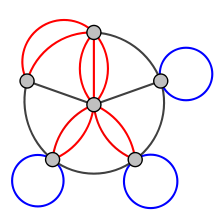

::: {.notes}

Nesse caso o pseudografo seria um grafo dirigido com pares de arestas paralelas dirigidas conectando cidades para mostrar que é possível voar para e a partir destas locações.

:::

---

# Grafo Valorado ou Ponderado

São grafos nos quais as arestas possuem valores associados dando peso a cada conexão/interação.

Exemplo:  Rede metabólica com fluxos (peso = taxa de produção) ou redes de coexpressão gênica (peso = correlação).

---

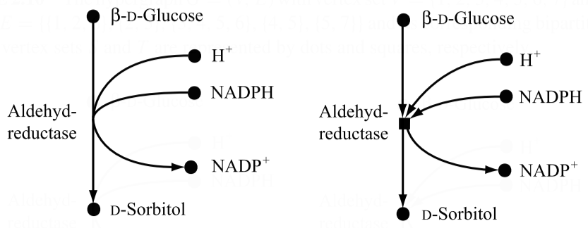

Aldeído-redutase

# Hipergrafo

No hipergrafo, uma única aresta pode ligar  mais de dois  vértices.

---

# Grafos Bipartidos

Os hipergrafos podem ser representados por grafos bipartidos. Grafos bipartidos são aqueles que podem ser divididos em dois subgrafos disjuntos. Exemplo:  Interação fármaco-proteína (conjunto A =  _fármacos_ , Conjunto B =  _proteínas-alvo_ ).

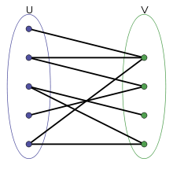

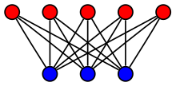

---

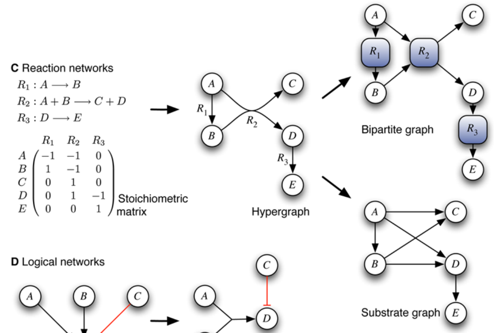

---

# Árvores

* Definição:   é um grafo sem ciclos e conectado.
* Exemplo:
  * R  elações evolutivas entre as espécies como uma árvore filogenética.
* V  értices de   grau 1: folhas.
* Todos os outros vértices são vértices internos.
* P  rofundidade  :   comprimento do caminho entre a raiz e este vértice
* Altura:   é a profundidade máxima de um vértice.
* Uma árvore binária é uma árvore onde cada vértice tem no máximo grau 3.

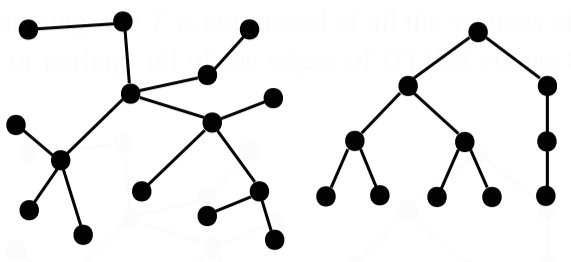

---

# Representações de grafos

---

# Matriz de adjacência

Quando o grafo é não-direcionado:  matriz de adjacência simétrica.

Quando o grafo é direcionado:  matriz de adjacência assimétrica.

---

# Lista de adjacência

= {1, 2, 5}

= {1, 3, 5}

= {2, 4)}

= {3, 5, 6}

= {1, 2, 4)}

= {4}

Quando o grafo é não-direcionado:  a lista repete as arestas para cada vértice.

Quando o grafo é direcionado:  a lista para cada vértice indica do vértice para onde a ligação vai.

