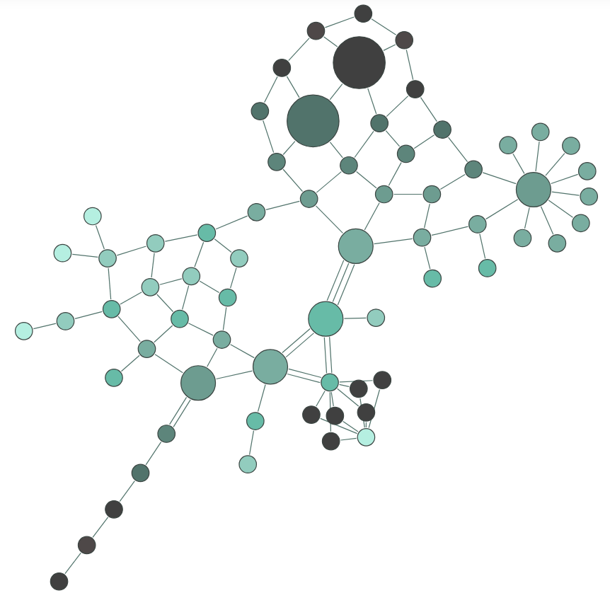
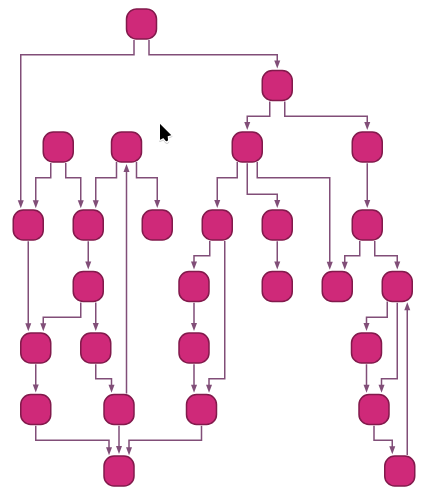
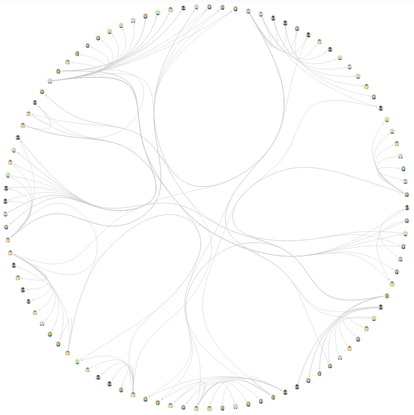
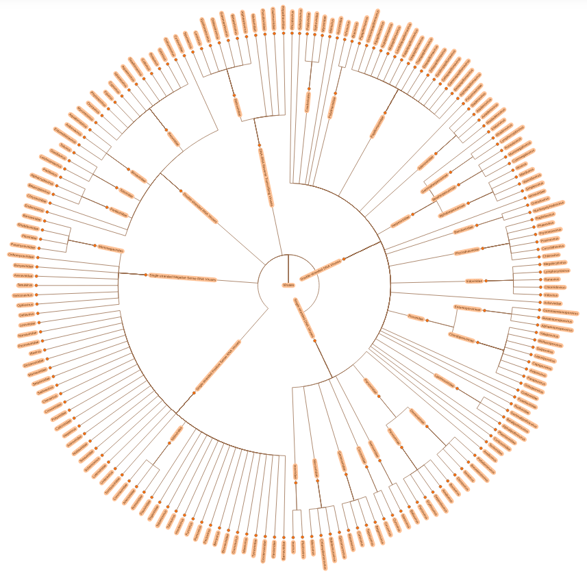

# Grafo *versus* Gráfico

::: {layout-ncol=2 layout-lcol=0.6}


:::

# Teoria de Grafos

{.r-stretch fig-align="center"}

<center>**É possível andar pela cidade atravessando cada ponte _exatamente uma vez_?**</center>

# Pontes de Kaliningrado


::: {.columns}

::: {.column}


:::

::: {.column}
**Leonhard Euler**

- Matemático e físico Suíço
- Tentou responder a questão sobre as pontes de Kaliningrado.
- Para tanto desenvolveu a **Teoria dos Grafos**.
:::

:::

# 

```{dot}
graph G {
    size="10,8"
    ratio=fill
    node [shape=circle, style=filled, fillcolor="#0066ff", fontcolor=white, width=0.8, height=0.8]
    edge [color=red, penwidth=2]

    A [label="A (Ilha)"]
    B [label="B (Margem Norte)"]
    C [label="C (Margem Sul)"]
    D [label="D (Margem Leste)"]

    A -- B [label="Ponte 1"]
    A -- B [label="Ponte 2"]
    A -- C [label="Ponte 3"]
    A -- C [label="Ponte 4"]
    A -- D [label="Ponte 5"]
    B -- C [label="Ponte 6"]
    B -- D [label="Ponte 7"]
}
```

# Grafo: Definição 1

Um grafo é uma representação matemática de um objeto consistindo de  vértices (nós) e  arestas representando elementos e conexões, respectivamente.


::: {.callout-note}
# O que é
V: Vértices (ex.: genes, proteínas, metabólitos).

E: Arestas (ex.: interações, reações químicas).
:::

# Grafo: Definição 2

$\text{G = (V,E)}$<br>

O grafo  $G$  é um  conjunto  formado por um conjunto de vértices $V$ e um conjunto de arestas $E$.


::: {.callout-note}
**Exemplo:**

- Grafo de Regulação Gênica

V = {GeneA, GeneB, GeneC}

E = {GeneA → GeneB, GeneB → GeneC}.
:::

# Grafo: Definição 2 expandida

$G = (V,E)$

O grafo $G$ é um conjunto formado por um conjunto de vértices $V = \{v_1,v_2,v_3,...,v_n\}$ e um conjunto de arestas $E = \{(v_1,v_2),(v_3,v_n),...,(v_x,v_z)\}$

# Definições: Vértices ou nós


::: {.columns}

::: {.column}
São os elementos do grafo. Os elementos podem significar qualquer coisa, ex:

- Pessoas

- Lugares

- Genes

- Animais

- Proteínas


:::

::: {.column}
::: {layout-nrow=2}


:::


:::

:::

::: {.callout-tip}
Sua representação gráfica pode ser um ponto ou um círculo que pode, ou não, conter algum símbolo interno.
:::

# Arestas{.smaller}


::: {.columns}

::: {.column}
* As arestas indicam  relações  entre os elementos. O significado da relação pode mudar dependendo dos elementos.
* Por isso as arestas podem ser:
* **Não-direcionadas**:  $(v_1,v_2) = (v_2,v_1)$, relações simétricas.
  * Quando a ligação não exibe precedência, somente relação.
  * Complexo proteico onde A interage com B e vice-versa.
* **Direcionadas**: $(v_1, v_2) ≠ (v_2,v_1)$
  * Quando a ligação entre os dados indica precedência ou ordem
    * causa e efeito;
    * antes ou depois;
    * substrato → produto.
    * GeneX ativa a expressão de GeneY $(GeneX \rightarrow GeneY)$.
:::

::: {.column}

::: {.callout}
- Relação sem precedência
  - Não-direcionadas

- Relação com precedência
  - Direcionadas


:::
:::
:::

# Grafos podem ser classificados de acordo com os tipos das suas arestas

- Grafos com **arestas direcionadas** são **grafos direcionados**.

- Grafos com **arestas não-direcionadas** são  **grafos não-direcionados**.

# Grafo: conectado e não-conectado


::: {.callout-important}
# Definição
Um grafo não-direcionado é conectado quando possui pelo menos um vértice e existe um caminho entre cada par de vértices.

Em um grafo conectado, não há vértices inacessíveis.
:::

- Um grafo não-direcionado que não está conectado é chamado desconectado.

- Um grafo não direcionado $G$ é, portanto, desconectado se existir dois vértices em $G$, de modo que nenhum caminho em $G$ tenha esses vértices como pontos finais.

- Um grafo com apenas um vértice está conectado.

- Um gráfico sem arestas entre dois ou mais vértices é desconectado.

# Grafo: conectado e não-conectado (cont.)

- **Conectado**: Todos os vértices estão ligados (ex.: rede metabólica essencial).

- **Desconectado**: Componentes isolados (ex.: vias metabólicas independentes).


::: {.callout}
# Exemplo
Rede de Coexpressão Gênica:  Se desconectada, indica grupos de genes com funções distintas.
:::

# Adjacência entre vértices


::: {.callout}
# Definição
Se os vértices compartilham da mesma aresta então eles são adjacentes entre si.


::: {.callout-important}
# Exemplo
Exemplo: Proteína A e B são adjacentes se interagem.
:::
:::

# Grau

::: {.callout}
# Definição
O grau de um vértice é o número de arestas que incidem nele.

Para o grafo direcionado, o grau do vértice pode ser dividido em grau de entrada e grau de saída.
:::

{.r-stretch fig-align="center"}


# Laço

Quando uma aresta começa e termina em um mesmo vértice ela é chamada de laço (loop)


::: {.callout}
# Exemplo
Autofosforilação de uma quinase (ex.: receptor EGFR).
:::

```{dot}
graph G {
    // Define o layout circular simétrico
    layout=circo
    size="10,8"
    ratio=fill
    
    // Ajuste da fonte proporcional ao nó de 2.0 polegadas
    node [
        shape=circle, 
        style=filled, 
        fillcolor="#0066ff", 
        fontcolor=white, 
        width=2.0, 
        height=2.0, 
        fixedsize=true, 
        fontsize=72
    ]
    
    edge [color=black, penwidth=6]

    A [label="1"]
    B [label="2"]
    C [label="3"]
    D [label="4"]
    E [label="5"]
    F [label="6"]

    // Aresta do laço expandida (len aumenta a distância/arco)
    A:s -- A:e [color=red]
    
    A -- B
    A -- C
    B -- C
    B -- D
    D -- E
    C -- E
    E -- F
}
```
<!-- 
{.r-stretch fig-align="center"} -->


# Layout

**Layout é um mapeamento dos vértices e arestas de um grafo $G=(V,E)$ em posições geométricas (coordenadas), seguindo regras que podem:**

- Minimizar cruzamentos de arestas.
- Destacar hierarquias ou comunidades.
- Facilitar a identificação de padrões.


::: {.callout-warning}
# Atenção
Disposição visual dos vértices (nós) e arestas (conexões) no espaço (geralmente em 2D ou 3D) para representar a estrutura do grafo de forma clara e interpretável. O layout não altera a estrutura matemática do grafo, mas influencia diretamente a compreensão humana das relações entre os elementos.

:::

# Layout


::: {.callout-note}
# Por que o Layout é Importante?

- **Clareza**:  Evita sobreposição de arestas (ex.: em redes densas como interações proteicas).

- **Análise**:  Layouts específicos revelam propriedades (ex.: hubs em redes livres de escala).

- **Comunicação**:  Facilita a apresentação de dados complexos em artigos ou relatórios.
:::

# Layout (cont.)

| Tipo de Layout | Características | Aplicação em Biotecnologia |
| :-: | :-: | :-: |
| Force-Directed | Arestas como molas, vértices se repelem | Redes de coexpressão gênica (identifica módulos funcionais). |
| Hierárquico | Vértices em camadas (top-down) | Cascatas de sinalização celular (ex.: via MAPK). |
| Circular | Vértices em um círculo | Interações proteína-DNA para destacar elementos centrais. |
| Radial | Vértices dispostos em anéis concêntricos | Árvores filogenéticas (evolução de patógenos). |

# Layout (cont.)

::: {.panel-tabset}
### Force-Directed e Hierárquico
:::{layout-ncol="2"}



:::
### Circular e Radial
:::{layout-ncol="2"}



:::
:::

<!-- {width="100%" height="800px" style="object-fit: contain;"} -->

::: aside
[yfiles: simulação de redes](https://www.yfiles.com/demos/showcase/layoutstyles/index.html)
:::

::: {.notes}
Ferramentas para Layout de Grafos

    Cytoscape: Oferece algoritmos como Prefuse Force-Directed para redes biológicas.

    Gephi: Usa Force Atlas 2 para layouts dinâmicos.

    Python (NetworkX + Matplotlib): Permite customização via spring_layout ou circular_layout.

Dica: Em biotecnologia, escolha o layout com base no objetivo:

    Se quer identificar comunidades, use force-directed.

    Se quer mostrar fluxos, use hierárquico.
:::


# Subgrafo

$G’ = (V’, E’)$ onde $V’$ é um subconjunto de $V$ e $E’$ é um subconjunto de $E$.

Isso implica que E’ só possui arestas que começam e terminam em vértices que estão em V’.


# Subgrafo Induzido

Se G’  é um subgrafo de G e E’ possui todas as arestas de E que ligam os vértices de V’, então esse subgrafo é chamado de grafo induzido.

{.r-stretch fig-align="center"}

::: {.callout-important}
- $E’={1,2; 5,6; 5,7}$

- $E’={1,2; 1,7; 5,5; 5,6; 5,7}$
:::

# Isomorfismo

Dois grafos $G_1=(V_1,E_1)$ e $G_2=(V_2,E_2)$ são isomorfos se existir uma bijeção (mapeamento um-para-um) entre seus vértices que preserve as adjacências.


::: {.callout}
# Ou seja:

Cada vértice em G1​ tem um correspondente único em G2.

Duas arestas são conectadas em G1​ se e somente se suas correspondentes em G2 também estiverem conectadas.

Em outras palavras: Os grafos têm a mesma "forma" ou topologia, mas podem diferir nos rótulos dos vértices/arestas.
:::

# Por que Isomorfismo é Importante na Biologia?

- **Homologia Estrutural**:  Identifica padrões conservados na evolução (ex.: redes de interação proteica em eucariotos vs. bactérias).

- **Engenharia Metabólica**:  Redes isomorfas em microrganismos podem ser "copiadas" para organismos-modelo.

- **Descoberta de Drogas**:  Alvos farmacológicos em uma espécie podem ser inferidos a partir de redes isomorfas em outras.

# Passeio & Caminho & Trilha

# Passeio - *Walk*

Um  passeio  de distância  _k_  em um grafo é uma sequência alternante de vértices e arestas v0, e0, v1, e1, v2, e2, … , vk-1, ek-1, vk, que começa e termina em vértices.

# Passeio - Walk (cont.)

Um passeio (_walk_) de comprimento $k$ em um grafo é uma sequência alternada de vértices e arestas:

$v_0, e_0, v_1, v_2, \ldots, v_{k-1}, e_{k-1}, v_k$

**onde:**

- Cada aresta $e_i$ conecta os vértices  $v_i$ e $v_{i+1}$.

- Vértices e arestas podem se repetir.

- Começa e termina em vértices

# Tipos de Passeio

* Trilha (_Trail_): Passeio sem arestas repetidas (vértices podem repetir).
  * Exemplo: $A, e_1, B, e_2, C, e_3, A, e_4, D$ (usa cada aresta apenas uma vez).
* Caminho (_Path_): Passeio sem vértices repetidos (_e, portanto, sem arestas repetidas_).
  * Exemplo:  $A, e_1, B, e_2, C$ (_vértices distintos_).
* Ciclo ( _Cycle_ ): Passeio fechado (v0=vk​) sem repetir arestas e com vértices distintos (_exceto o primeiro/último_).
  * Exemplo:  $A, e_1, B, e_2, C, e_3, A$.
  * Exemplo: Ciclo de Krebs (rede metabólica circular).

# Caminhos especiais

# Caminho simples

Sequência de vértices conectados por arestas, sem repetição de vértices ou arestas.


::: {.callout}
# Exemplo
Em uma rede metabólica, um caminho simples pode representar uma rota linear de reações enzimáticas (e.g., Glicose $\rightarrow$ Glicose-6-F $\rightarrow$ Frutose-6-F).
:::

# Caminho Euleriano

Caminho que passa por **todas as arestas** do grafo exatamente uma vez.

::: {.callout}
# Exemplo
 Modelar a trajetória de um metabólito que percorre todas as reações de uma via sem repetições (raro em redes biológicas devido a ciclos).
:::

# Caminho Hamiltoniano

Caminho que visita todos os vértices exatamente uma vez.


::: {.callout}
# Exemplo
Identificar uma ordem de ativação de proteínas em uma cascata de sinalização (e.g., Receptor → Kinase A → Kinase B → TF).
:::


# Comprimento

É dado pelo número de arestas  _atravessadas_  de um vértice inicial a um vértice final.


::: {.callout-important}
# Definição
A distância entre dois vértices é o comprimento do  menor caminho  entre eles ou ∞ se não existir um menor caminho.
:::

# Menor caminho

É um caminho de tamanho mínimo entre dois vértices.

Podem existir vários menores caminhos (obviamente todos do mesmo tamamnho) entre dois vértices (passando por diferentes vértices).

{.r-stretch fig-align="center"}

::: {.notes}

Fazer a distância entre 6 e 2 passando por 5 e por 3.
Depois fazer a distância entre 6 e 1 passando por 5 e por 3.

:::

# Outros tipos de grafos

# Grafos Mistos

Um grafo que possui arestas direcionadas e não direcionadas.


::: {.callout-note}
# Exemplo:
Rede de sinalização com interações bidirecionais (e.g., feedback) e unidirecionais (e.g., fosforilação).
:::

::: {layout-ncol=2}
{.r-stretch fig-align="center"}

{.r-stretch fig-align="center"}
:::

# Multigrafo

É um grafo onde dois vértices podem ser ligados por mais de uma aresta.

::: {.callout-note}
# Exemplo:
Proteínas que interagem por diferentes domínios ou em diferentes condições.
:::


{.r-stretch fig-align="center"}

::: {.notes}

Nesse caso o pseudografo seria um grafo dirigido com pares de arestas paralelas dirigidas conectando cidades para mostrar que é possível voar para e a partir destas locações.

:::

# Grafo Valorado ou Ponderado

São grafos nos quais as arestas possuem valores associados dando peso a cada conexão/interação.


:::{.callout-note}
# Exemplo:
Rede metabólica com fluxos (peso = taxa de produção) ou redes de coexpressão gênica (peso = correlação).
:::

{.r-stretch fig-align="center"}


# Hipergrafo

No hipergrafo, uma única aresta pode ligar mais de dois vértices.

{.r-stretch fig-align="center"}

# Grafos Bipartidos

Os hipergrafos podem ser representados por grafos bipartidos. Grafos bipartidos são aqueles que podem ser divididos em dois subgrafos disjuntos. Exemplo:  Interação fármaco-proteína (conjunto A =  _fármacos_ , Conjunto B =  _proteínas-alvo_ ).

:::{layout-ncol="2"}
{.r-stretch fig-align="center"}

{.r-stretch fig-align="center"}
:::

# Árvores


::: {.columns}

::: {.column}
{.r-stretch fig-align="center"}
:::

::: {.column}
* **Definição**: é um grafo sem ciclos e conectado.
* Exemplo:
  * Relações evolutivas entre as espécies como uma árvore filogenética.
* Vértices de grau 1: **folhas**.
* Todos os outros vértices são vértices internos.
* Profundidade:   comprimento do caminho entre a raiz e este vértice
* **Altura**: é a profundidade máxima de um vértice.
* Uma árvore binária é uma árvore onde cada vértice tem no máximo grau 3.
:::
:::

# Representações de grafos

# Matriz de adjacência


::: {.columns}

::: {.column}
{width="100%" height="600px" style="object-fit: contain;"}


:::

::: {.column}
{width="100%" height="600px" style="object-fit: contain;"}


:::

:::


::: {.callout-note}

- Quando o grafo é não-direcionado:  matriz de adjacência simétrica.

- Quando o grafo é direcionado:  matriz de adjacência assimétrica.

:::

# Lista de adjacência

::: {.columns}
::: {.column}
= {1, 2, 5}<br>
= {1, 3, 5}<br>
= {2, 4}<br>
= {3, 5, 6}<br>
= {1, 2, 4}<br>
= {4}<br>
:::
::: {.column}
{width="100%" height="500px" style="object-fit: contain;"}
:::
:::


::: {.callout}
- Quando o grafo é não-direcionado:  a lista repete as arestas para cada vértice.

- Quando o grafo é direcionado:  a lista para cada vértice indica do vértice para onde a ligação vai.
:::