# O que são redes?

# Redes

* Redes são estruturas ou entidades que conotam a relação entre:
  * Objetos
  * Indivíduos
  * Entidades.
* Os indivíduos são representados por nós/vértices.
* As relações são representadas por arestas.

# Redes: alguns tipos


::: {.columns}

::: {.column}
- Redes sociais
- Redes de computadores
- Redes neurais
- **Redes biológicas**
- Redes de telecomunicações
:::

::: {.column}
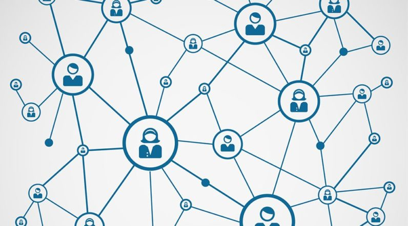
:::

:::

# O que são redes biológicas?<br>Algum exemplo?

# Rede de predação: Carnaúba por inseto

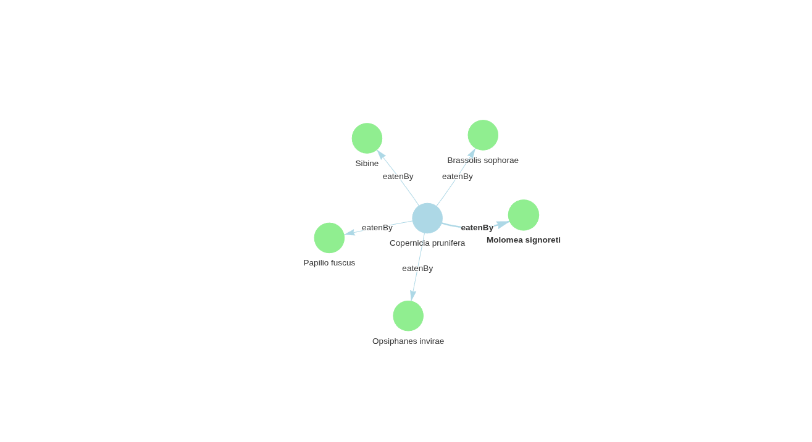{.r-stretch fig-align="center"}

# Redes Biológicas

::: {.callout-note}
# **Formalmente**

São redes em que os elementos são [**dados biológicos**](color="blue"). São abstrações computacionais/matemáticas baseadas em dados experimentais.
:::

# Redes biológicas

::: {.callout-note}
# E quais são os dados biológicos?

- São dados sobre animais, plantas, microorganismos, genes, proteínas, regulações…

- …que tenham alguma relação entre si.
:::

# Redes biológicas (cont.)

Dependendo do tipo de dado e das relações podemos ter diferentes tipos de redes biológicas.

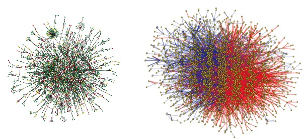{.r-stretch fig-align="center"}

( [Jeong et al. Nature 2001. 411](https://www.ebi.ac.uk/training/online/course/network-analysis-protein-interaction-data-introduction/references) and [Rual et al. Nature 2005. 437](https://www.ebi.ac.uk/training/online/course/network-analysis-protein-interaction-data-introduction/references).

# Redes Metabólicas


::: {.columns}

::: {.column}
**É o conjunto completo de processos metabólicos:**

- Podemos ter como nós os substratos e produtos;
- E as arestas como as reações metabólicas convertendo um composto em outro.
:::

::: {.column}
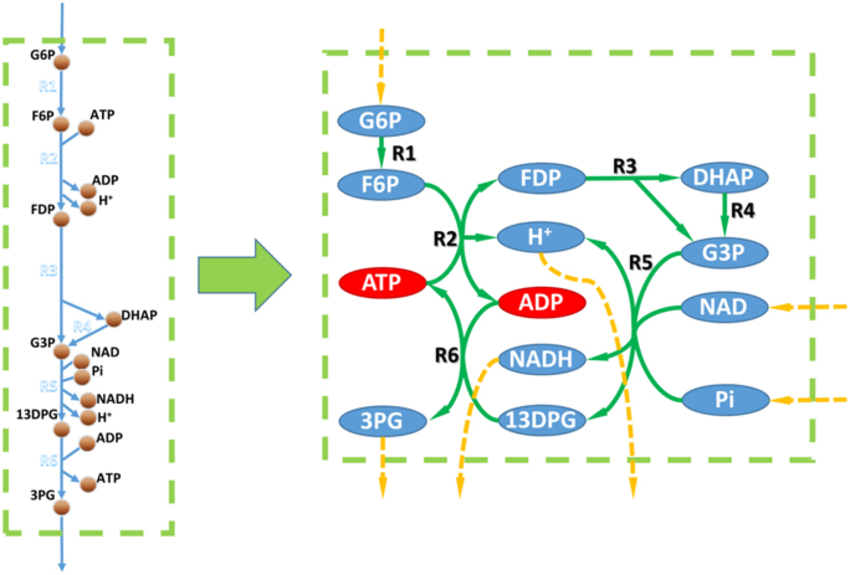{.r-stretch fig-align="center"}


[Zhang, Cheng & Hua, Qiang. (2015). Applications of Genome-Scale Metabolic Models in Biotechnology and Systems Medicine. Frontiers in Physiology. 6. 10.3389/fphys.2015.00413.]{style="font-size: 0.5em;"}
:::

:::

# Redes de co-expressão

* Relação entre transcritos que são expressos ou reprimidos concomitantemente.


::: {.columns}

::: {.column}
::: {.callout-note}
# Genes co-expressos podem:
  * Ser regulados pelo mesmo fator de transcrição;
  * Estarem funcionalmente relacionados;
  * Serem membros da mesma via;
  * Codificar proteínas do mesmo complexo proteico.
:::
::: {style="text-align: right;font-size: 0.5em;"}
Human gene co-expression landscape: confident network derived from tissue transcriptomic profiles. Carlos PRIETO, Alberto RISUENO, Celia FONTANILLO and Javier DE LAS RIVAS.
:::
:::

::: {.column}
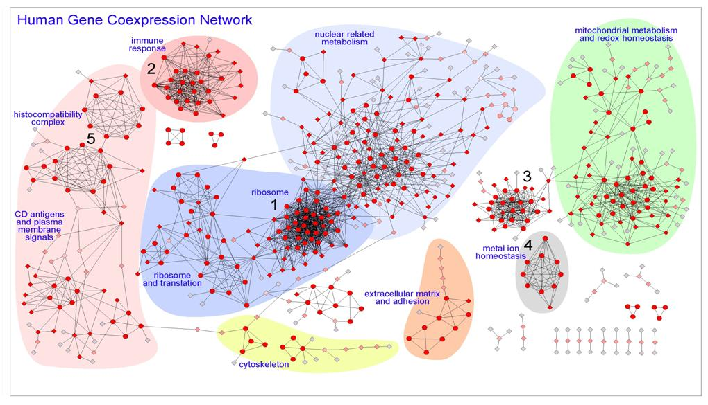{style="width: 100%; height: auto; object-fit: contain;"}
:::
:::

# Redes de interação proteína-proteína

- As proteínas interagem entre si para desempenhar suas funções celulares
- Proteínas interagem formando complexos ou participando de vias comuns.
- Interação entre proteínas podem significar a formação de um  complexo proteico  ou  proteínas que funcionam no mesmo processo celular.

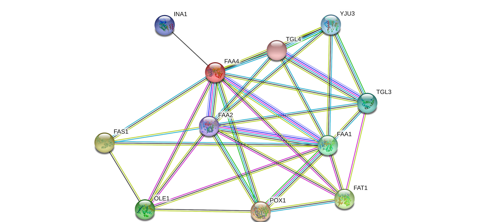{.r-stretch fig-align="center"}

# Propriedades globais de redes complexas

# Distância - Relembrando

A distância entre dois vértices em um grafo é o número de arestas em um  caminho mais curto  ( _shortest path_ ) conectando-os.

{.r-stretch fig-align="center"}


# Shortest Path - O caminho mais curto - Relembrando

Dos caminhos possíveis de serem caminhados entre um vértice e outro, o menor caminho é aquele com o menor número de vértices ou arestas atravessados da origem ao destino.

{.r-stretch fig-align="center"}

# Diâmetro

* É a maior distância entre qualquer par de vértices.
  * Para encontrar o diâmetro de um grafo, primeiro encontre o caminho mais curto entre cada par de vértices. O maior comprimento de qualquer desses caminhos é o diâmetro do grafo.

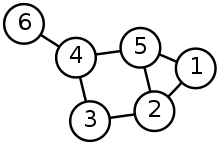{.r-stretch fig-align="center"}

# Weight factor - Peso

Pesos são atributos ou valores que podem ser atribuídos as arestas de um grafo.

Quando o grafo possui arestas com pesos, o grafo é chamado de  grafo valorado ou ponderado .

:::callout
Alguém consegue dar um exemplo de possíveis valores que podem ser atribuídos a arestas em redes biológicas?

- Fluxo
- Massa
- Probabilidade
:::

{.r-stretch fig-align="center"}

# Weight factor - Peso (cont.)

Pesos são atributos ou valores que podem ser atribuídos as arestas de um grafo.

Quando o grafo possui arestas com pesos, o grafo é chamado de  grafo valorado ou ponderado .

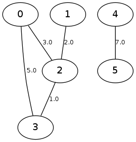{.r-stretch fig-align="center"}

# Centralidades

Indicadores de centralidade identificam os vértices mais importantes dentro de um grafo.

As mais importantes para nós são:

- Centralidade de Grau (_Degree centrality_)
- Centralidade de Proximidade (_Closeness centrality_)
- Centralidade de Intermediação (_Betweenness centrality_)
- Centralidade de Autovetor (_Eigenvector_)
- Centralidade de Alavancagem (_Leverage Centrality_)
- Centralidade de Difusão (_Diffusion Centrality/Katz Centrality_)
- Centralidade de Intermediação de Fluxo (_Flow Betweenness Centrality_)

# Centralidade de grau

É definida como o número de arestas adjacentes a um vértice, ou seja, o número de arestas que um vértice possui.

# Centralidade de grau (cont.)

Grau (*Degree*): Número absoluto de conexões.

Centralidade de Grau Normalizada: O grau absoluto dividido pelo número máximo de conexões possíveis (que é $n-1$, onde $n$ é o número total de nós na rede). Isso permite comparar nós de redes de tamanhos diferentes, resultando em um valor entre 0 e 1.

# Centralidade de grau (cont.)

* É definida como o número de arestas adjacentes a um vértice, ou seja, o número de arestas que um vértice possui.
* Rede direcionada, onde as relações têm direção, definimos:
  * Centralidade de grau de entrada
  * Centralidade de grau de saída.

# Centralidade de grau (cont.)

**Interpretação**: Um nó com alta centralidade de grau é um *conector* ou um *hub* da rede. Ele tem interação direta com muitos outros elementos. Na biologia, isso frequentemente indica um elemento funcionalmente crucial – se ele for perturbado, o impacto na rede (e, por consequência, no sistema biológico) tende a ser grande.

# Centralidades de proximidade - Closeness centrality

A  Centralidade de Proximidade  é uma medida de centralidade em teoria de redes que quantifica quão próximo um nó está de todos os outros nós na rede.

Diferente da centralidade de grau (que conta conexões diretas), a de proximidade leva em conta a distância geodésica (o caminho mais curto) para alcançar todos os outros nós.

# Centralidades de proximidade - Closeness centrality (cont.)

Um nó com alta centralidade de proximidade pode alcançar todos os outros nós da rede com poucos  _passos_  (intermediários).

Ele está no  _centro_  da rede no sentido de eficiência de comunicação ou disseminação de informação.

# Centralidades de proximidade - Closeness centrality (cont.)


::: {.callout-note}
# Exemplo

A alta centralidade de proximidade do α-KG indica que ele é um ponto de confluência estratégico ou um "grande terminal de ônibus" do metabolismo celular. Muitos caminhos (rotas metabólicas) passam por ele.
:::

Modificar a disponibilidade deste metabólito (por exemplo, superexpressando a enzima que o produz ou _knockdown_ de uma enzima que o consome para outras vias) pode ter um impacto amplo e eficiente em redirecionar o fluxo de carbono de várias fontes diferentes em direção à via sintética de interesse.

# Centralidades de proximidade - Closeness centrality (cont.)

* Nó 1:
  * $1→2: 1$
  * $1→3: 2$
  * $1→4: 2$
  * $1→5: 2$
  * $1→6: 3$
  * $1→7: 1$
  * Média: 1,83

# Centralidades de intermediação


::: {.columns}

::: {.column}
{style="width: 100%; height: auto; object-fit: contain;"}
:::

::: {.column}
A centralidade de intermediação quantifica o número de vezes que um vértice age como uma ponte ao longo do caminho mais curto entre dois outros nós.

**TRADUZINDO**: A medida de centralidade de intermediação diz quantas vezes um vértice $i$ faz parte dos menores caminhos entre os outros vértices do grafo.
:::

:::

# Centralidades de intermediação (cont.)


::: {.columns}

::: {.column}
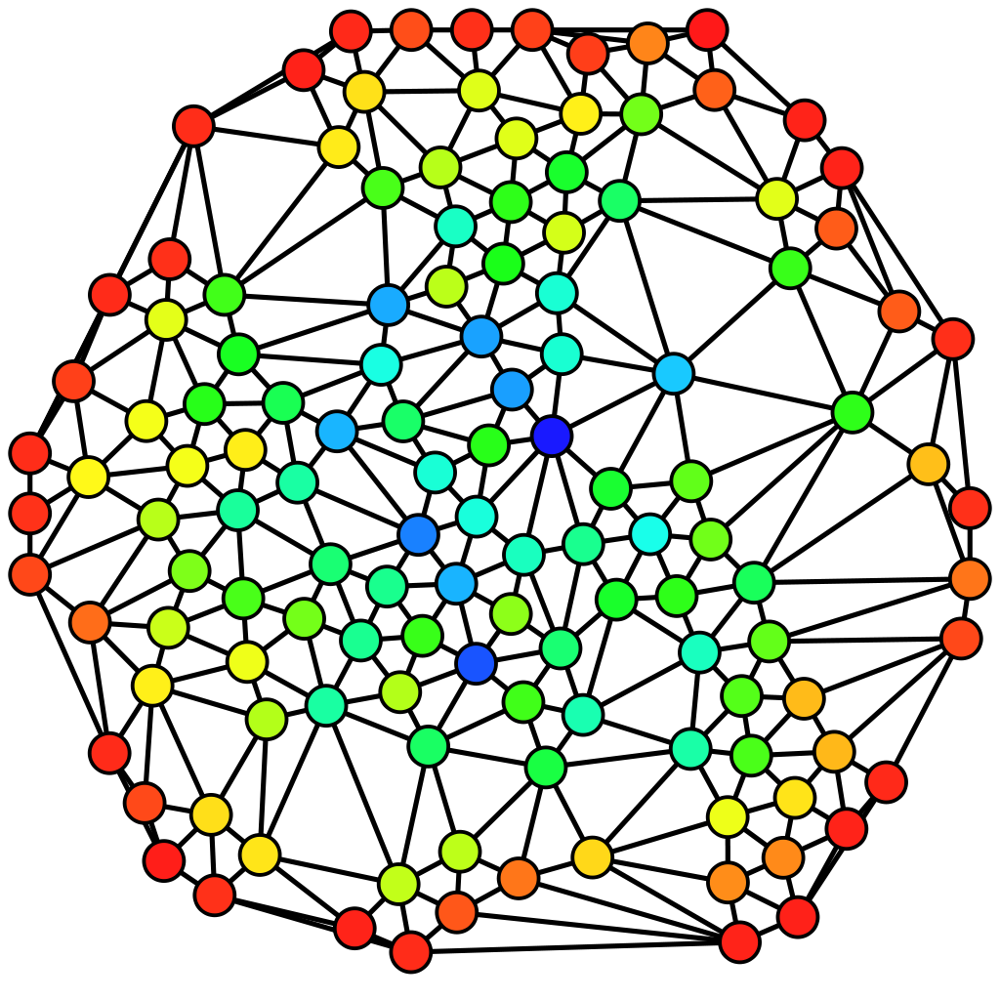{style="width: 100%; height: auto; object-fit: contain;"}
:::

::: {.column}
Um nó com alta centralidade de intermediação tem um poder de controle desproporcional sobre o fluxo de informação, recursos ou influência na rede.

Se esse nó for removido, a rede pode se fragmentar, e a comunicação entre diferentes grupos se tornará muito menos eficiente ou até impossível.
:::

:::

# Centralidades de intermediação (cont.)

* **TRADUZINDO**: A medida de centralidade de intermediação diz quantas vezes um vértice $x$ faz parte dos menores caminhos entre os outros vértices do grafo.
  * Calculando para o vértice  2:
    * $1 → 3: 2; 1 → 4: 1; 1 → 5: 0$
    * $3 → 1: 2; 3 → 4: 2; 3 → 5: 3$
    * $4 → 1: 2; 4 → 3: 2; 4 → 5: 0$
    * $5 → 1: 0; 5 → 4:0; 5 → 3: 4$
    * Somando: 18


# Centralidade Autovetor (Eigenvector)

- **Definição**: A Centralidade de Autovetor mede a influência de um nó na rede, levando em conta não apenas o número de suas conexões (grau), mas também a importância dos nós aos quais ele está conectado. Um nó é importante se estiver conectado a muitos outros nós importantes.

- **Aplicação**: É perfeita para identificar genes mestres ou proteínas-chave em redes de regulação. Por exemplo, um fator de transcrição que regula outros fatores de transcrição importantes terá uma centralidade de autovetor muito alta, indicando seu papel central na hierarquia de controle da rede.


::: {.callout-note}
# **Exemplo**
Identificar os _pontos de controle mestres_ em uma rede de regulação gênica de uma planta para aumentar a produção de um metabólito secundário de interesse (ex.: um corante natural). Manipular um nó com alta centralidade de autovetor pode causar um efeito cascata desejado em toda a rede regulatória.
:::

# Centralidade Alavancagem (Leverage Centrality)

- **Definição**: Essa medida compara a conexão de um nó com a de seus vizinhos. Especificamente, ela calcula a diferença entre o grau de um nó e o grau médio de todos os seus vizinhos, normalizada pela soma dos graus. Nós com alta alavancagem são aqueles que estão conectados a nós que têm, em média, muito menos conexões do que eles mesmos.

- **Aplicação**: Excelente para identificar nós periféricos críticos ou "conectores de periferia". São frequentemente genes ou proteínas especializadas que atuam como uma interface crucial entre um módulo altamente conectado (um complexo proteico, por exemplo) e o resto da rede.

::: {.callout-note}
# **Exemplo**
Em uma rede de interação proteína-proteína de um patógeno, um nó com alta alavancagem pode ser uma proteína de membrana que é essencial para a virulência, mas que não é um hub central. Ela poderia ser um ótimo alvo para uma vacina ou anticorpo monoclonal, pois sua inibição pode isolar um módulo funcional crítico sem perturbar drasticamente todo o sistema.
:::

# Centralidade de Difusão (Diffusion Centrality / Katz Centrality)

- **Definição**: Uma generalização da centralidade de autovetor que leva em conta não apenas as conexões diretas e de vizinhos imediatos, mas todos os caminhos na rede, atribuindo um peso maior aos caminhos mais curtos. A Centralidade de Katz soma o número de caminhos de todos os comprimentos que emanam de um nó, penalizando caminhos mais longos.

- **Aplicação**: Útil para modelar processos de sinalização ou difusão de metabólitos, onde a informação ou molécula pode percorrer múltiplos caminhos de diferentes comprimentos. Captura a noção de influência de longo alcance.


::: {.callout-note}
# **Exemplo**
Modelar como um sinal hormonal (ex.: auxina em plantas) se espalha por uma rede de tecidos para iniciar um processo de crescimento. Identificar os nós com maior centralidade de difusão pode ajudar a prever quais células ou genes responderão mais fortemente ao sinal, permitindo o desenho de estratégias para modular esse processo.
:::

# Centralidade de Intermediação de Fluxo (Flow Betweenness Centrality)

- **Definição**: Uma variação da betweenness clássica. Em vez de contar apenas os caminhos mais curtos, ela considera todos os caminhos possíveis entre os nós, assumindo que o fluxo na rede (de informação, metabólitos) se dá como em uma rede de encanamentos, não apenas pelos caminhos mais curtos. Ela mede a fração do fluxo total que passa por um nó.

- **Aplicação**: Extremamente poderosa para analisar redes metabólicas. O fluxo de carbono através de uma rede metabólica raramente segue apenas um caminho único e mais curto; ele se distribui por múltiplas rotas.


::: {.callout-note}
# **Exemplo**
Ao tentar redirecionar o fluxo metabólico em uma bactéria para maximizar a produção de um bioplástico (ex.: PHA), calcular a centralidade de intermediação de fluxo pode identificar quais enzimas são gargalos reais que controlam a maior parte do fluxo de carbono em direção ao produto desejado, mesmo que não estejam no caminho mais curto. Essas enzimas são os alvos prioritários para a engenharia metabólica.
:::

# Centralidade: Resumo

| Centralidade | Melhor para... | Exemplo de Aplicação Biotecnológica |
| :-: | :-: | :-: |
| Grau | Identificar hubs conectados. | Alvo antibiótico (inibir uma proteína essencial muito conectada). |
| Proximidade | Identificar nós de comunicação rápida. | Otimização de vias metabólicas sintéticas. |
| Intermediação | Identificar gargalos e pontes. | Descobrir alvos terapêuticos que desconectam vias de doença. |
| Autovetor | Identificar influência hierárquica. | Engenharia de redes de regulação gênica. |
| Alavancagem | Identificadores especializados críticos. | Desenvolvimento de vacinas (proteínas de membrana de patógenos). |
| Difusão (Katz) | Modelar sinalização de longo alcance. | Prever resposta a hormônios ou fármacos. |
| Intermediação de Fluxo | Analisar redes de fluxo (metabolismo). | Superar gargalos em produção de bioproductos. |

# Simulador de Centralidades

<iframe src="v2-simulador_centralidades.html" width="100%" height="900px" style="object-fit: contain;">
</iframe>

# Características de Redes Biológicas

## Seis graus de separação

- _Seis graus de separação:_ a ideia de que todas as pessoas têm seis ou menos conexões sociais separando-as uma das outras.
- Se fizermos uma cadeia de “_amigo de um amigo_” poderíamos conectar duas pessoas em um máximo de seis passos.
- Foi originalmente estabelecido por Frigyes Karinthy em 1929.

## Seis graus de separação - redes

A ideia dos _seis graus de separação_ pode ser aplicada para várias _redes biológicas_.

Em uma rede biológica, a comunicação ou a separação entre um vértice e outro é, em média, muito baixo.

## Mundo Pequeno - Redes

Uma rede de mundo pequeno é um tipo de grafo no qual a maioria dos vértices não são vizinhos uns dos outros,  MAS  os vizinhos de qualquer  vértices  são vizinhos entre si e a maioria dos vértices pode ser alcançada por todos os outros vértices por um pequeno número de passos.


::: {.callout-note}
# Implica que...

todos os vértices de uma rede biológica são facilmente alcançados por outros vértices, assim qualquer perturbação ou sinal em um ponto da rede é rapidamente percebido pelo restante da rede.
:::

# Rede livre de escala


::: {.columns}

::: {.column}
- São redes complexas cujo grau de distribuição segue uma lei de potência, em que a maioria dos vértices tem poucas ligações, contrastando com a existência de alguns  vértices  que apresentam um elevado número de ligações.

- Nelas a probabilidade de um  vértice  se ligar a outro  vértice novo  é diretamente proporcional ao seu grau.

- Nestas redes a probabilidade de um nó ter k ligações decai quando k aumenta, segundo a lei de potência.
:::

::: {.column}
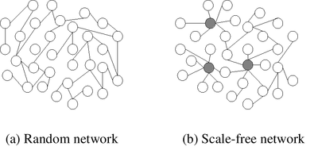{style="width: 100%; height: auto; object-fit: contain;"}

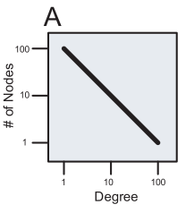{style="width: 100%; height: auto; object-fit: contain;"}
:::

:::

# Rede livre de escala (cont.)

Os  vértices com alto grau são raros e chamados de  hubs.

Estas redes são por norma mais resistentes a falhas acidentais mas mais vulneráveis a ataques direcionados .

Alguém sabe dizer porque?

{style="width: 100%; height: auto; object-fit: contain;"}

# Coeficiente de Agrupamento

- O coeficiente de agrupamento, _clustering coefficient_, mede o quanto os vértices de um grafo tendem a agrupar-se.
- A maioria das redes reais tendem a criar grupos coesos caracterizados por uma alta densidade de laços.
- **Transitividade**: Se x se relaciona com y e y se relaciona com z, é provável que x e z também se relacionem.
- O agrupamento é uma propriedade muito comum nas redes sociais; círculos de amigos.
- Se os dados são biológicos, o que isso pode significar?

# Robustez e adaptabilidade de sistemas biológicos

**Robustez**

É a capacidade de manter uma função ou característica independente das perturbações do meio.

**Adaptabilidade**

Capacidade de fazer mudanças no sistema em resposta a perturbações do meio.

# Motivos de redes

::: {.columns}

::: {.column}
- Motivos em redes são definidos como padrões ou sub-grafos recorrentes e estatisticamente significativos dentro de uma rede.
- Cada um desses sub-grafos, definidos por um padrão particular de interações entre os vértices, pode refletir uma estrutura na qual determinadas funções são alcançadas com eficiência.
- Sua importância reside em serem blocos de construção evolutivamente conservados que compõem redes maiores, conferindo-lhes funções específicas e robustez. A identificação de motivos ajuda a prever o comportamento do sistema a partir de sua estrutura de conectividade local.
:::

::: {.column}
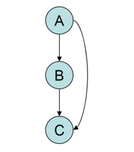{style="width: 100%; height: 800px; object-fit: contain;"}
:::

:::

::: {.notes}

Motifs are subgraphs of complex networks that occur significantly more frequently in the given network than expected by chance alone [29]. Consequently, the basic steps of motif analyses are (i) estimating the frequencies of each subgraph in the observed network, (ii) grouping them into subgraph classes consisting of isomorphic subgraphs (topologically equivalent motifs) and (iii) determining which subgraph classes are displayed at much higher frequencies than in their random counterparts (under a specified random graph model).


:::

# Motivos de redes (cont.){.smaller}

::: {.columns}

::: {.column}
* *Feedback Loop* (Laço de Retroalimentação)
* Estrutura:  Um nó regula outro, que eventualmente regula o primeiro, formando um ciclo. Pode ser positivo $(→)$ ou negativo $(⊣)$.
* **Função**:
  * **Positivo**: Cria estados estáveis irreversíveis (ex.: diferenciação celular).
  * **Negativo**: Gera oscilações ou mantém homeostase.


::: {.callout-note}
# Exemplo Biológico
O ciclo de divisão celular é controlado por um oscilador baseado em um loop de feedback negativo envolvendo as ciclinas e quinases dependentes de ciclina (CDKs).
:::
:::

::: {.column}
```{dot}
digraph G {
    size="10,8"
    ratio=fill
    rankdir=TB
    
    // Força os nós a ficarem na mesma coluna e centralizados
    node [shape=circle, style=filled, fillcolor="#7e0fb1", fontcolor=white, width=0.8, height=0.8]
    edge [color="#7e0fb1", penwidth=2]

    // O atributo group="1" força o alinhamento na mesma linha vertical
    A [label="A", group="1"]
    B [label="B", group="1"]
    B [label="B", group="2"]
    C [label="C", group="2"]

    // Conexões diretas da coluna
    A -> B
    B -> C
    
    // A seta de A para C agora fará uma curva para não quebrar o alinhamento
    A -> C
}
```
:::

:::

# Motivos de redes (cont.)

::: {.columns}

::: {.column}
Single Input Module ( SIM - Módulo de Entrada Única )

Estrutura:  Um único nó regulador controla múltiplos nós alvo, sem que haja regulação entre os alvos.

Função:  Coordena a expressão sincronizada de um grupo de genes que atuam em uma mesma via biológica.

Exemplo:  Um operon em bactérias, onde um único fator de transcrição controla vários genes envolvidos em uma única via metabólica (ex.: operon lac).
:::

::: {.column}
```{dot}
graph G {
    size="10,8"
    ratio=fill
    node [shape=circle, style=filled, fillcolor="#0066ff", fontcolor=white, width=0.8, height=0.8]
    edge [color=red, penwidth=2]

    A [label="A"]
    B [label="B"]
    C [label="C"]
    D [label="D"]

    A -- B [label="Ponte 1"]
    A -- B [label="Ponte 2"]
    A -- C [label="Ponte 3"]
    A -- C [label="Ponte 4"]
    A -- D [label="Ponte 5"]
    B -- C [label="Ponte 6"]
    B -- D [label="Ponte 7"]
}
```
:::

:::

# Motivos de redes (cont.)

::: {.columns}

::: {.column}
Feedforward Loop (FFL - Laço de Alimentação Direta)
Estrutura: Um nó (A) regula outro (B), e ambos regulam um terceiro nó (C).
A→B→C e A→C
Função: Age como um filtro temporal para sinais. Ignora pulsos curtos de entrada e responde apenas a sinais persistentes, evitando ativações desnecessárias.
Exemplo: Na rede de regulação do açúcar em E. coli, o FFL controlado pela CRP (Proteína Receptora de AMPc) garante que os genes de metabolismo de lactose só sejam ativados após um sinal prolongado de ausência de glicose.


:::

::: {.column}
```{dot}
graph G {
    size="10,8"
    ratio=fill
    node [shape=circle, style=filled, fillcolor="#0066ff", fontcolor=white, width=0.8, height=0.8]
    edge [color=red, penwidth=2]

    A [label="A"]
    B [label="B"]
    C [label="C"]
    D [label="D"]

    A -- B [label="Ponte 1"]
    A -- B [label="Ponte 2"]
    A -- C [label="Ponte 3"]
    A -- C [label="Ponte 4"]
    A -- D [label="Ponte 5"]
    B -- C [label="Ponte 6"]
    B -- D [label="Ponte 7"]
}
```


:::

:::


# Motivos de redes (cont.)
::: {.columns}

::: {.column}

Bifan (tradução própria: leque duplo)
Estrutura: Dois nós de entrada regulam dois nós de saída.
A→C, A→DB→C, B→D
Função: Distribui um sinal para múltiplos destinos simultaneamente, permitindo a coordenação de respostas.
Exemplo: Em redes de sinalização celular, dois receptores ativados (A e B) podem regular a expressão de dois genes efetores (C e D) de forma coordenada.


:::

::: {.column}
```{dot}
graph G {
    size="10,8"
    ratio=fill
    node [shape=circle, style=filled, fillcolor="#0066ff", fontcolor=white, width=0.8, height=0.8]
    edge [color=red, penwidth=2]

    A [label="A"]
    B [label="B"]
    C [label="C"]
    D [label="D"]

    A -- B [label="Ponte 1"]
    A -- B [label="Ponte 2"]
    A -- C [label="Ponte 3"]
    A -- C [label="Ponte 4"]
    A -- D [label="Ponte 5"]
    B -- C [label="Ponte 6"]
    B -- D [label="Ponte 7"]
}
```


:::

:::

# Motivos de redes (cont.)
::: {.columns}

::: {.column}
Single Input Module (SIM - Módulo de Entrada Única)
Estrutura: Um único nó regulador controla múltiplos nós alvo, sem que haja regulação entre os alvos.
Função: Coordena a expressão sincronizada de um grupo de genes que atuam em uma mesma via biológica.
Exemplo: Um operon em bactérias, onde um único fator de transcrição controla vários genes envolvidos em uma única via metabólica (ex.: operon lac).


:::

::: {.column}
```{dot}
graph G {
    size="10,8"
    ratio=fill
    node [shape=circle, style=filled, fillcolor="#0066ff", fontcolor=white, width=0.8, height=0.8]
    edge [color=red, penwidth=2]

    A [label="A"]
    B [label="B"]
    C [label="C"]
    D [label="D"]

    A -- B [label="Ponte 1"]
    A -- B [label="Ponte 2"]
    A -- C [label="Ponte 3"]
    A -- C [label="Ponte 4"]
    A -- D [label="Ponte 5"]
    B -- C [label="Ponte 6"]
    B -- D [label="Ponte 7"]
}
```


:::

:::

```{dot}
graph G {
    size="10,8"
    ratio=fill
    node [shape=circle, style=filled, fillcolor="#0066ff", fontcolor=white, width=0.8, height=0.8]
    edge [color=red, penwidth=2]

    A [label="A"]
    B [label="B"]
    C [label="C"]
    D [label="D"]

    A -- B [label="Ponte 1"]
    A -- B [label="Ponte 2"]
    A -- C [label="Ponte 3"]
    A -- C [label="Ponte 4"]
    A -- D [label="Ponte 5"]
    B -- C [label="Ponte 6"]
    B -- D [label="Ponte 7"]
}
```