#
- A geração e análise de dados são partes essenciais da biologia de sistemas.
- Grandes quantidades de dados ômicos podem ser gerados de forma rápida e econômica, graças ao desenvolvimento de técnicas modernas de medição de alto rendimento.
- Sua interpretação é, no entanto, desafiadora por causa da alta dimensionalidade e dos níveis freqüentemente substanciais de ruído.


#

::: {.columns}
::: {.column}
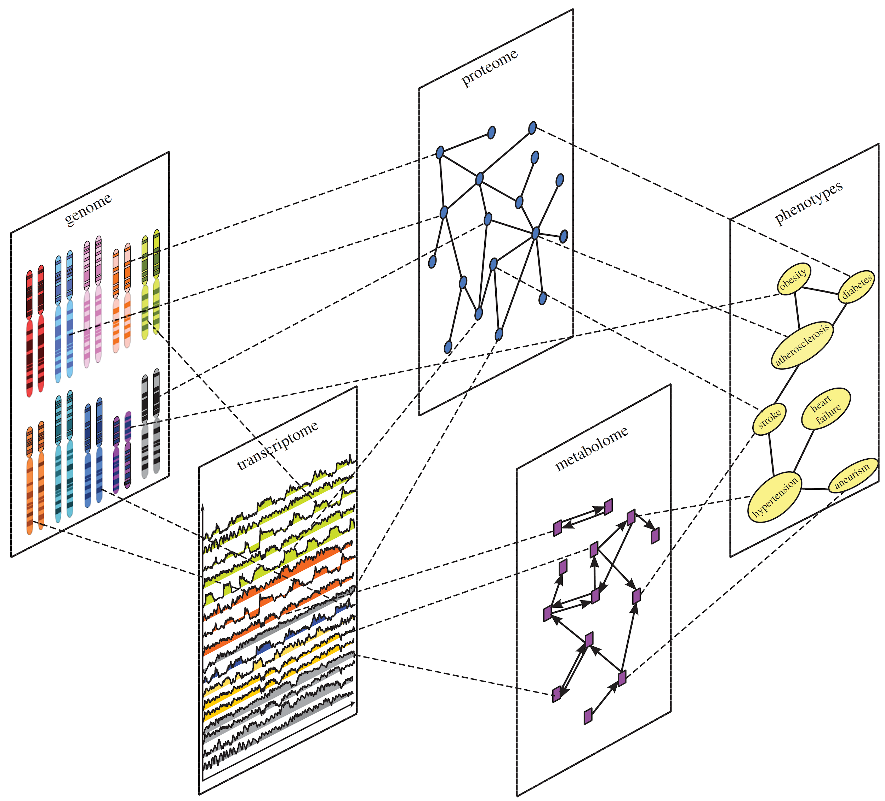
:::

::: {.column}
- A integração é necessária para capturar a complexidade dos sistemas biológicos, onde diferentes camadas (DNA, RNA, proteína, metabólito) interagem de forma não linear.
- O objetivo final é construir modelos preditivos e entender mecanismos emergentes que não são visíveis ao analisar uma única camada ômica.
  - Exemplo: Alterações no transcriptoma (RNA) podem não se traduzir em alterações no proteoma devido a regulação pós-traducional. Somente integrando ambas as camadas você entende verdadeiramente o estado funcional da célula.
:::
:::

#
<center>Uma análise **integrativa** fornece uma estrutura para a análise dos dados **ômicos** a partir de uma perspectiva biológica, a partir dos dados brutos, via pré-processamento e análise estatística, até a interpretação dos resultados.</center>


---

```{=html}
<style>
/* Força o container a ocupar quase toda a área útil do slide e centraliza */
.diagram-wrapper {
  position: absolute;
  top: 50%;
  left: 50%;
  transform: translate(-50%, -50%);
  width: 95vw;
  height: 75vh;
  display: flex;
  align-items: center;
  justify-content: center;
  font-family: serif;
  font-weight: bold;
  box-sizing: border-border-box;
}

/* Bloco principal (esquerda) */
.box-main {
  background-color: #7A0026;
  color: white;
  writing-mode: vertical-rl;
  transform: rotate(180deg);
  padding: 12vh 3.5vw;
  border-radius: 36px;
  font-size: 4.8rem;
  letter-spacing: 6px;
  text-align: center;
}

/* Conectores ortogonais largos */
.connector-h1 {
  width: 8vw;
  height: 6px;
  background-color: #333;
}

.connector-tree {
  display: flex;
  flex-direction: column;
  justify-content: space-between;
  height: 52vh;
  border-left: 6px solid #333;
}

.connector-h2 {
  width: 8vw;
  height: 6px;
  background-color: #333;
}

/* Blocos da direita */
.box-group {
  display: flex;
  flex-direction: column;
  gap: 14vh;
}

.box-item {
  background-color: #B0003A;
  color: white;
  padding: 5vh 6vw;
  border-radius: 28px;
  font-size: 3.6rem;
  text-align: center;
  white-space: nowrap;
}
</style>

<div class="diagram-wrapper">
  <div class="box-main">DADOS!</div>
  <div class="connector-h1"></div>
  <div class="connector-tree">
    <div class="connector-h2"></div>
    <div class="connector-h2"></div>
  </div>
  <div class="box-group">
    <div class="box-item">ÔMICAS</div>
    <div class="box-item">Recursos de dados</div>
  </div>
</div>
```

---

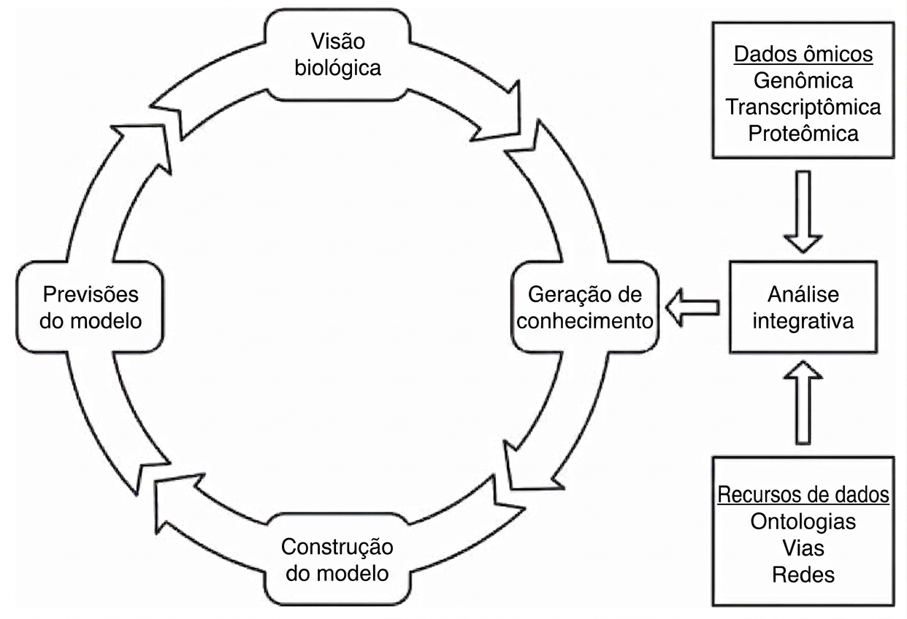

---

<center>

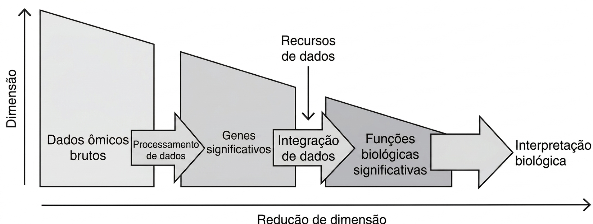

**Quando há integração dos dados há redução de dimensionalidade**

<br>

**O processo de análise integrativa pode ser dividido em dois passos principais: <span style="color:#4169E1">processamento dos dados</span> e <span style="color:#4169E1">integração dos dados</span>.**

</center>

---

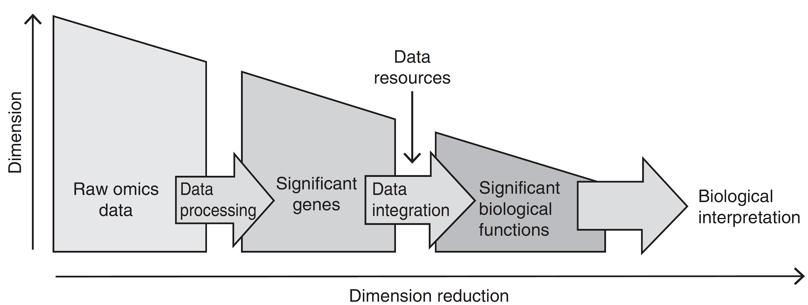

# Processamento de dados

# Processamento de dados (cont.)

Aplica ferramentas computacionais e estatísticas aos dados ômicos de alta dimensionalidade

- Eliminar erros e ruídos

- Identificar genes e outros componentes que contêm informações significativas para o experimento.

<center><span style="color:#4169E1">**Etapa essencial. Erros aqui se propagam para o restante da análise.**</span></center>

# Processamento de dados: etapas

1. <span style="color:#4169E1;font-weight:bold;">Controle de Qualidade, Pré-processamento e Limpeza.</span>

2. <span style="color:#4169E1;font-weight:bold;">Alinhamento/Mapeamento e Quantificação</span>

3. <span style="color:#4169E1;font-weight:bold;">Normalização</span>

4. <span style="color:#4169E1;font-weight:bold;">Identificação de Características Significativas</span>

# Processamento de dados: etapas (cont.)

1. <span style="color:#4169E1;font-weight:bold;">Controle de Qualidade, Pré-processamento e Limpeza.</span>

Inspeção sistemática dos dados brutos para identificar e, se possível, corrigir vieses técnicos e erros. A aplicação de algoritmos para *limpar* os dados com base nos resultados do QC.

2. <span style="color:#4169E1;font-weight:bold;">Alinhamento/Mapeamento e Quantificação</span>

3. <span style="color:#4169E1;font-weight:bold;">Normalização</span>

4. <span style="color:#4169E1;font-weight:bold;">Identificação de Características Significativas</span>

# Processamento de dados: etapas (cont.)

1. <span style="color:#4169E1;font-weight:bold;">Controle de Qualidade, Pré-processamento e Limpeza.</span>

2. <span style="color:#4169E1;font-weight:bold;">Alinhamento/Mapeamento e Quantificação</span>

O processo de alinhar cada _read_ (sequência lida) a sua posição correta em um genoma de referência. Transformar os dados alinhados em valores numéricos que representam a abundância de cada entidade biológica (gene, transcrito, proteína).

3. <span style="color:#4169E1;font-weight:bold;">Normalização</span>

4. <span style="color:#4169E1;font-weight:bold;">Identificação de Características Significativas</span>

# Processamento de dados: etapas (cont.)

1. <span style="color:#4169E1;font-weight:bold;">Controle de Qualidade, Pré-processamento e Limpeza.</span>

2. <span style="color:#4169E1;font-weight:bold;">Alinhamento/Mapeamento e Quantificação</span>

3. <span style="color:#4169E1;font-weight:bold;">Normalização</span>

Ajustar os dados quantificados para remover vieses técnicos sistemáticos que impedem comparações justas entre amostras.

4. <span style="color:#4169E1;font-weight:bold;">Identificação de Características Significativas</span>

# Processamento de dados: etapas (cont.)

1. <span style="color:#4169E1;font-weight:bold;">Controle de Qualidade, Pré-processamento e Limpeza.</span>

2. <span style="color:#4169E1;font-weight:bold;">Alinhamento/Mapeamento e Quantificação</span>

3. <span style="color:#4169E1;font-weight:bold;">Normalização</span>

4. <span style="color:#4169E1;font-weight:bold;">Identificação de Características Significativas</span>

A aplicação de testes estatísticos para distinguir o sinal biológico real do ruído aleatório inerente a qualquer experimento de alto rendimento.

# Controle de Qualidade (QC), Pré-processamento e Limpeza

Passo vital e deve sempre ser feito independente do tipo de dados

- DNA
- RNA
- Proteínas
- Metabólitos
- Doenças
- ...

# Controle de Qualidade, Pré-processamento e Limpeza (cont.){.smaller}

- A natureza dos erros é fortemente dependente da técnica e de suas propriedades bioquímicas, e os métodos para avaliação da qualidade devem, portanto, ser selecionados com base na plataforma de medição aplicada.
- DNA-seq
  - Baixa qualidade no final da leitura
  - Substituições, inserções e deleções
  - Adaptadores
- RNA-seq
  - Todas as anteriores
  - Excesso de rRNA
- Espectrometria de massa
  - Espectros de baixa qualidade
  - O que podem dar nenhum dado ou falso-positivos

---


| Método | Propósito | Tipo de dado |
| :-: | :-: | :-: |
| Garantia de qualidade e filtragem |  |  |
| FASTX toolkit | Controle de qualidade e filtragem | Genômica, transcritômica |
| TrimGalore | Filtragem por qualidade e remoção de adaptadores | Genômica, transcritômica |
| NGS QC Toolkit | Controle de qualidade e filtragem | Genômica, transcritômica |
| Spectrum quality | Filtragem de Espectro de MS | Proteômica |


# Quantificação

* O passo de quantificação transforma o dado que já passou por uma avaliação de qualidade em dado quantitativo que descreve a abundância de variantes genéticas, transcritos ou proteínas.
* **DNA**
  * Mapeamento das leituras em uma referência e determinação de variantes pela verificação do alinhamento.
* **RNA**
  * Mapeamento das leituras em regiões do genoma anotadas como genes. Posterior contagem da quantidade de alinhamentos dentro de uma região codificante.
* **Proteína**
  * Comparação com espectros padrões e o quanto esse espectro é detectado.

---


| Método | Propósito | Tipo de dado |
| :-: | :-: | :-: |
| Quantificação |  |  |
| Bowtie2 | Mapeamento de leituras na referência | Genômica, transcritômica |
| Star | Mapeamento de leituras ciente de  _splicing_ | Transcritômica |
| MASCOT | Mapeamento de espectros de massa ao banco de dados | Proteômica |
| InsPecT | Mapeamento de espectros de massa ao banco de dados | Proteômica |

# Normalização

Os dados ômicos exibem grandes variações e vieses, dos quais uma parte substancial é de natureza técnica introduzida pelas técnicas de medição e as etapas experimentais sensíveis necessárias para a preparação da amostra. O objetivo da normalização é remover essa variabilidade indesejada para tornar o dado mais uniforme e comparável.


::: {.callout-important}
## Importante
Isto é especialmente importante para transcriptômica e proteômica, onde os dados são frequentemente gerados em um cenário comparativo usando múltiplas replicatas técnicas e/ou biológicas.
:::

# Normalização (cont.)

* **RNA**
  * FPKM/RPKM: Fragmentos/Reads por kilobase por milhão de reads mapeados.
* **Proteína**
  * Métodos de regressão.
  * Escala baseada na intensidade total do íon em relação ao comprimento total da proteína

---

| Método | Propósito | Tipo de dado |
| :-: | :-: | :-: |
| Normalização |  |  |
| RPKM/FPKM | Normalização da abundância de transcritos | Transcritômica |
| Normalização por regressão linear | Normalização de picos do espectro de massas | Proteômica |

# Análise estatística: Situação

Os dados ômicos são de alta dimensionalidade, onde milhares de características (por exemplo, variantes genéticas, transcritos ou proteínas) são medidas simultaneamente e onde apenas uma minoria delas contém informações que são valiosas para o estudo.

# Análise estatística: Objetivo

A análise estatística visa reduzir a dimensão dos dados, distinguindo entre as características biologicamente relevantes e as características que contêm principalmente ruído.

---

| Dados Ômicos Brutos | Pré-processamento | Quantificação | Normalização | Análise estatística |
| :-: | :-: | :-: | :-: | :-: |
| Resequenciamento Genômico | Filtragem e trimagem de leituras | Mapeamento de leituras com um genoma de referência |  | Chamada de polimorfismos e variantes estrutural |
| RNA-Seq | Filtragem e trimagem de leituras | Mapeamento ciente de splicing e contagem de  leituras | Normalização intra e inter amostras | Identificação de transcritos diferencialmente abundantes |
| Proteômica por MS | Remoção de espectros de baixa qualidade | Comparação do espectro com banco de dados | Normalização intra e inter amostras | Identificação de proteínas diferencialmente abundantes |

# Integração dos dados

# Integração dos dados (cont.)

Depois dos passo de processamento dos dados, obtemos uma  _lista de genes_  relevantes que podem nos direcionar a resposta biológica que buscamos.

# Integração dos dados (cont.)

A lista de genes é usada para identificar funções e caminhos relevantes integrando os dados com uma base comum construída usando informações biológicas estabelecidas coletadas de vários recursos e bancos de dados.

O resultado, que é baseado na análise combinada dos genes com propriedades funcionais similares, tem uma dimensão substancialmente reduzida, o que facilita consideravelmente sua interpretação.

# Integração dos dados (cont.)

* O conjunto reduzido de genes, transcritos ou proteínas obtidos anteriormente são anotados com um vocabulário comum
  * Gene Ontology
  * KEGG/KOG
* Desta maneira, é possível reunir todos aqueles genes/transcritos/proteínas que fazem parte da mesma resposta biológica.
* Isso também serve para associar genes, transcrito ou proteínas com suas respectivas contrapartes em outros experimentos.

# Análise de Conjunto de Genes - Gene Set Analysis

Método usado para interpretar resultados de experimentos de larga escala focado em grupos de genes que compartilham uma característica biológica comum.

O objetivo principal é responder à pergunta:

_“Dada uma lista de genes que mudaram em um experimento, quais os processos ou vias biológicas estão sendo afetados de forma significativa?”_

# Análise de Conjunto de Genes - Gene Set Analysis (cont.)

* Precisamos de uma estatística para cada gene que defina a mudança da expressão
* Definição de função de acordo com algum banco de dados
* Cálculo de  _score_  de enriquecimento
  * De acordo com o valor estatístico, quem tem as maiores mudanças e quem não tem mudança aparente.

---


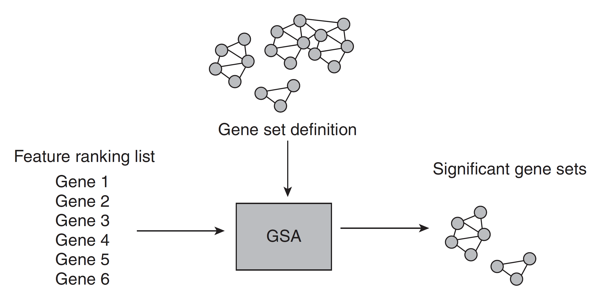


# Integração

* **Antecipada (ou completa)**
  * Combina os conjuntos de dados de tipos diferentes em um único conjunto de dados.
  * Requer uma transformação dos conjuntos de dados em uma representação comum, que em alguns casos pode  resultar em perda de informação .
  * A  Integração Antecipada  funde os conjuntos de dados brutos ou de características em uma única  matriz combinada  antes da aplicação de qualquer algoritmo de modelagem. Embora conceitualmente simples, este método requer a  transformação de dados heterogêneos em um espaço comum , o que frequentemente introduz ruído, perda de informação e o desafio da dimensionalidade (p >> n), podendo mascarar sinais biológicos sutis.

# Integração (cont.)

* **Tardia (ou de decisão)**
  * Cria modelos para cada conjunto de dados separadamente
  * Combina os modelos em um modelo unificado.
  * Construir modelos a partir de cada conjunto de dados isoladamente dos outros  desconsidera suas relações mútuas  .   _A_  _o modelar cada conjunto isoladamente, as relações entre as diferentes camadas de dados (ex: como a metilação do DNA regula a expressão gênica) são ignoradas, perdendo a sinergia central da Biologia de Sistemas._

# Integração (cont.)

* **Intermediária (ou parcial)**
  * A Integração Intermediária infere um modelo conjunto que  aprende uma representação compartilhada ou latente  a partir de todos os conjuntos de dados simultaneamente. Esta abordagem  modela explicitamente as relações entre as diferentes modalidades de dados, capturando a sinergia entre elas.  Por isso, é frequentemente a mais indicada para a Biologia de Sistemas, podendo levar a uma melhor precisão preditiva e a descobertas biológicas mais ricas.  _No entanto, ela ainda envolve uma transformação dos dados para um espaço latente, cuja qualidade depende criticamente do algoritmo utilizado._

# Integração (cont.)

Integrando redes
* Homogêneo
  * Quando as duas redes a serem integradas possuem o mesmo tipo de vértices mas diferentes tipos de arestas.
* Heterogêneo
  * Quando as duas redes a serem integradas possuem como vértices e arestas tipos diferentes de dados e relações.

# Métodos de integração: Projeção de Rede{.smaller}

Usado para integrar redes heterogêneas. Por exemplo, projetar uma rede Fármaco-Alvo em uma rede Alvo-Doença para inferir uma nova rede Fármaco-Doença.

---

<center>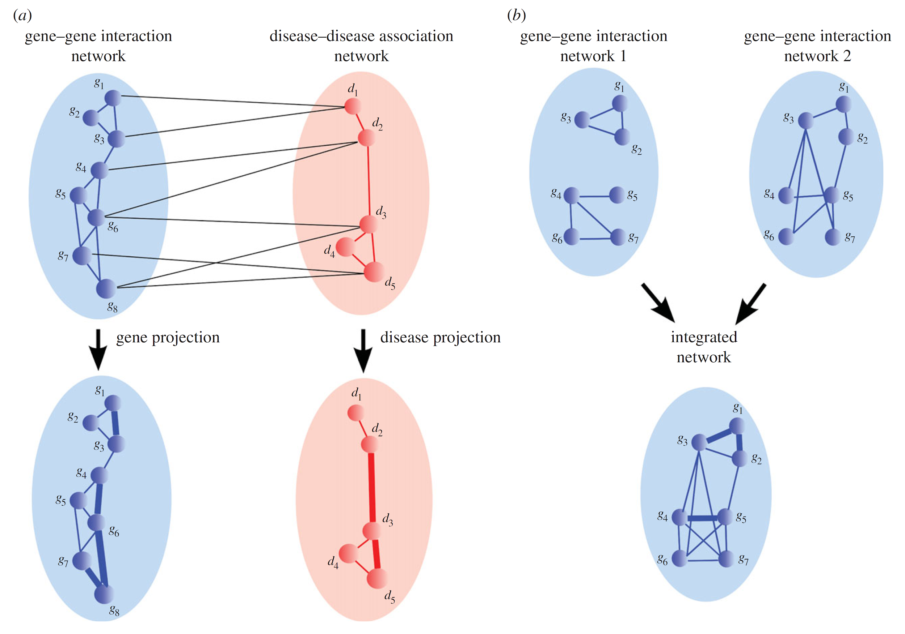</center>

::: {.notes}

    • Nielsen, J., Hohmann, S., & A, R. (2017). Systems Biology. https://doi.org/10.978.352769/6161. Capítulo 1
    • Methods for biological data integration: perspectives and challenges (artigo no Mendeley)
    • https://towardsdatascience.com/network-learning-from-network-propagation-to-graph-convolution-eb3c62d09de8
Network propagation: a universal amplifier of genetic associations
:::

# Métodos de integração: Propagação de informação

Técnica poderosa para difundir informação (ex: escores de genes associados a uma doença) através de uma rede integrada, permitindo a priorização de novos genes ou fármacos.

---

<center>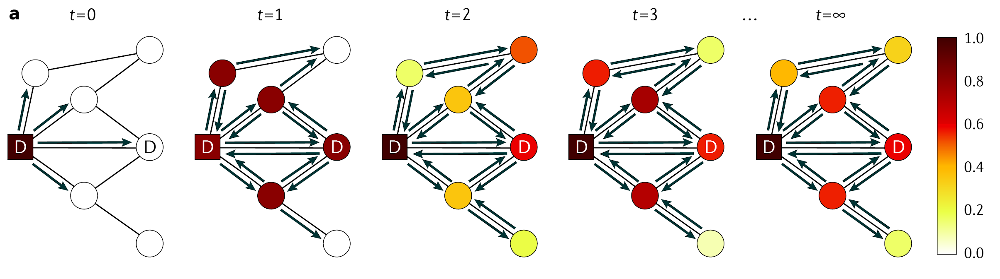</center>

# Métodos de integração: baseado em redes

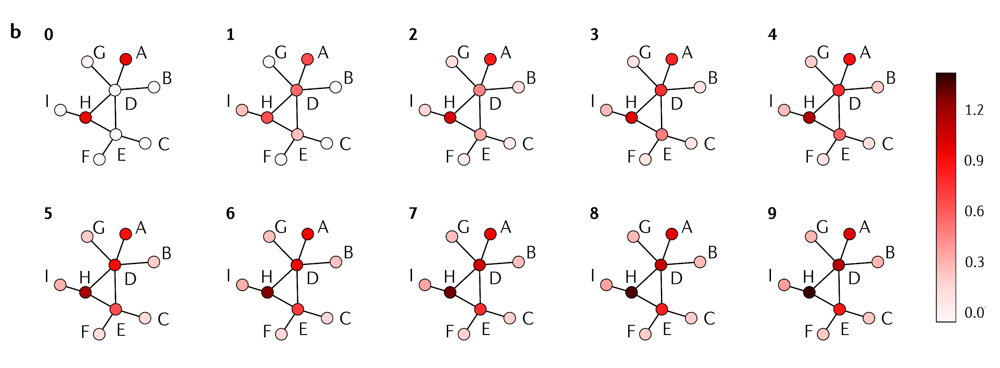

# Métodos de integração: baseado em redes (cont.)

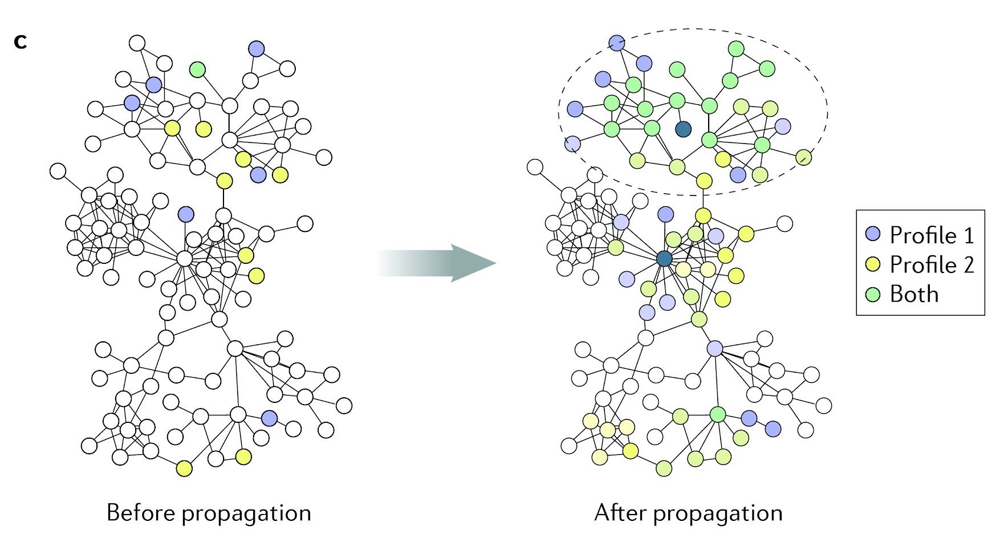

# Métodos de integração: bayesiano

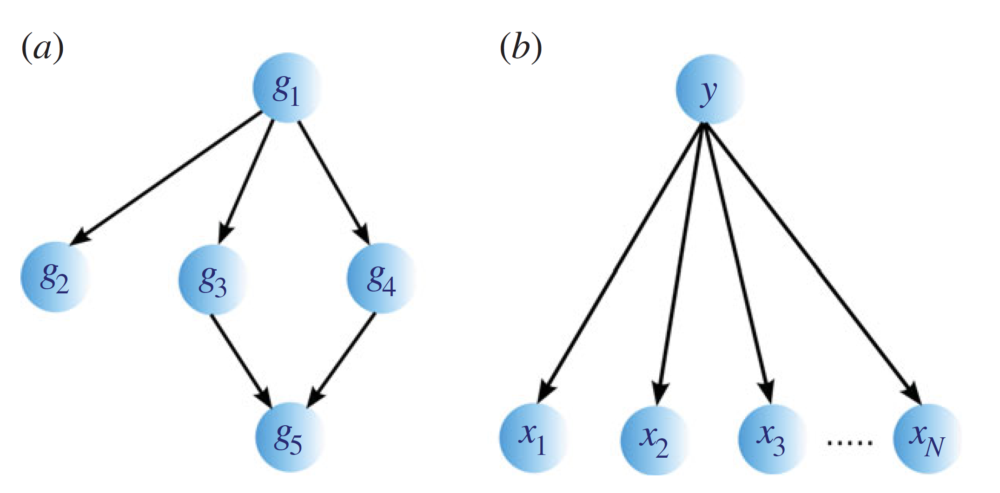

Constroem modelos probabilísticos que explicitamente representam as dependências entre diferentes tipos de dados (ex: genótipo -> expressão gênica -> fenótipo).

# Métodos de integração: baseado em kernels. Mudanças de dimensionalidade

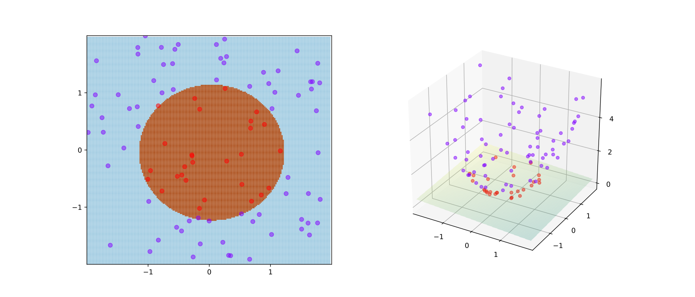

# Métodos de integração: NMF

Fatoração de Matriz não-Negativa (_Non-negative Matrix Factorization_)

- Método de ranqueamento e clusterização.
- Encontrar padrões por aproximações iterativas.
- Onde a matriz de dados é fatorada em duas outras. Uma delas dá o grupo ao qual um dado pertence de acordo com padrões.