# Redes metabólicas

* Se refere a rede composta de metabólitos e suas interconversões.
* As interconversões são usualmente catalisadas por enzimas (proteínas).
* Via metabólica : é uma série de reações bioquímicas sucessivas ou intimamente relacionadas e ligadas a um propósito metabólico comum.
  * Pode ser considerada uma porção menor da rede metabólica;
  * Enquanto a rede metabólica dá uma visão mais completa do metabolismo celular.

# Rede metabólica (cont.)

- Uma rede metabólica completa deve mostrar todos os possíveis modos de fluxo de material dentro da célula, indicando assim a capacidade e potencial metabólico da célula.

- A célula depende dessa rede metabólica para absorver e digerir substratos do meio e gerar energia ( na forma de ATP) e sintetizar componentes necessários para seu crescimento e sobrevivência.

# Redes metabólicas (cont.)

- É de grande interesse estudar a _rede metabólica_ por sua importância fundamental na biologia no geral mas em particular porque várias aplicações funcionam diretamente no uso do _metabolismo celular_.

# Redes metabólicas (cont.)

* Biotecnologistas modificam células:
  * Fábricas celulares para produção, por exemplo, de produtos químicos, antibióticos, enzimas industriais e anticorpos.
* Em biomedicina:
  * Melhor entendimento dos mecanismos metabólicos de doenças metabólicas humanas.
  * Controle de infecções bacterianas fazendo uso das diferenças metabólicas entre os seres humanos e os patógenos.

# Ômicas! <br> e bioinformática

::: {.callout}
Tornaram possível a reconstrução de redes metabólicas de um organismo específico em nível de genoma.
:::

# Visualização e representação em grafo

* Pode ser representado como um grafo com dois tipos diferentes de vértices em ordem alternada:
  * Metabólitos
  * Enzimas

# Visualização e representação em grafo (cont.)

::: {.columns}
::: {.column}
* Podem também ser representadas por grafos direcionados com vértices representando metabólitos e arestas correspondendo  a reações convertendo um metabólito em outro.
* Essa simplificação é útil para a análise estrutural
* **PROBLEMA**
  * Nessa representação, metabólitos moeda podem oferecer pequenos caminhos espúrios.
:::
::: {.column}
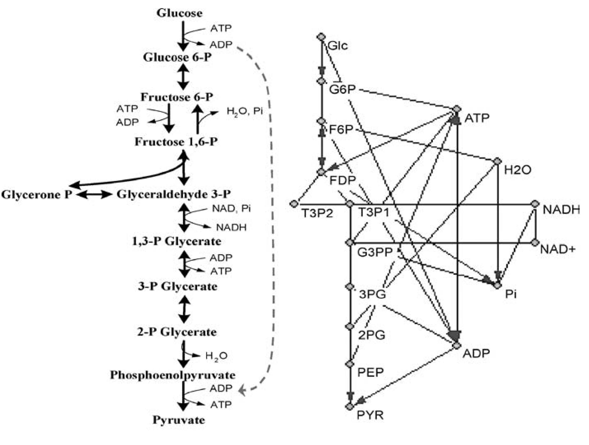
:::
:::

---

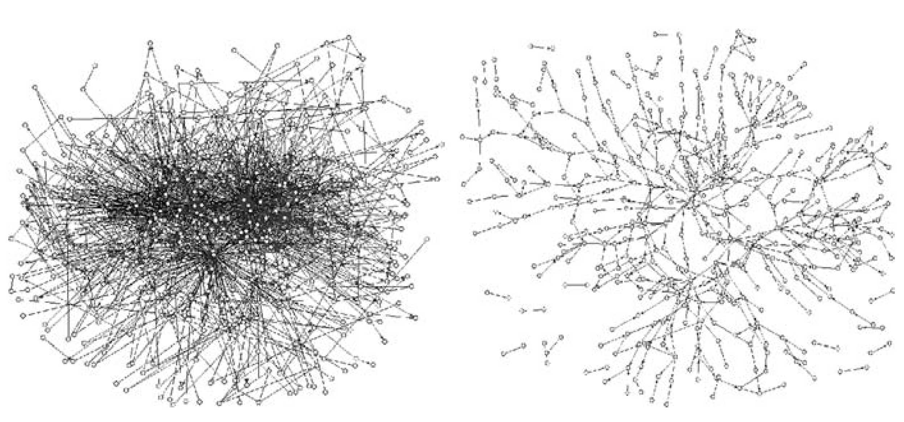

<!-- Aqui coloquei essa tag <pre> para poder ter os TABs e posicionar as palavras embaixo das figuras. É uma figura só com dois quadros. Então fica com um caption só -->
<pre>                     <b>Com metabólitos moeda</b>                                      <b>Sem metabólitos moeda</b></pre>


<!-- # Reconstrução metabólica em escala genômica{.nostretch} -->

# Reconstrução metabólica genômica{background-iframe="about:blank"}

```{r}
#| echo: false
#| message: false
#| warning: false
#| fig-width: 16
#| fig-height: 9
#| out-width: "100%"
#| out-height: "100%"
#| fig-align: "center"

library(ggplot2)

# ==============================================================================
# 1. DADOS DAS FATIAS (DONUT)
# ==============================================================================
df <- data.frame(
  id = factor(1:5),
  label_num = c("01", "02", "03", "04", "05"),
  y_pos = c(0.5, 1.5, 2.5, 3.5, 4.5)
)

paleta <- c(
  "01" = "#0e4640",
  "02" = "#155750",
  "03" = "#1b6b63",
  "04" = "#1b6b63",
  "05" = "#268b80"
)

# ==============================================================================
# 2. RÓTULOS E HASTES CONECTORAS
# ==============================================================================
# Ajustamos os pontos x_start e x_end para aproximar os textos do anel principal
labels_df <- data.frame(
  id = c("01", "02", "03", "04", "05"),
  x_start = 2.0,       # Início na borda externa do anel
  x_end = 2.3,         # Ponto final com a bolinha
  y_pos = c(0.5, 1.5, 2.5, 3.5, 4.5),
  text = c(
    "Criação de uma\nreconstrução rascunho",
    "Curadoria Manual",
    "Converter a rede para\num modelo matemático",
    "Avaliação da rede\ngenômica",
    "Concatenação dos dados,\ndisseminação e uso"
  ),
  hjust = c(0, 0, 0, 1, 1),
  x_text = c(2.4, 2.4, 2.6, 2.4, 2.4)
)

# ==============================================================================
# 3. GRÁFICO OTIMIZADO PARA SLIDES 16:9 (1600x900)
# ==============================================================================
ggplot() +
  # Rosquinha principal
  geom_bar(
    data = df, 
    aes(x = 1.5, y = 1, fill = label_num), 
    stat = "identity", 
    width = 1, 
    color = "white", 
    size = 1.2
  ) +
  
  # Números dentro das fatias
  geom_text(
    data = df, 
    aes(x = 1.5, y = y_pos, label = label_num), 
    color = "white", 
    fontface = "bold", 
    size = 7, 
    family = "Georgia"
  ) +
  
  # Hastes conectoras
  geom_segment(
    data = labels_df, 
    aes(x = x_start, xend = x_end, y = y_pos, yend = y_pos),
    color = "#1b6b63", 
    size = 0.8
  ) +
  
  # Bolinhas
  geom_point(
    data = labels_df, 
    aes(x = x_end, y = y_pos), 
    color = "#1b6b63", 
    size = 2.8
  ) +
  
  # Textos explicativos
  geom_text(
    data = labels_df, 
    aes(x = x_text, y = y_pos, label = text, hjust = hjust),
    color = "#111111", 
    family = "Georgia", 
    size = 4.8, 
    lineheight = 0.95
  ) +
  
  # Coordenadas Polares (Sentido Horário)
  coord_polar(theta = "y", start = 0, direction = 1) +
  
  scale_fill_manual(values = paleta) +
  
  # xlim reduzido para expadir o diâmetro do anel na tela
  xlim(0.3, 3.2) +
  
  theme_void() +
  theme(
    legend.position = "none",
    plot.margin = margin(0, 0, 0, 0, "cm")
  )
```

---


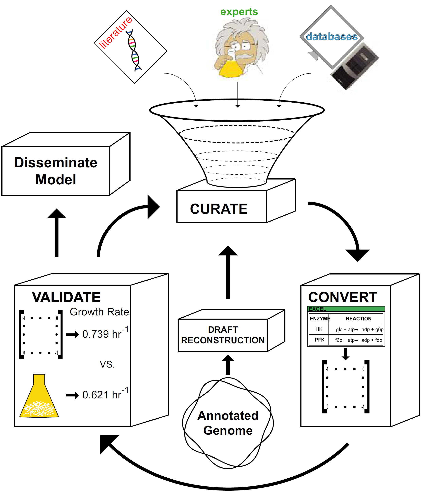{.r-stretch fig-align="center"}


---


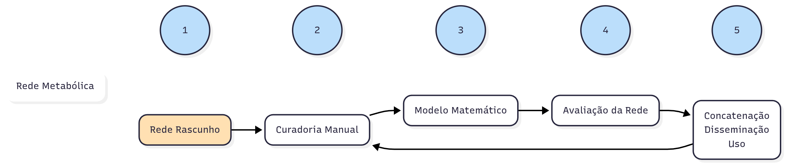{.r-stretch fig-align="center"}


# Estágio 1: Criação de uma reconstrução rascunho

* O que precisamos para começar:
* Genoma anotado
  * Coordenadas genômicas;
  * Funções conhecidas de produtos gênicos;
  * Isoformas de splicing;
* Genes com função metabólica precisam ser identificados
  * EC number;
  * Termos metabólicos (desidrogenase ou quinase por exemplo);
  * Ou termos do Gene Ontology relacionados ao metabolismo;

# Estágio 1: Criação de uma reconstrução rascunho (cont.)

As reações de genes metabólicos devem ser estabelecidas.

Ou seja, se o gene codificar uma enzima, qual reação esta enzima catalisa.

Criação de uma reconstrução rascunho preliminar.

Preparação para fase seguinte.

---

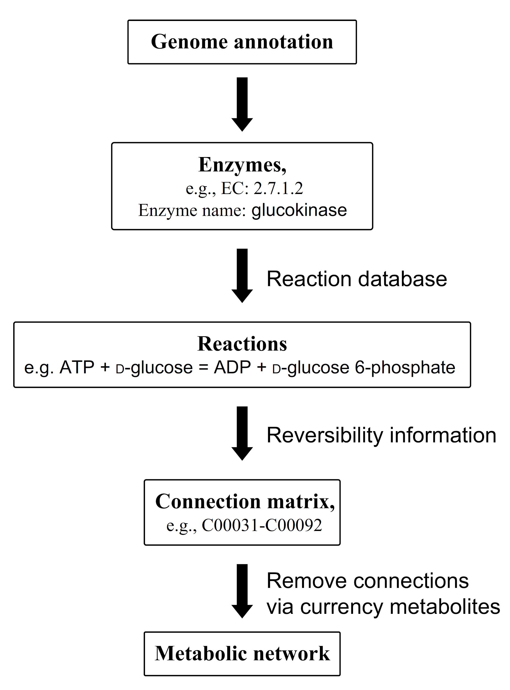{.r-stretch fig-align="center"}

# De onde vem essa informação?

# Bancos de dados!

- KEGG
- The SEED Viewer
- BRENDA
- BiGG Models
- Gene Ontology
- Reactome
- MetaCyc
- MEMOTE
- AGORA

---

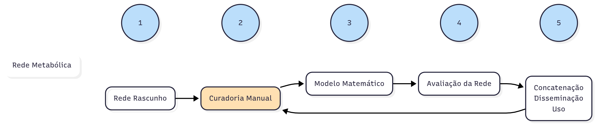

# Estágio 2: Curadoria Manual

O processo de curadoria manual é feito na rede metabólica rascunho.

# Estágio 2: Curadoria Manual (cont.)

Para a maioria dos organismos, a anotação é feita baseada em **homologia** .

_Por isso, reconstruções baseadas somente na anotação do genoma podem conter vários erros propagados._

# Estágio 2: Curadoria Manual (cont.)

* Grande esforço precisa ser feito para:
  * verificar que todas as reações e genes estejam incluídas na reconstrução.

# E2 - Curadoria Manual: Informações adicionais e verificação

* Especificidade substrato-cofator, pode variar entre organismos
  * Literatura ou banco de dados.
* Localização das reações.
  * Algoritmos, literatura ou dados experimentais.
  * Determinar a localização, se for indeterminada, as reações devem ser colocadas no citosol.
  * Importante devido a disponibilidade de metabólitos em cada compartimento e por causa das reações de transporte.

# E2 - Curadoria Manual: Informações adicionais e verificação (cont.)

* A relação gene-proteína-reação (GPR) deve ser encontrada.
  * Dado em formato lógico.
  * Exemplos
    * pykA e pykF: proteínas PykA e PykF.
    * Ambos podem catalisar a reação de piruvato quinase, assim *pykA* **OU** *pykF*.
    * *sdhA*, *sdhB*, *sdhC* e *sdhD* são necessários para formação da proteína Sdh, que catalisa a reação irreversível da succinato desidrogenase na fosforilação oxidativa.
    * Assim *sdhA* **E** *sdhB* **E** *sdhC* **E** *sdhD* são necessário para a reação.

# E2 - Curadoria Manual: Informações adicionais e verificação (cont.)

* Confirmar a fórmula química de cada metabólito.
  * Carga do metabólito no devido compartimento celular de acordo com o pH encontrado.
* Reações balanceadas em carga e massa.
  * Algumas reações podem requerer a adição de água ou prótons.

# E2 - Curadoria Manual: reações espontâneas e de transporte

[Nem todas as reações são catalisadas por enzimas, além disso, alguns metabólitos difundem facilmente através da membrana.]{style="color: blue"}

Reações Espontâneas!

Reações de Transporte!

# E2 - Curadoria Manual: reações espontâneas e de transporte (cont.)

Se existir evidência de transporte do meio para a célula, da célula para o meio e entre compartimentos, essas reações  devem  ser descritas.

Na eventualidade das reações de transporte não serem conhecidas, se pode fazer uma reação análoga, se existir alguma parecida em outro organismo, mas se deve anotar que a informação não é precisa.

# E2 - Curadoria Manual: a reação de biomassa

**Função objetivo de Biomassa**

- É um modelo de rede metabólica que simula crescimento.

- É uma representação matemática da quantidades molares de vários metabólitos necessários para fazer os componentes celulares para crescimento.

- É necessário saber a composição geral da célula em termos de lipídios, proteínas, carboidratos, ácidos nucleicos e demais metabólicos.

---

A Reação de Biomassa é uma reação artificial (não enzimática) incluída em modelos metabólicos. Ela representa, em proporções molares exatas, o conjunto de todos os componentes necessários para a célula formar uma nova unidade de si mesma — ou seja, para crescer e se dividir.

Funciona como uma _lista de compras_ ultra detalhada do que a célula precisa para se duplicar.

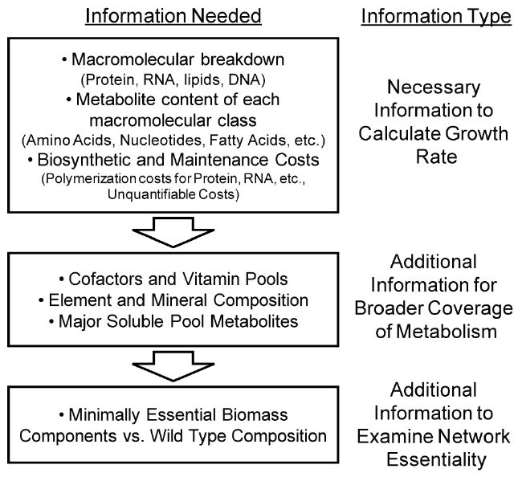{fig-align="center"}

# Fórmula de biomassa para bactérias gram-negativas {.smaller}

<span style="color: red">(0) Glutationa + (0) Ubiquinona-8 + (0.51) Glicina + (0.01) Fosfatidilglicerol dianteisoheptadecanoil + (0.03) Polímero de Peptidoglicano (n subunidades) + (0) Fosfato de Piridoxal + (0) Fe³⁺ + (0.38) L-Leucina + (0) ACP + (0.43) L-Alanina + (0) Hemo + (0) Biossíntese Proteica + (0) Cobinamida + (0) Replicação do DNA + (0.18) L-Serina + (0) 5-Metiltetrahidrofolato + (0.01) Fosfatidiletanolamina dioctadecanoil + (35.54) H₂O + (0) FAD + (0.01) Cardiolipina isoheptadecanoil + (0) Espermidina + (0) 2-Desmetilmenaquinona 8 + (0.24) L-Isoleucina + (0.35) L-Valina + (0) Menaquinona 8 + (0) 10-Formiltetrahidrofolato + (0) Coenzima A + (0.15) L-Fenilalanina + (0) Tetrahidrofolato + (0.29) L-Lisina + (0.01) dCTP + (0) Siroheme + (0.02) TTP + (0.01) Fosfatidilglicerol dioctadecanoil + (0) Co²⁺ + (40.11) ATP + (0) Mn²⁺ + (0) Transcrição de RNA + (0.01) Fosfatidiletanolamina dianteisoheptadecanoil + (0) Mg²⁺ + (0) S-Adenosil-L-Metionina + (0.09) UTP + (0.01) Fosfatidilglicerol diisoheptadecanoil + (0.01) Cardiolipina anteisoheptadecanoil + (0.13) L-Metionina + (0.08) L-Histidina + (0) TPP + (0.08) L-Cisteína + (0.08) CTP + (0) Fe²⁺ + (0) Sulfato + (0) Putrescina + (0) Cu²⁺ + (0.22) L-Glutamato + (0) Zn²⁺ + (0.20) L-Asparagina + (0.25) L-Arginina + (0.05) L-Triptofano + (0) Ca²⁺ + (0.18) L-Prolina + (0) Cl⁻ + (0.03) Bactoprenil Difosfato + (0.03) Oligossacarídeo Central do Lipídio A + (0.02) dATP + (0.22) L-Glutamina + (0) Riboflavina + (0.01) Cardiolipina estearoil + (0) NAD + (0.12) L-Tirosina + (0) K⁺ + (0.21) L-Treonina + (0.20) L-Aspartato + (0.01) Fosfatidiletanolamina diisoheptadecanoil + (0.14) GTP + (0) NADP + (0.01) dGTP</span>  **(COSUMO)**

⟶

<span style="color: purple">(0.03) Polímero de Peptidoglicano (n-1 subunidades) + (0) Apo-ACP + (0) Dimetilbenzimidazol + (1.00)  BIOMASSA  + (40.00) Fosfato + (40.00) ADP + (40.00) H⁺ + (0.48) Pirofosfato + (0) Cobinamida</span> **(PRODUÇÃO)**

# Fórmula de biomassa para bactérias gram-negativas (cont.)

Na prática, a produção de 1 unidade do metabólito BIOMASSA no modelo equivale à síntese equilibrada das seguintes classes de componentes celulares:

**1. Macromoléculas Estruturais e Informacionais**

  - **Proteínas** — principal fração da biomassa, representando cerca de 55% do peso seco em muitas bactérias.  
  - **RNA** — incluindo rRNA, tRNA e mRNA.  
  - **DNA** — todo o material genético.  
  - **Parede celular** — essencialmente peptidoglicano (polímero de açúcares e aminoácidos) em bactérias.  
  - **Membrana celular** — formada por uma bicamada lipídica que inclui fosfolipídios (como fosfatidiletanolamina e fosfatidilglicerol), cardiolipinas e outros lipídios de membrana.

---

::: {.columns}
::: {.column}
**2. Moléculas Complexas e Cofatores**

  - **Cofatores enzimáticos e vitaminas** — indispensáveis para a atividade enzimática, como NAD, NADP, FAD, coenzima A, fosfato de piridoxal, hemo e tetrahidrofolato.  
  - **Pigmentos e quinonas** — atuam em processos energéticos, como a respiração (ex.: ubiquinona e menaquinona).  
  - **Íons inorgânicos** — essenciais como cofatores e para o equilíbrio iônico (K⁺, Mg²⁺, Ca²⁺, Fe²⁺/³⁺, Zn²⁺, entre outros).
:::
::: {.column}
**3. Metabólitos de Reserva e Pequenas Moléculas**

  - **Compostos de armazenamento** — como glicogênio ou grânulos lipídicos, variando conforme o organismo.  
  - **Moléculas sinalizadoras e intermediárias** — integrantes do *pool* metabólico celular.
:::
:::

---

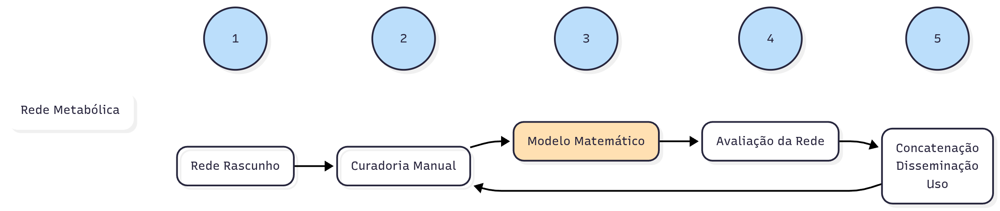

# Estágio 3: Convertendo a rede em um modelo matemático

* Para ser usada como uma  ferramenta preditiva, a reconstrução deve ser convertida em um modelo matemático.
* Um modelo metabólico é a forma computável da reconstrução da rede metabólica
* Para ser um modelo matemático a rede deve:
  * Ser descrita matematicamente;
  * Fornecer os limites do modelo em relação ao que entra e ao que sai do modelo;
* A conversão da rede para sua forma matemática é feita na construção de uma matriz estequiométrica.

# Estágio 3: Convertendo a rede em um modelo matemático (cont.){.smaller}

::: {.columns}
::: {.column}
* Matriz estequiométrica
  * Cada metabólito é posto numa linha.
  * Cada reação é uma coluna.
  * Os elementos são os coeficientes de cada metabólito em uma reação específica.
    * Metabólitos que são consumidos tem coeficiente negativo
    * Metabólitos que são sintetizados tem coeficiente positivo
  * Metabólitos que são obtidos do meio ou secretados para ele são descritos em reações de troca.
    * Essas reações permitem que o sistema receba e exporte metabólitos.
    * Valores máximos e mínimos podem ser colocados para as reações de troca.
:::
::: {.column}
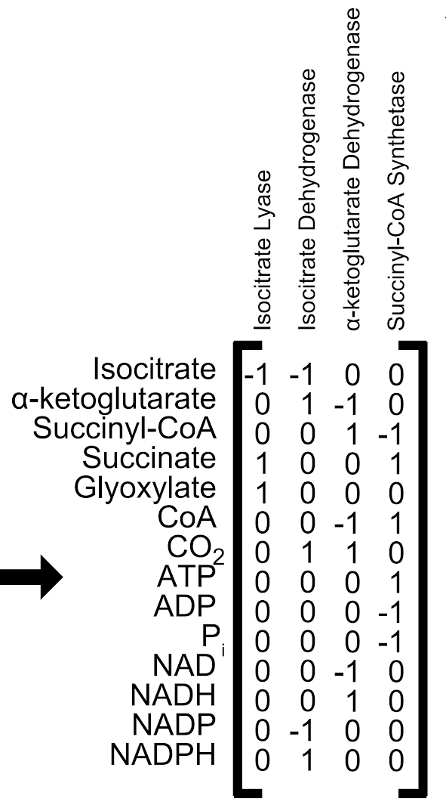{.r-stretch}
:::
:::

---

Hefzi H et al .2013.  Reconstruction of Genome Scale Metabolic Network. Hand Book of System Biology: Concept and Insight . First Edition. Elsevier

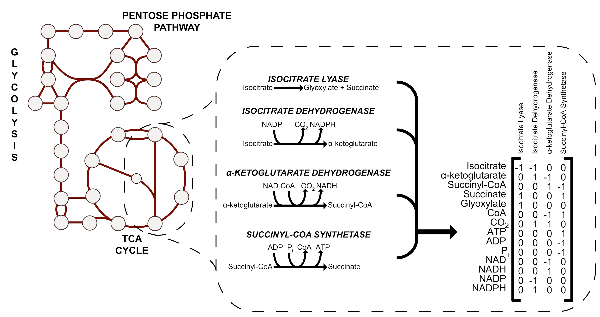

Matriz Estequiométrica

::: {.notes}
Hefzi H et al .2013. Reconstruction of Genome Scale Metabolic Network. Hand Book of System Biology: Concept and Insight. First Edition. Elsevier
:::

# Estágio 3: Convertendo a rede em um modelo matemático (cont.)

* Matriz estequiométrica, mais detalhes:
* Pseudo-reações podem ser adicionadas.
* Essa reações são usadas quando sabemos que existem metabólitos que são gerados ou consumidos além do escopo do nosso modelo
  * Reações de demanda
  * Reações fornecimento

---

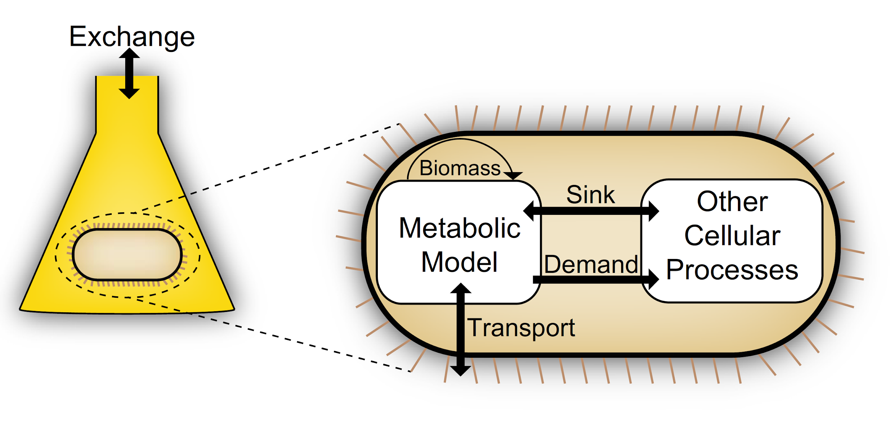

# Depois da transformação matemática

* O modelo pode ser usado para simular como as vias são usadas.
* _Flux balance analysis_  (FBA)
  * Assume um estado estacionário
  * S . v =0
  * v, o vetor de fluxo.

---

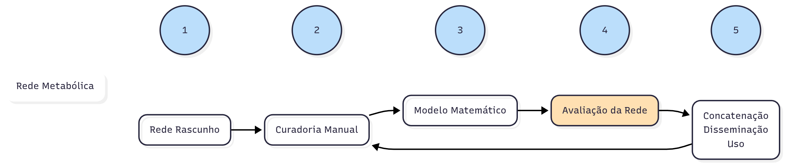

# Estágio 4: Avaliação da rede{.smaller}

* Existem vários testes
  * **Teste topológico**
    * Verificação de reações a mais ou faltando, assim como rever o balanço de massas e carga.
    * Verificação da localização dos metabólitos.
  * **Teste termodinâmico**
    * Verificar a reversibilidade das reações.
    * Informação em bancos de dados. Algoritmos especializados.
  * **Teste Fenotípico**
    * Testar a habilidade do modelo de reproduzir algum aspecto fenotípico.
  * **Teste Quantitativo**
    * É crítico  testar o modelo na sua capacidade de predição de parâmetros quantitativos.
      * Erros: crescer quando não deveria, não crescer quando deveria, crescimento mais rápido ou mais devagar do que deveria.

# *Gap Filling*

Nessa etapa, informações novas são usadas para preencher lacunas nos modelos.

# Resolução

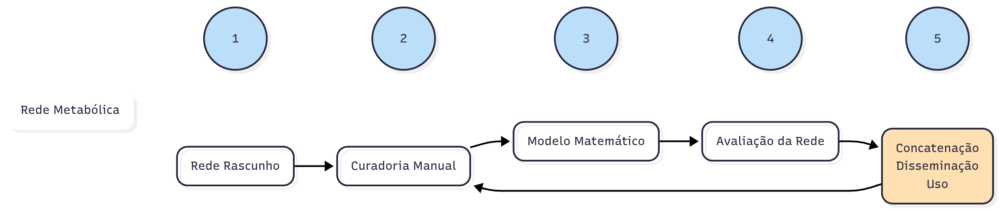

# Estágio 5: Concatenação dos dados, disseminação e uso{.smaller}

Uma vez que a reconstrução termina, é importante que ela seja disponibilizada. Geralmente se usa o SBML, mas também temos:

- BioModels Database
- BioPAX
- CellML
- MIASE
- MIRIAM
- Systems Biology Ontology
- Systems Biology Graphical Notation

---

```{.bash}
<?xml version="1.0" encoding="UTF-8"?>
<sbml xmlns="http://www.sbml.org/sbml/level2/version4" level="2" version="4">
  <model id="modelo_exemplo" name="Conversao_A_para_B">
    <listOfCompartments>
      <compartment id="compartimento" size="1" constant="true"/>
    </listOfCompartments>
    <listOfSpecies>
      <species id="A" compartment="compartimento" initialConcentration="10" boundaryCondition="false"/>
      <species id="B" compartment="compartimento" initialConcentration="0" boundaryCondition="false"/>
    </listOfSpecies>
    <listOfParameters>
      <parameter id="k1" value="0.1" constant="true"/>
    </listOfParameters>
    <listOfReactions>
      <reaction id="reacao1" reversible="false">
        <listOfReactants>
          <speciesReference species="A"/>
        </listOfReactants>
        <listOfProducts>
          <speciesReference species="B"/>
        </listOfProducts>
        <kineticLaw>
          <math xmlns="http://www.w3.org/1998/Math/MathML">
            <apply>
            <times/>
              <ci> k1 </ci>
              <ci> A </ci>
            </apply>
          </math>
        </kineticLaw>
      </reaction>
    </listOfReactions>
  </model>
</sbml>
```

---

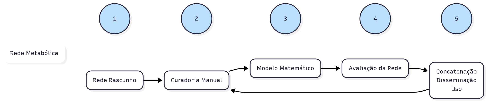{.r-stretch fig-align="center"}

---

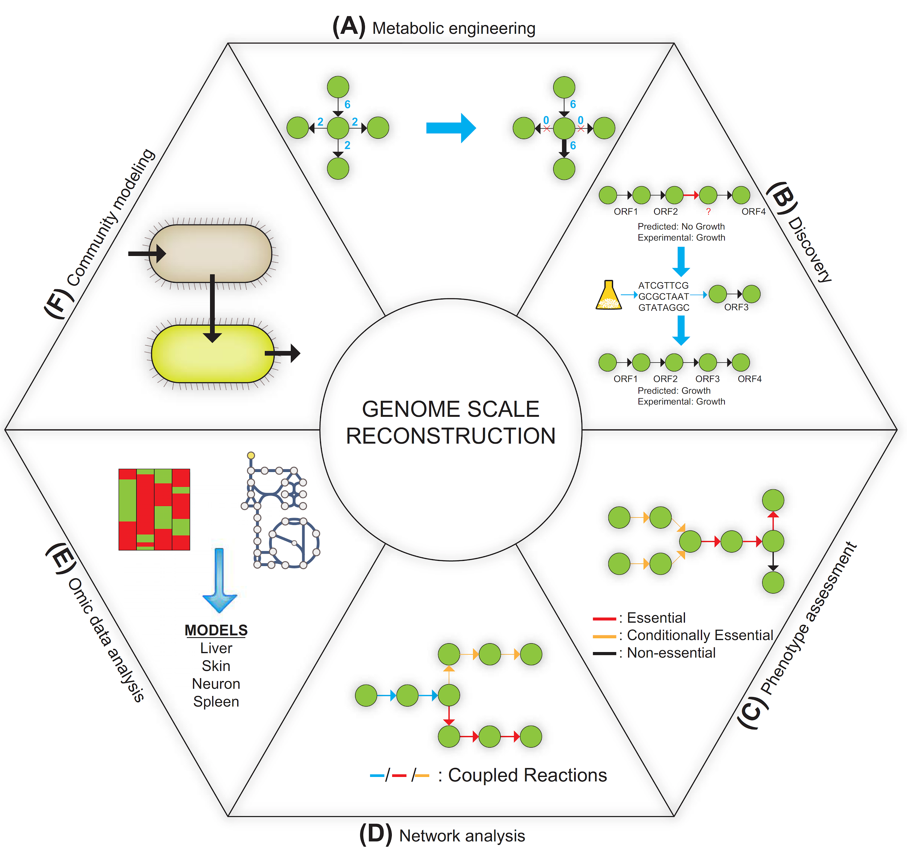{.r-stretch fig-align="center"}

# Aplicações de Reconstruções metabólicas

# Modularidade

A modularidade em redes metabólicas é um princípio organizacional fundamental que explica como a complexidade celular é gerenciada.

A modularidade das redes metabólicas está associada a robustez, adaptabilidade e eficiência dos sistemas vivos.

É uma ferramenta crucial para engenharia metabólica e para a medicina.

# Modularidade: exemplo{.smaller}

::: {.columns}
::: {.column}
* **Condição 1: Oxigênio Pleno (Aerobiose)**
  * Módulo Ativo 1: Glicólise (quebra a glicose até piruvato).
  * Módulo Ativo 2: Ciclo de Krebs (oxida o piruvato).
  * Módulo Ativo 3: Cadeia Transportadora de Elétrons (produz ATP).
  * Acoplamento: O módulo 1 alimenta o módulo 2 com piruvato, e o módulo 2 alimenta o módulo 3 com NADH. O resultado é uma produção eficiente de ATP.
:::
::: {.column}
* **Condição 2: Sem Oxigênio (Anaerobiose)**
  * Módulo Ativo 1: Glicólise (continua funcionando).
  * Módulo Inativo 2 e 3: Ciclo de Krebs e CTE são drasticamente reduzidos.
  * Módulo Ativo Alternativo: Fermentação (um módulo menor que recicla o NAD+ necessário para a glicólise continuar).
  * Mudança Modular: A célula desliga módulos inteiros que dependem de oxigênio e ativa um módulo alternativo para manter a produção de energia, mesmo que de forma menos eficiente.
:::
:::