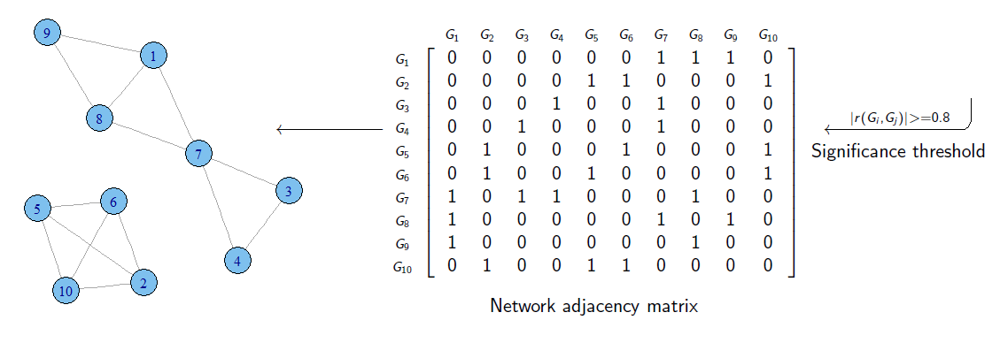
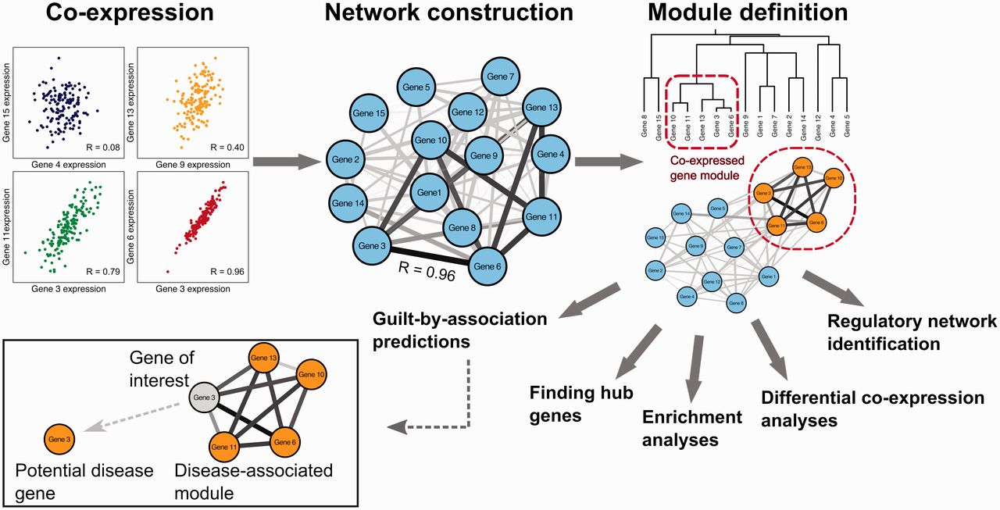
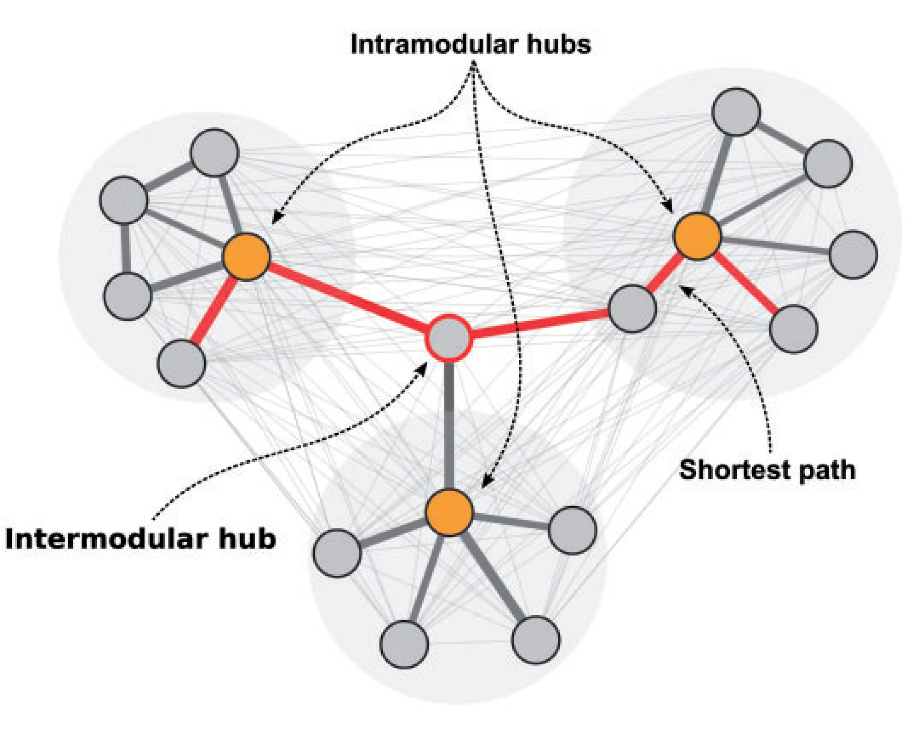

# Rede de co-expressão

É uma rede de genes que possuem a tendência de serem co-expressos (<span style="color:#4169E1; font-weight:bold;">ativados</span> ou <span style="color:#4169E1; font-weight:bold;">reprimidos</span>) através de um grupo de amostras.

# Redes de co-expressão (cont.)


::: {.columns}
::: {.column}
São grafos não-direcionados.

- **Vértices**: genes.
- **Arestas**: relação de co-expressão.
:::
::: {.column}

:::
:::

# Redes de co-expressão (cont.)

* Para construir redes de co-expressão, precisamos de várias amostras.
  * **Para quê?**

# Redes de co-expressão (cont.)

* Uma rede de co-expressão gênica pode ser construída procurando pares de genes que mostram:
  * <span style="color:#4169E1; font-weight:bold;">Padrão de expressão similar entre amostras</span>
    * Dois genes co-expressos podem subir ou descer juntos em amostras.

# Redes de co-expressão (cont.)

::: {.columns}
::: {.column}
**Podem ser usadas para:**

- Priorização de genes associados a doenças;
- Anotação funcional de genes;
- Identificação de correlação;
:::
::: {.column}
**Normalmente não são capazes de:**

* Conferir informação sobre causalidade;
  * Genes podem estar ativos durante uma resposta biológica mas não necessariamente com efeito causativo entre o gene e a resposta.
* Não fazem diferença entre genes **regulatórios** e genes **regulados**;
:::
:::

# Construção de redes de co-expressão

**É feita em três passos:**

::: {style="display: flex; flex-direction: column; gap: 15px; width: 60%; margin: 2em auto;"}
::: {style="background-color: #005689; color: white; padding: 20px 0; display: flex; justify-content: center; align-items: center; font-weight: bold;"}
1. Definir relações entre os genes.
:::
::: {style="background-color: #00873e; color: white; padding: 20px 0; display: flex; justify-content: center; align-items: center; font-weight: bold;"}
2. Construir a rede.
:::
::: {style="background-color: #e67e15; color: white; padding: 20px 0; display: flex; justify-content: center; align-items: center; font-weight: bold;"}
3. Definição de módulos.
:::
:::

# Passo 1: Definir relações entre genes

* As relações entre os genes são baseadas nas  medidas de correlação .
* As medidas de correlação fazem a comparação do padrão de um par de genes através das amostras.
* Existem várias medidas de correlação:
  * Correlação de Pearson.
  * Correlação de Spearman.

# Correlação de Pearson{.smaller}

- É uma medida da  correlação   linear  entre duas variáveis X e Y .

- O coeficiente de correlação de Pearson é a covariância das duas variáveis ​​dividida pelo produto de seus desvios-padrão.

::: {.columns .v-align-middle}
::: {.column}
<center><br><br><br><br>$\huge \displaystyle \rho_{X,Y} = \frac{\text{Cov}(X,Y)}{\sigma_X \sigma_Y}$</center>
:::
::: {.column}
|Símbolo|O que é|Significado|
|:---:|:---:|:---:|
| $\rho_{X,Y}$ | $\rho$. | Coeficiente de correlação de Pearson |
| $\text{Cov}(X,Y)$ |	Covariância entre X e Y. | Mede como as duas variáveis variam juntas. |
| $\sigma_X$	| Desvio padrão da variável X | Dispersão de X em torno da média |
| $\sigma_Y$	| Desvio padrão da variável Y | Dispersão de Y em torno da média |
:::
:::

::: {.notes}

Uma relação é linear quando a mudança em uma variável é associada a uma mudança proporcional na outra variável.
http://lcb.fflch.usp.br/sites/lcb.fflch.usp.br/files/upload/paginas/AULA5-correla%C3%A7%C3%A3o_0.pdf

:::

# Correlação de Spearman

* Vê a correlação entre duas variáveis.
* A relação entre as variáveis é monotônica, sejam lineares ou não, o que é menos restritivo que uma relação como seria com a correlação de Pearson.
  * Se elas crescem ou diminuim juntas.

{.r-stretch fig-align="center"}

::: {.notes}

Em uma relação monotônica, as variáveis tendem a mudar juntas mas não necessariamente a uma taxa constante.
https://support.minitab.com/pt-br/minitab/18/help-and-how-to/statistics/basic-statistics/supporting-topics/correlation-and-covariance/a-comparison-of-the-pearson-and-spearman-correlation-methods/

:::

---

{.r-stretch fig-align="center"}

# Passo 2: Construir a rede

As associações de co-expressão são usadas para reconstruir a rede. Vértices são genes e arestas são a presença da correlação (além da presença podem refletir a **força da correlação**).

{.r-stretch fig-align="center"}

# Tipos de redes de co-expressão

- Redes com sinal e sem sinal.

- Redes ponderadas e não-ponderadas

# Redes de co-expressão com sinal e sem sinal

Numa rede de co-expressão baseada em correlação, às medidas de correlação têm valores entre:


::: {.callout-note}
# Valor
-1:	correlação negativa perfeita

1:	correlação positiva perfeita.
:::

- Em uma  rede sem sinal , os absolutos dos valores de correlação são usados. Então teremos somente a informação de correlação mas não saberemos se são positiviamente ou negativamente co-expressos.
- Mas teremos a relação de crescem juntos, decrescem juntos ou aumentam e diminuem ao mesmo tempo na mesma proporção.

# Redes de co-expressão com sinal e sem sinal (cont.)

Uma  rede com sinal  resolve esse problema escalonando os valores de correlação entre 0 e 1.

::: {.callout-note}
# Valores

**<0,5**:	indicam correlação negativa

**=0,5**: neutra/fraca

**\>0,5**: indicam correlação positiva.

:::

- Assim, um valor escalonado próximo de 0 indica uma correlação forte e  negativa, uma característica que pode ser particularmente interessante quando o transcrito exerce sua função principalmente através da regulação negativa de outros genes.
- Na rede com sinal só teremos relações de crescem ou diminuim juntos.

::: {.notes}
https://peterlangfelder.com/2018/11/25/signed-or-unsigned-which-network-type-is-preferable/
https://peterlangfelder.com/2019/05/30/signed-network-from-signed-topological-overlap/
https://peterlangfelder.com/2018/11/25/trashed/
:::

# Redes de co-expressão com peso e sem peso {.smaller}

::: {.columns}
::: {.column}
- Em uma rede ponderada:
  - todos os genes são conectados uns aos outros
  - conexões têm valores de peso contínuos entre 0 e 1 que indicam a força de co-regulação entre os genes.

- Em uma rede não-ponderada:
  - a interação entre pares de genes é binária, ou seja, 0 ou 1, não-conectados e conectados, respectivamente.

- Uma rede não-ponderada pode ser criada a partir de uma rede ponderada: considerando acima de um certo limiar de correlação a ser conectado e todos os outros desconectados.
:::
::: {.column}
{.r-stretch fig-align="center"}
:::
:::

---

::: {.notes}
van Dam S, Võsa U, van der Graaf A, Franke L, de Magalhães JP. (2017) Gene co-expression analysis for functional classification and gene-disease predictions. Brief Bioinform
:::

# Passo 3: Definição de módulos

* Módulos de genes co-expressos são identificados usando técnicas de agrupamento (clusterização).
* O agrupamento é usado para fazer grupos de genes com padrões de expressão similares entre as amostras.
* Os módulos podem ser subsequentemente interpretados por Análise de Enriquecimento Funcional.
  * Um método que identifica e ranqueia categorias funcionais super representadas em uma lista de genes.

# Passo 3: Definição de módulos (cont.){.smaller}

**É importante considerar a heterogeneidade das amostras.**

Análises de co-expressão enfrentam um *troca*: redes **multitecido/multicondição** diluem o sinal e escondem módulos específicos, enquanto redes de **tecido/condição única** reduzem o tamanho da amostra e perdem poder estatístico para detectar módulos compartilhados.

**Solução:**

* **Métodos gerais (sem distinção):** ideais para identificar módulos de co-expressão **comuns/compartilhados**.
* **Co-expressão diferencial (comparativa):** ideal para identificar módulos **específicos/exclusivos**.

# Identificando módulos{.smaller}

::: {.columns}
::: {.column}
- O pacote de clustering mais usado para a análise de redes co-expressão é o Análise Ponderada de Rede de Correlação de Genes (WGCNA, _Weighted Gene Co-expression Network Analysis_).

- Essa ferramenta fácil de usar constrói módulos de co-expressão usando o agrupamento hierárquico em uma rede de correlação criada a partir de dados de expressão.

- O agrupamento em clusters hierárquicos divide iterativamente cada cluster em subclusters para criar uma árvore com ramificações representando módulos de co-expressão. Os módulos são definidos cortando os ramos a uma certa altura (valor de corte) definida pelo usuário.
:::
::: {.column}
{.r-stretch fig-align="center"}
:::
:::

::: {.notes}
El-Sharkawy, Islam & Liang, Dong & Xu, Kenong. (2015). Transcriptome analysis of an apple (Malus × domestica) yellow fruit somatic mutation identifies a gene network module highly associated with anthocyanin and epigenetic regulation. Journal of Experimental Botany. 66. 10.1093/jxb/erv433.
:::

---

{.r-stretch fig-align="center"}

::: {.footer}
van Dam S, Võsa U, van der Graaf A, Franke L, de Magalhães JP. (2017) Gene co-expression analysis for functional classification and gene-disease predictions. Brief Bioinform
:::

# Redes de co-expressão diferencial

**Além da Co-Expressão Tradicional: Análise Diferencial de Redes**

- O que faz: Mapeia genes que alteram dinamicamente seus parceiros de co-expressão conforme a condição (tecidos, doenças ou estágios de desenvolvimento).

- Importância Biológica: Genes com conexões flexíveis têm maior potencial regulatório e são chaves para explicar diferenças fenotípicas.

- Validação Multi-Ômica: O papel regulatório desses genes é investigado integrando:

  - Interações Proteína-Proteína (PPI)
  - Perfil de Metilação do DNA (Metiloma)
  - Redes Regulatórias de Fatores de Transcrição (TF-alvo)

# Identificando hubs

**Priorização e Papel dos Genes Hub em Redes de Co-Expressão**

- **Desafio**: Módulos de clustering costumam ser extensos, exigindo a identificação dos genes que melhor explicam o comportamento do grupo.

- **Solução**: Identificação de genes hub — nós altamente conectados e biologicamente mais relevantes para a topologia da rede.

- **Classificação Topológica**:

  - **Hubs Intramodulares**: exercem centralidade dentro de um módulo específico.
  - **Hubs Intermodulares**: atuam como pontes e reguladores globais entre diferentes módulos da rede.

---

São usadas medidas de centralidade para identificar os hubs.

{.r-stretch fig-align="center"}

# Análise de enriquecimento

* Dentro de um módulo são encontrados os termos funcionais mais frequentes.
  * Assim pode se ter uma ideia de qual função, dentro de um módulo na rede, pode ser mais frequente e representativa daquele módulo.

# Predição de culpados por associação{.smaller}

::: {.columns}
::: {.column}
**Significado Biológico e o Princípio GBA**

  - Enriquecimento Funcional: Principal método para traduzir uma lista de genes em uma função biológica compreensível (o "papel" do módulo).

  - Princípio GBA (Guilt by Association / "Culpado por Associação"): Premissa de que genes co-expressos participam do mesmo processo biológico.

  - Anotação Funcional: Permite inferir a função de genes desconhecidos (mal anotados) com base nos genes bem conhecidos do mesmo grupo.

  - Aplicações Clínicas: Identifica novos genes candidatos para doenças se o módulo como um todo apresentar forte ligação com uma patologia.
:::
::: {.column}
{.r-stretch fig-align="center"}
:::
:::

<!-- # Redes de co-expressão

A maneira mais comum de construir redes de co-expressão baseadas em dados de RNA-seq é fundir todas as isoformas de um gene em uma única versão e só depois construir a rede usando o nível de genes.

O ideal, e mais interessante, é que usássemos as isoformas de splicing para construir a rede, porém usar todas as isoformas de um gene  aumenta muito o tamanho da rede de co-expressão o que aumenta o tempo de análise. -->

# Ferramentas

- Pré-processamento: WGCNA para construção da rede

- Identificação de módulos: WGCNA ou clusterMaker2 (Cytoscape)

- Análise de hubs: CytoHubba ou igraph

- Enriquecimento funcional: clusterProfiler ou g:Profiler

- Visualização final: Cytoscape ou ggplot2/ggraph

# Testa: simulação

```{r}
#| echo: false
#| fig-align: "center"
#| output-location: slide

library(igraph)
library(ggraph)
library(tidygraph)

# 1. Simulação de 6 genes em 30 amostras
set.seed(42)
amostras <- 30
GeneA <- rnorm(amostras, mean=10, sd=2)
GeneB <- GeneA * 0.8 + rnorm(amostras, sd=0.5)  # Forte correlação positiva com A
GeneC <- -GeneA * 0.9 + rnorm(amostras, sd=0.5) # Forte correlação negativa com A
GeneD <- rnorm(amostras, mean=10, sd=2)         # Independente
GeneE <- GeneD * 0.85 + rnorm(amostras, sd=0.3) # Correlacionado com D
GeneF <- rnorm(amostras, mean=5, sd=1)          # Ruído

matriz_exp <- data.frame(GeneA, GeneB, GeneC, GeneD, GeneE, GeneF)

# 2. Matriz de Correlação de Pearson
matriz_cor <- cor(matriz_exp, method = "pearson")

# 3. Criar Rede Não-Ponderada com Limiar (|r| > 0.6)
adj_matrix <- abs(matriz_cor) > 0.6
diag(adj_matrix) <- 0 # Remover auto-conexões

# 4. Plot da Rede com destaque para Hubs
rede <- graph_from_adjacency_matrix(adj_matrix, mode = "undirected")

ggraph(rede, layout = 'stress') + 
  geom_edge_link(color = "gray70", width = 1) + 
  geom_node_point(aes(size = degree(rede)), color = "#005689") + 
  geom_node_text(aes(label = name), vjust = -1, fontface = "bold") +
  theme_void() +
  labs(title = "Simulação de Rede de Co-expressão (|r| > 0.6)",
       size = "Grau (Hub)")
```

# Exemplo Prático: Código Python (NetworkX + Matplotlib)

Se você utiliza o engine de Python no Quarto (Jupyter Engine), pode usar o script abaixo no slide de **Identificação de Hubs**:

---

```{python}
#| echo: false
#| fig-align: "center"

import numpy as np
import networkx as nx
import matplotlib.pyplot as plt

# 1. Criar rede sintética de co-expressão (Modelo Scale-Free / Barabási-Albert)
np.random.seed(42)
G = nx.barabasi_albert_graph(n=15, m=2, seed=42)

# Rotular nós como genes
mapping = {i: f"Gene_{i+1}" for i in range(15)}
G = nx.relabel_nodes(G, mapping)

# 2. Calcular centralidade de grau (Hubs)
degrees = dict(G.degree())
node_sizes = [v * 300 for v in degrees.values()]
node_colors = [degrees[n] for n in G.nodes()]

# 3. Renderizar Grafo
plt.figure(figsize=(8, 5))
pos = nx.spring_layout(G, seed=42)

nodes = nx.draw_networkx_nodes(G, pos, node_size=node_sizes, 
                                node_color=node_colors, cmap=plt.cm.Blues)
nx.draw_networkx_edges(G, pos, alpha=0.4, edge_color="gray")
nx.draw_networkx_labels(G, pos, font_size=9, font_weight="bold")

plt.colorbar(nodes, label="Conexões (Grau do Hub)")
plt.title("Identificação de Genes Hub em Rede Simulada", fontsize=12)
plt.axis("off")
plt.show()
```