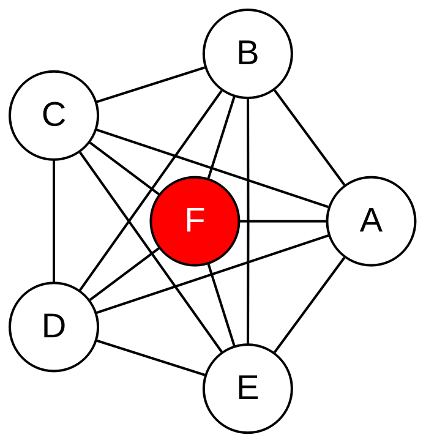
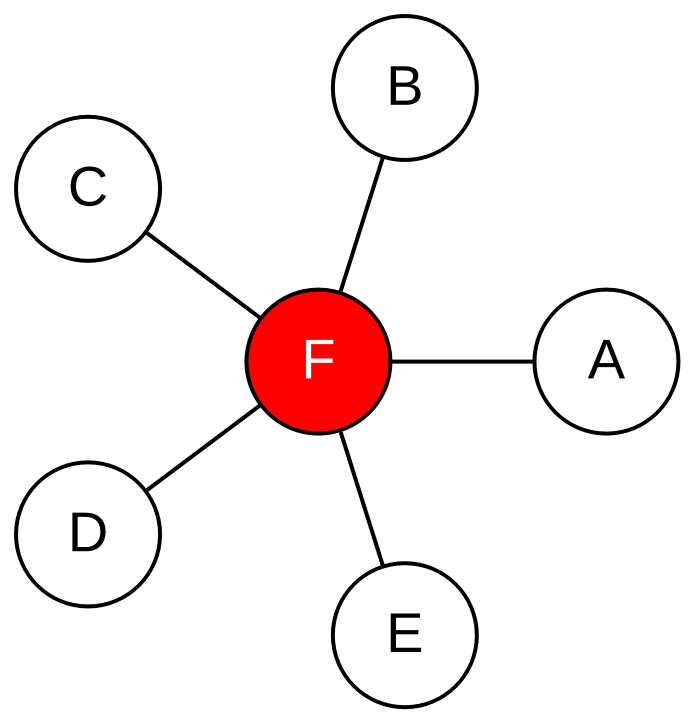
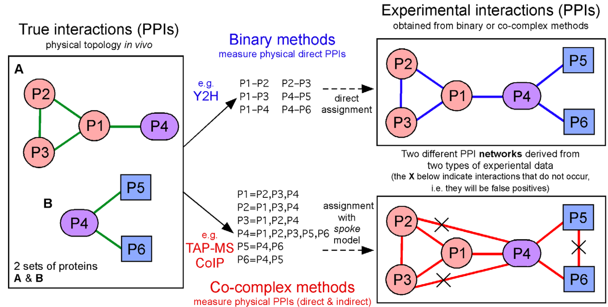
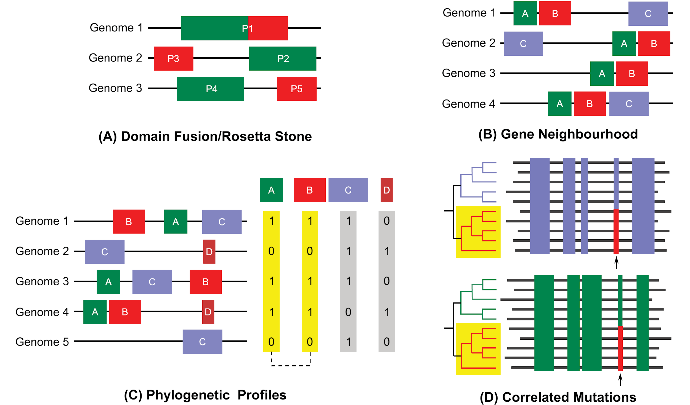
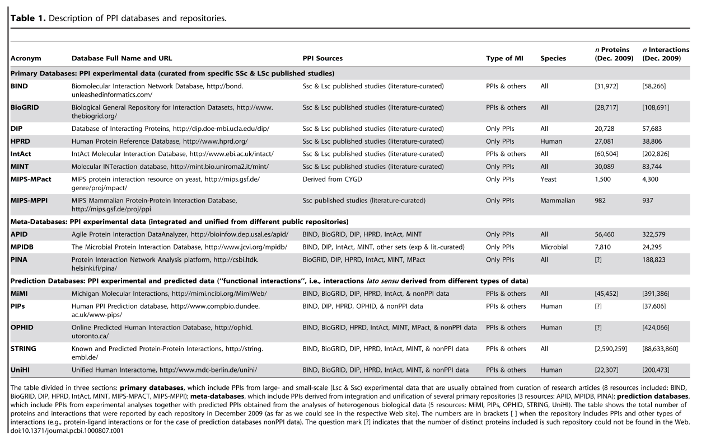
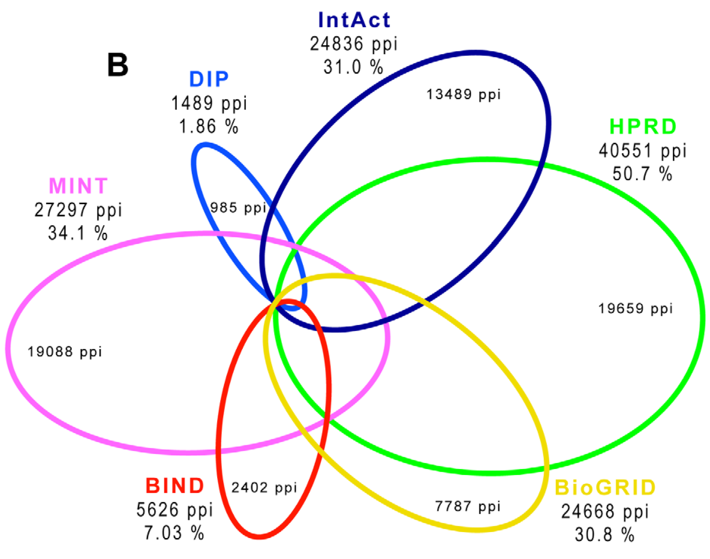
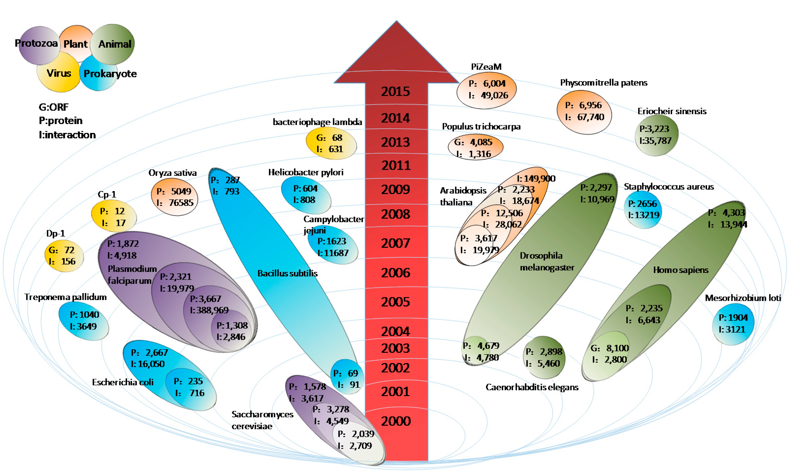

# Rede de interação proteína-proteína

- São redes em que temos proteínas como vértices e uma aresta quando as proteínas apresentarem interação entre si.

- São grafos não-direcionados.

# Interação entre proteínas: PPI

No foco das redes de interação proteína-proteína definimos como interação quando um proteína interage fisicamente com outra proteína _in vivo_ .

# Mais sobre interações

* A interação entre as proteínas deve ser específica, excluindo aquelas interações que acontecem ao acaso.
* Também é importante excluir aquelas interações da proteína de quando ela está sendo feita, dobrada, checada ou degrada.
  * Exemplo: as proteínas podem em algum momento tocar o ribossomo, chaperonas e proteassoma.

# Portanto...

... a definição de interação proteína-proteína deve considerar que:

- A interface de interação deve ser intencional e não acidental, ou seja, deve ser o resultado de eventos/forças biomoleculares selecionados; e
- A interface de interação deve ser não-genérica, ou seja, desenvolvido para uma finalidade distinta de funções totalmente genéricas, como produção de proteínas, degradação e entre outras.

:::{.callout-important}
# Cuidado

- Isso não quer dizer que as interações devem ser estáticas ou permanentes.

- Podemos ter também interações  transientes  que dependem da função
:::

# Contexto biológico de PPIs

* **Nem todas as interações possíveis ocorrerão**
  * Em qualquer célula
  * A qualquer momento.
* Em vez disso, as interações dependem
  * Do tipo de célula
  * Fase e estado do ciclo celular
  * Estágio de desenvolvimento
  * Condições ambientais
  * Modificações de proteínas (por exemplo, fosforilação)
  * Presença de cofatores e presença de outros parceiros de ligação.
* Ou seja, a interação pode ser específica de um momento celular.

# Determinando interações entre proteínas

* Binária
  * Determinação de interação entre duas proteínas, par-a-par
* Co-complexo
  * Determinação de interação entre grupos de proteínas

# Determinando interações entre proteínas (cont.)

* Binária
  * Determinação de interação entre duas proteínas, par-a-par
    * [Y2H]{style="color: red;"}
* Co-complexo
  * Determinação de interação entre grupos de proteínas
    * [AP-MS e CoIP]{style="color: red;"}
    * [Precisa de modelos que definem as interações entre as proteínas isoladas concomitantemente.]{style="color: red;"}
    <!-- * [texto grande e amarelo]{style="color: yellow; font-size: 200%;"} -->

---

::: {.columns}
::: {.column}

**Modelo de Matriz**

{.r-stretch fig-align="center"}
:::
::: {.column}

**Modelo Spoke** (de raios)

{.r-stretch fig-align="center"}
:::
:::

---

::: {style="display: flex; flex-direction: column; justify-content: center; align-items: center; height: 100%;"}
| Característica | Modelo Spoke | Modelo Matrix |
| :-: | :-: | :-: |
| **Foco** | Conservador | Abrangente |
| **Interações inferidas** | Apenas isca-presa | Todos contra todos |
| **Confiança** | Alta para isca-presa | Baixa para muitos pares |
| **Cobertura** | Menor | Maior |
| **Uso típico** | Bancos de dados curados | Análises exploratórias |
:::

---

{.r-stretch fig-align="center"}

# Métodos computacionais

1. Método baseado em interólogos
2. Predição baseada em algoritmos genéticos
3. Perfil evolutivo

# Métodos computacionais (cont.)

* Método baseado em interólogos
  * Interólogos são definidos como as interações proteína-proteína que são [conservadas em duas espécies]{style="color: red;"}.
  * O método baseado em interólogos baseia-se no pressuposto de que proteínas conservadas evolutivamente tendem a ter sua interação também conservada.
  * Depende de buscas por homologia.

# Métodos computacionais (cont.){.smaller}

::: {.columns}
::: {.column}
* Predição baseada em algoritmos genéticos
  * Algoritmos genéticos são técnicas de otimização inspiradas na evolução natural que usam seleção, cruzamento e mutação para encontrar soluções.
:::
::: {.column}
* **Características usadas como "genes"**:
  * Domínios conservados
  * Motivos de sequência
  * Perfis físico-químicos
  * Padrões de co-ocorrência
* **Processo iterativo**:
  * Seleção: Mantém os pares com melhor _aptidão_
  * Cruzamento: Combina características de pares promissores
  * Mutação: Introduz variações aleatórias
  * Avaliação: Testa a nova geração de predições
:::
:::

# Métodos computacionais (cont.)

::: {.columns}
::: {.column width="60%"}
Cromossomo_Pai₁: [0.85, 0.72, 0.91, 0.68, 0.95, 0.33]

Cromossomo_Pai₂: [0.42, 0.88, 0.67, 0.91, 0.54, 0.71]

---------------------------------------------↓ (cruzamento no ponto 3)

Cromossomo_Filho: [0.85, 0.72, 0.91,0.91, 0.54, 0.71]
:::
::: {.column width="40%"}
- Gene₁: Similaridade de Domínios
- Gene₂: Co-expressão Gênica
- Gene₃: Conservação de Resíduos na Interface
- Gene₄: Complementaridade Eletrostática
- Gene₅: Co-ocorrência Filogenética
- Gene₆: Distância na Rede Funcional
:::
:::

# Métodos computacionais (cont.)

::: {.columns}
::: {.column}
* Perfil Evolutivo:
  * Analisa padrões de co-evolução entre proteínas - se duas proteínas evoluem de forma correlacionada ao longo da evolução, é sinal que podem interagir.
:::
::: {.column}
- Correlação filogenética
- Análise de ganho/perda conjunta
- Substituições compensatórias
:::
:::

---

{fig-align="center"}

# Bancos de dados de PPI: Primários{.smaller}

{fig-align="center"}

# Bancos de dados de PPI: Meta-base de dados, reunião de dados de bases de dados primárias{.smaller}

{fig-align="center"}

# Bancos de dados de PPI: dados preditos{.smaller}

{fig-align="center"}

---

{.r-stretch fig-align="center"}

---

{.r-stretch fig-align="center"}

# Aplicações

* Anotação funcional de proteínas
  * Baseado em proteínas adjacentes: _guilt-by-association._
* Módulos
  * Proteínas que possuem as mesmas funções ou fazem parte de um complexo
* Investigação de subsistemas.
  * Associados com alguma via, resposta ou doença específica.

# Aplicações (cont.)

* Análise evolutiva
  * Análise da relação entre as proteínas com foco evolutivo nos interólogos associados às suas funções.
* Análise de hubs
  * Regra da centralidade-letalidade
  * Hubs _party_
  * Hubs _date_

# Aplicações (cont.)

* Hubs _party_
  * Interage com todos os seus parceiros ao mesmo tempo.
  * Funcionam dentro de módulos na formação de complexos.
* Hubs _date_
  * Interage com seus parceiros em diferentes tempos e localizações.
  * Funcionam para conectar módulos e funções uns aos outros

# Interação doença-doença

Podem ainda ser usados integrados com dados de doenças para achar proteínas que podem estar envolvidas em mais de uma doença, podendo servir de foco para o co-tratamento das doenças.