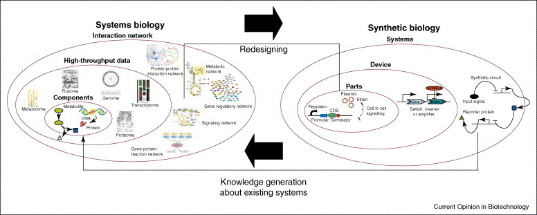
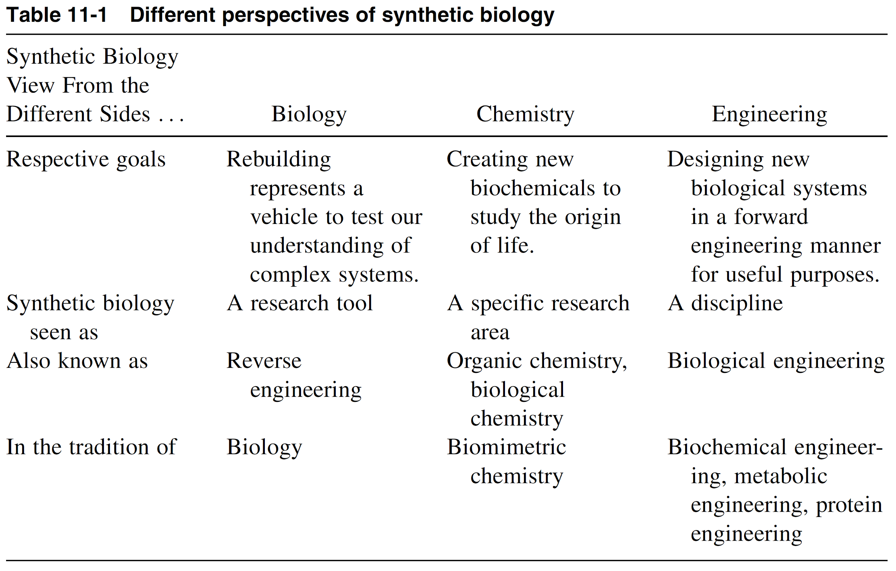
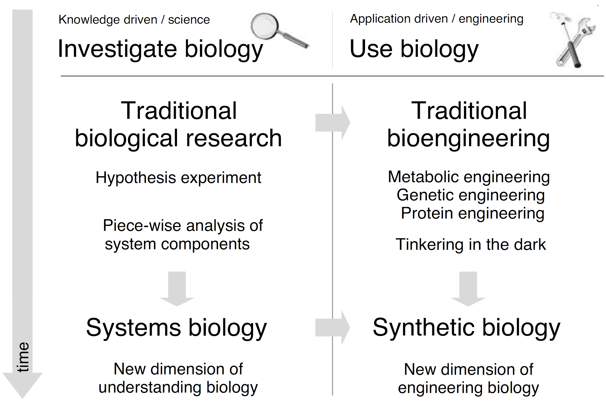
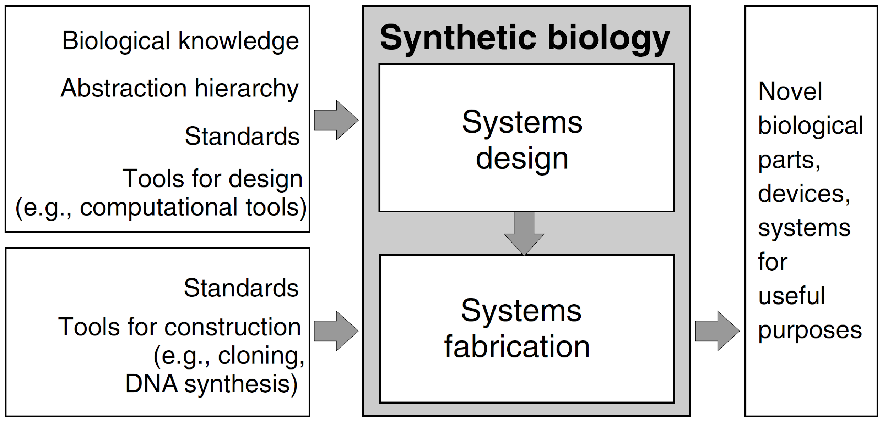
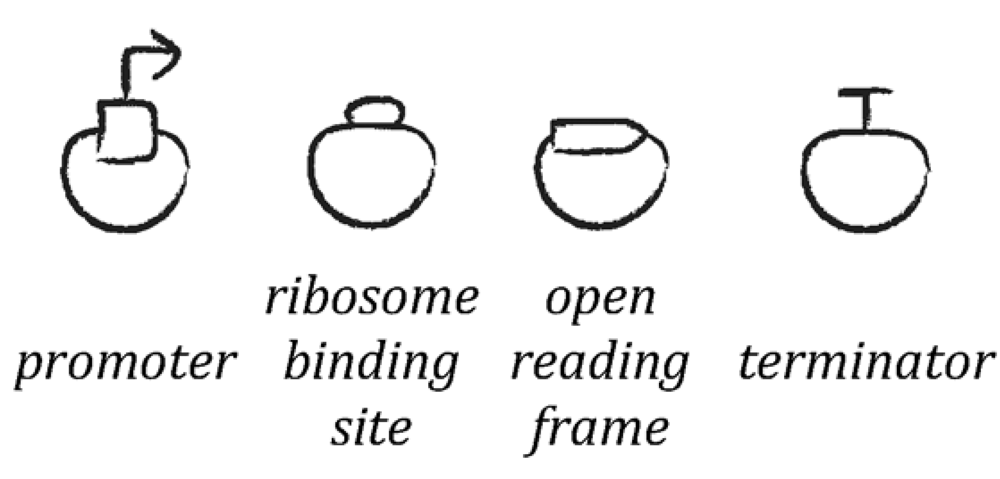
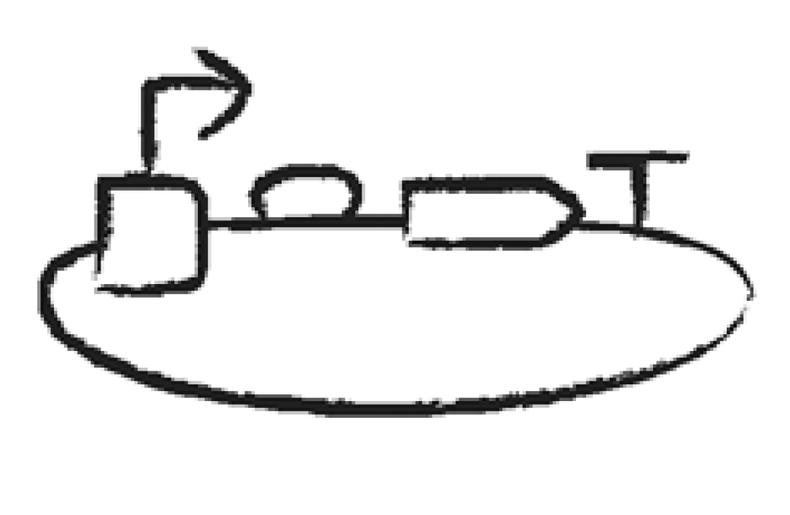
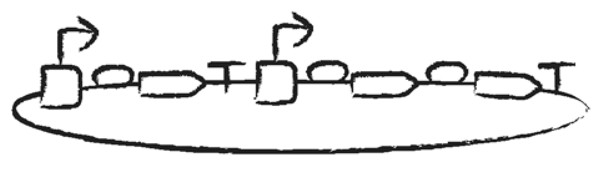
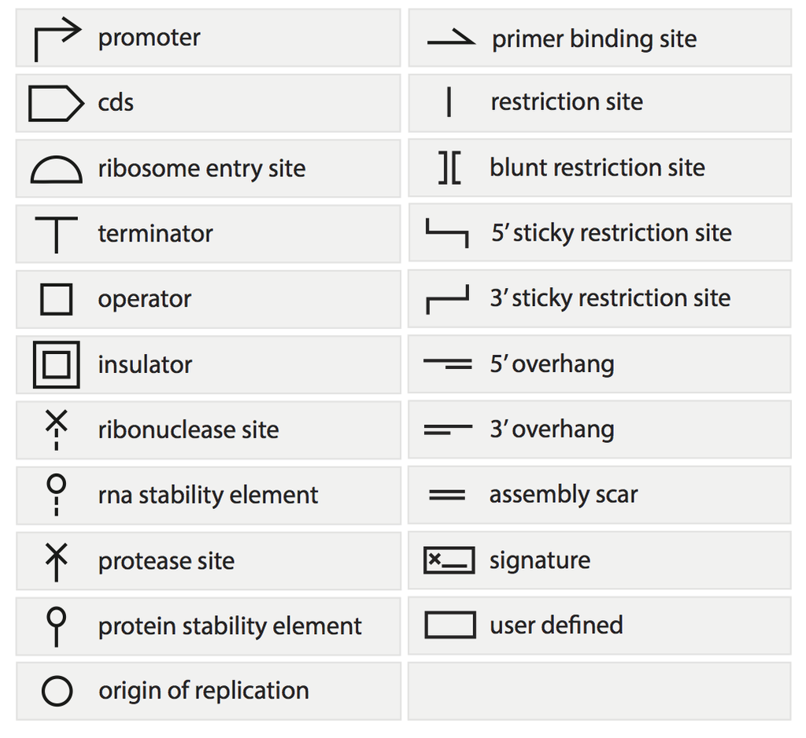
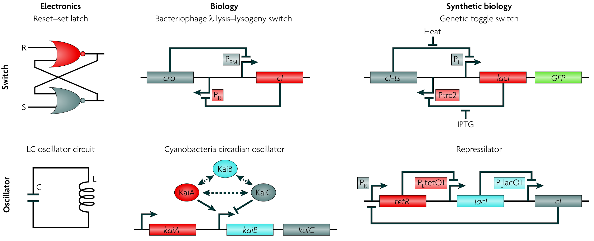
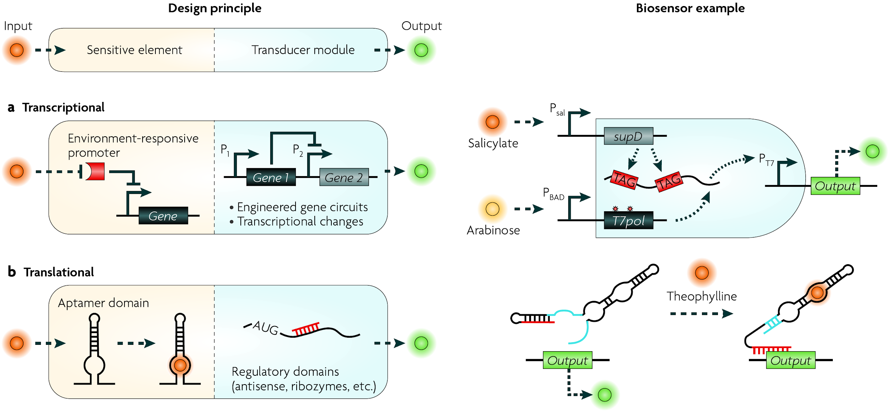

# Definição

A engenharia da biologia: o projeto e construção de novos dispositivos e sistemas biológicos que não existem na natureza, e o re-projeto de sistemas biológicos existentes para fins úteis.

Isso torna a biologia  projetável . Tornaria o processo de engenharia de um sistema biológico previsível, robusto e escalável.

Exemplo : A produção de insulina humana em bactérias E. coli foi um dos primeiros e mais bem-sucedidos exemplos de Biologia Sintética.

# A biologia é difícil de engenheirar

* Ruído intrínseco: a expressão gênica é estocástica. Duas células geneticamente idênticas podem ter quantidades diferentes da mesma proteína.
* Conectividade de Rede: o gene inserido interage com a rede metabólica, regulatória e de sinalização da célula hospedeira:
  * Efeito de carga ( _burden_ ): A expressão do circuito consome recursos celulares e pode prejudicar o crescimento e saúde celular.
  * Interações imprevisíveis: metabólitos e proteínas da célula hospedeira podem interferir no circuito.
* Contexto Espacial: A localização de moléculas e organelas importam.

---

{.r-stretch fig-align="center"}

---

- Com base em um modelo computacional que já leva em conta a rede celular.
- Usar os dados para refinar o modelo computacional, entender as falhas e gerar novas hipóteses.
- Síntese de DNA, edição genômica (CRISPR).
- Coletar dados ômicos e fenotípicos de alto rendimento.

---

{.r-stretch fig-align="center"}

---

{.r-stretch fig-align="center"}

---

{.r-stretch fig-align="center"}

---

{.r-stretch fig-align="center"}

---

{.r-stretch fig-align="center"}

---

{.r-stretch fig-align="center"}

---

{.r-stretch fig-align="center"}

---

{.r-stretch fig-align="center"}

---

{.r-stretch fig-align="center"}
