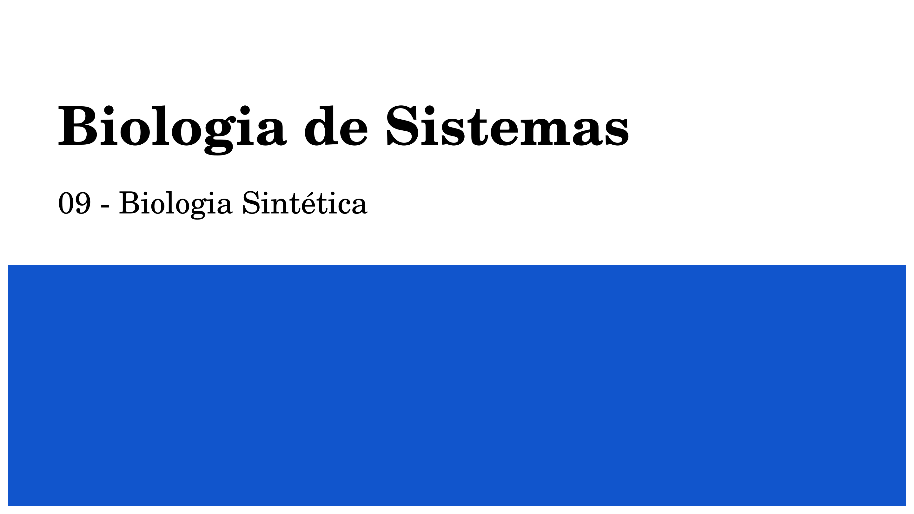{fig-align="center" width=100% style="border: 3px solid black; border-radius: 8px;"}

---

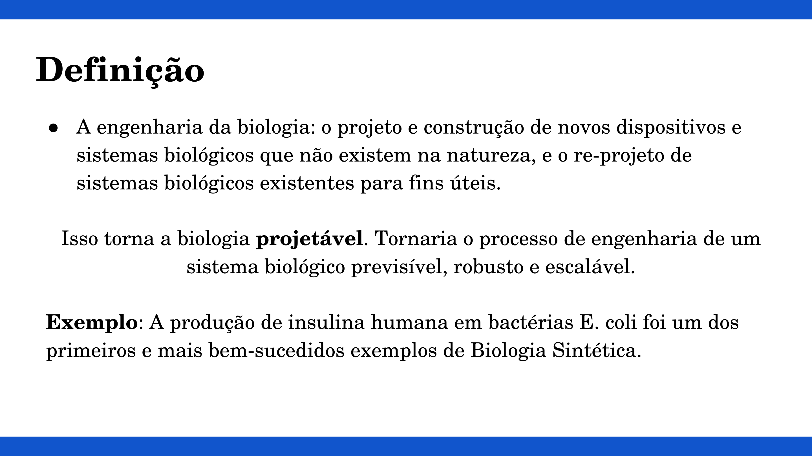{fig-align="center" width=100% style="border: 3px solid black; border-radius: 8px;"}

---

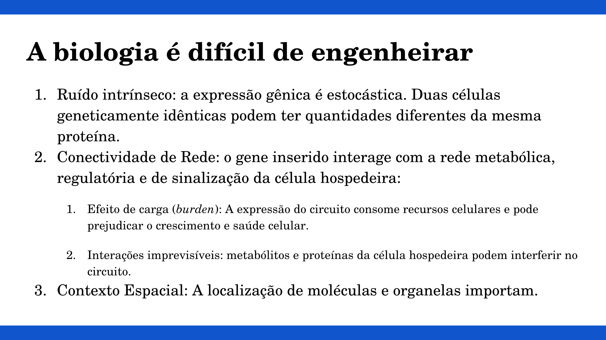{fig-align="center" width=100% style="border: 3px solid black; border-radius: 8px;"}

---

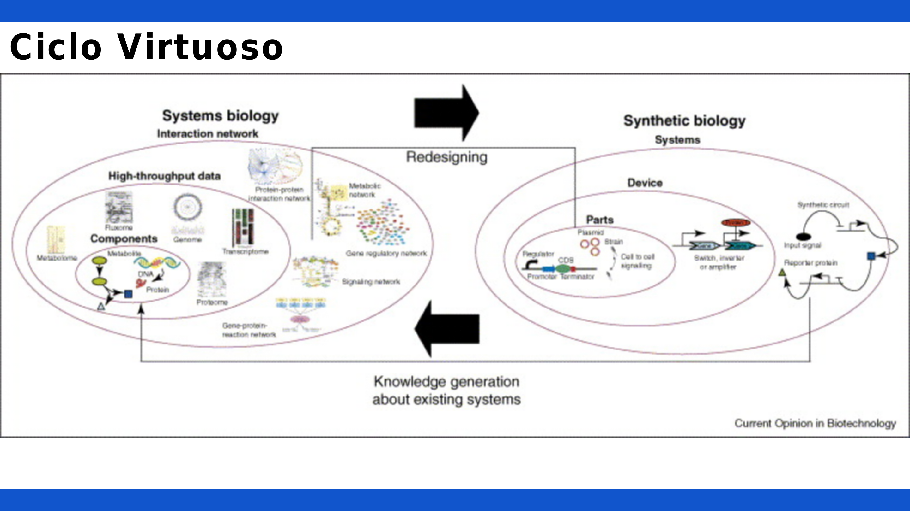{fig-align="center" width=100% style="border: 3px solid black; border-radius: 8px;"}

---

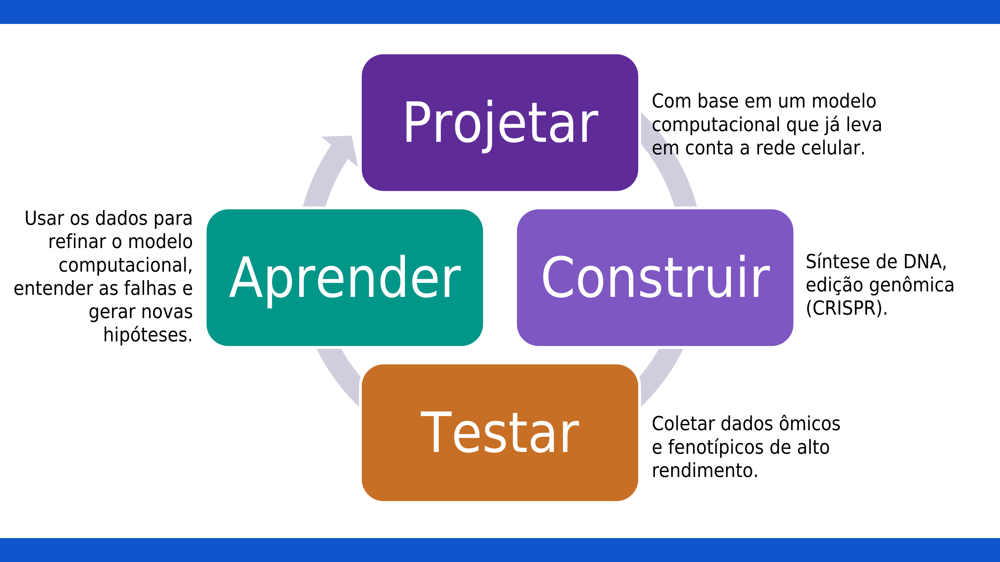{fig-align="center" width=100% style="border: 3px solid black; border-radius: 8px;"}

---

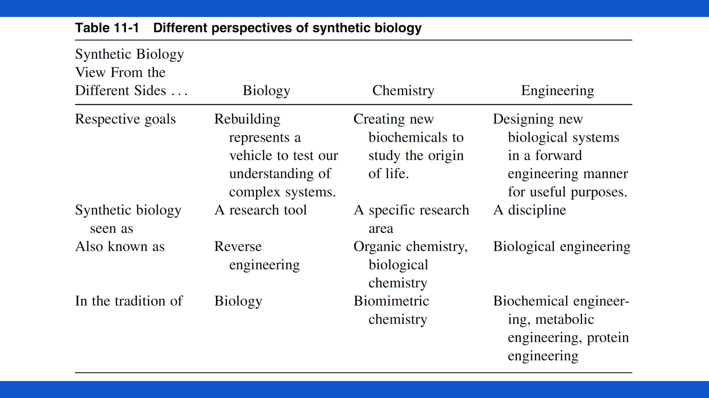{fig-align="center" width=100% style="border: 3px solid black; border-radius: 8px;"}

---

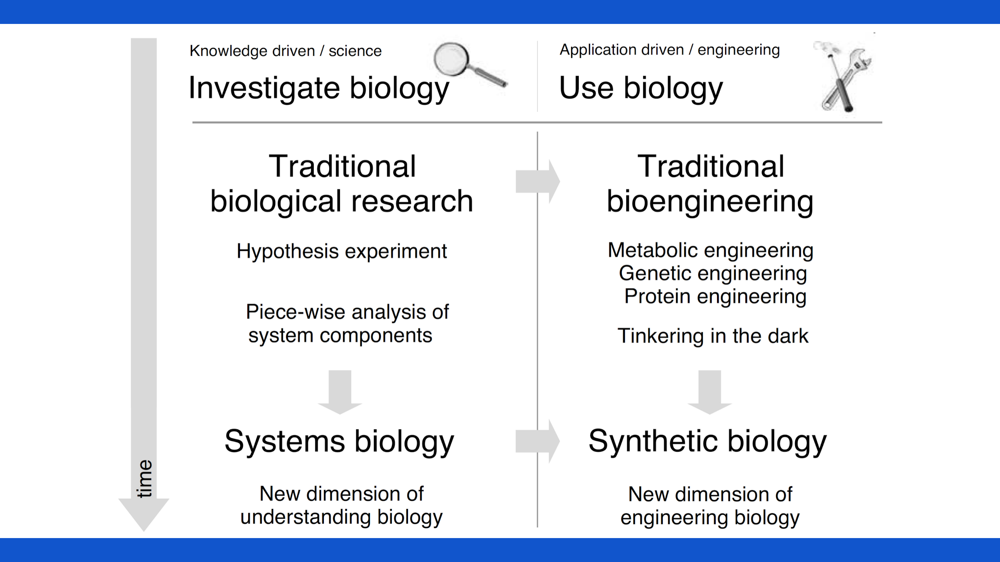{fig-align="center" width=100% style="border: 3px solid black; border-radius: 8px;"}

---

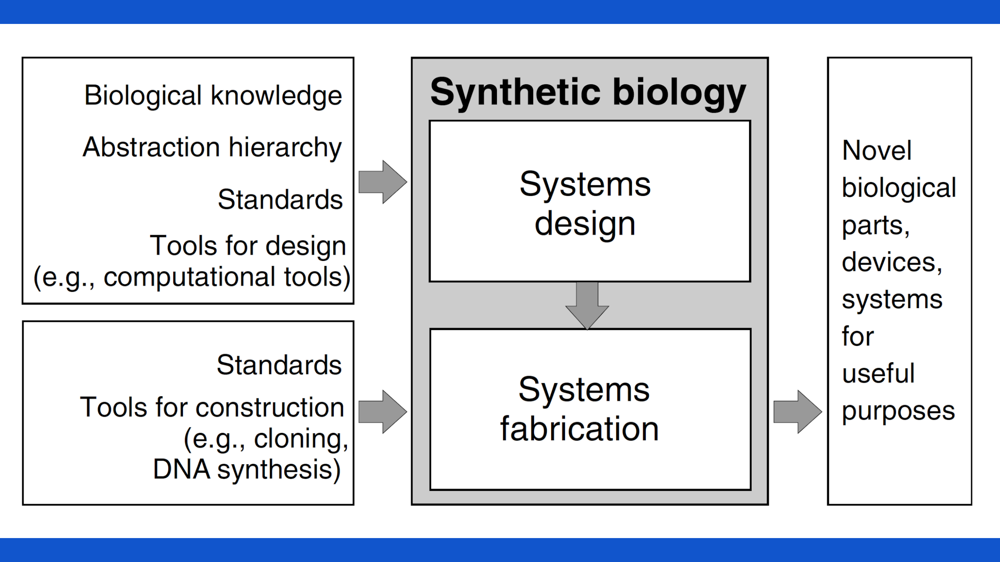{fig-align="center" width=100% style="border: 3px solid black; border-radius: 8px;"}

---

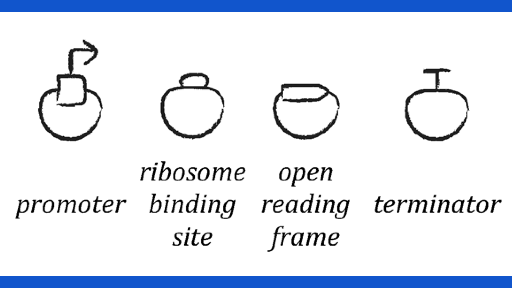{fig-align="center" width=100% style="border: 3px solid black; border-radius: 8px;"}

---

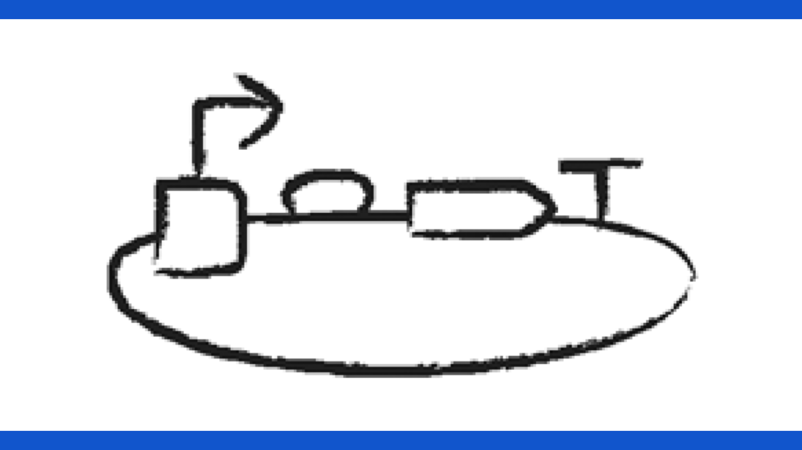{fig-align="center" width=100% style="border: 3px solid black; border-radius: 8px;"}

---

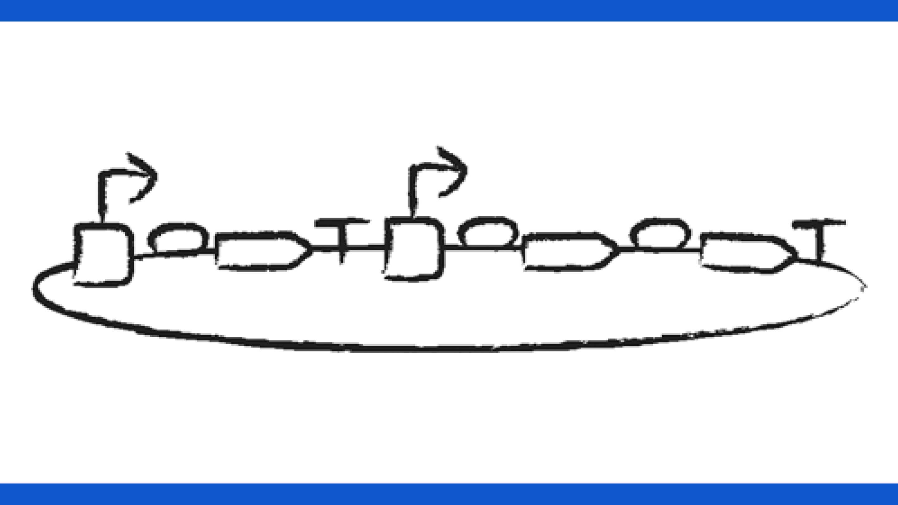{fig-align="center" width=100% style="border: 3px solid black; border-radius: 8px;"}

---

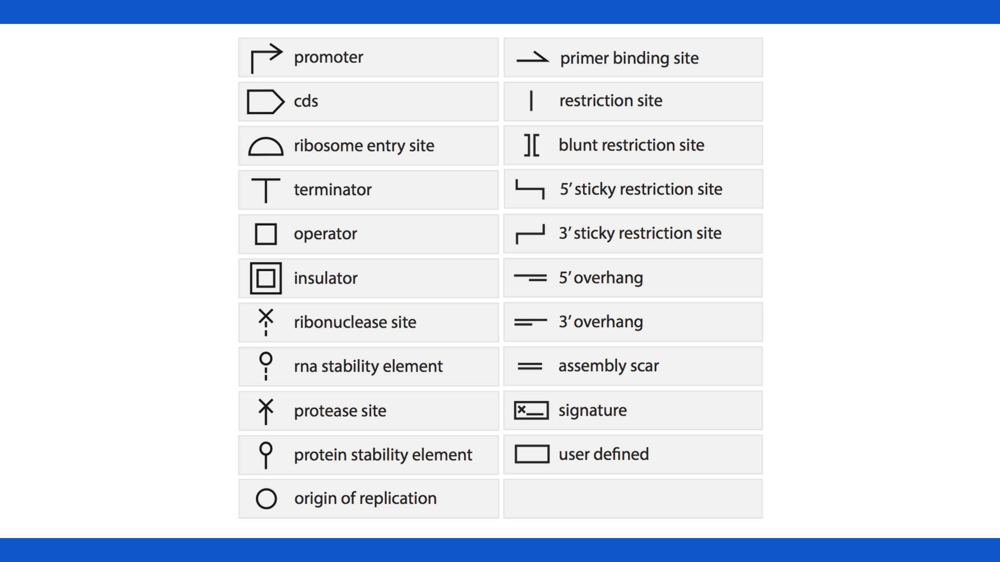{fig-align="center" width=100% style="border: 3px solid black; border-radius: 8px;"}

---

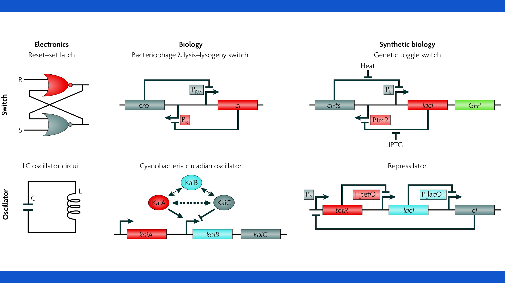{fig-align="center" width=100% style="border: 3px solid black; border-radius: 8px;"}

---

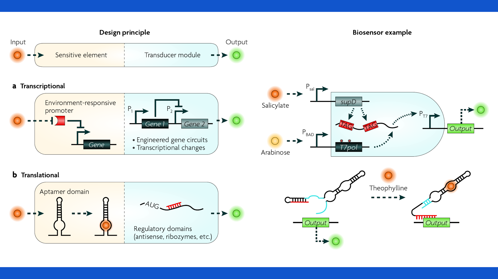{fig-align="center" width=100% style="border: 3px solid black; border-radius: 8px;"}
