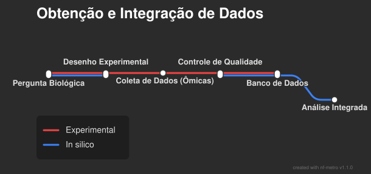
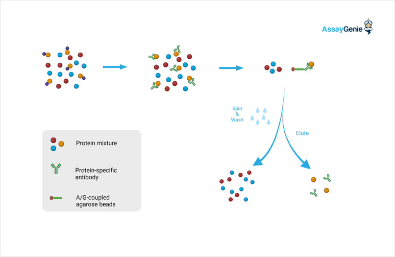
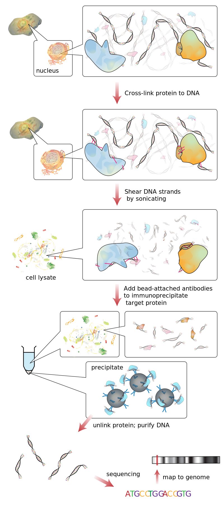
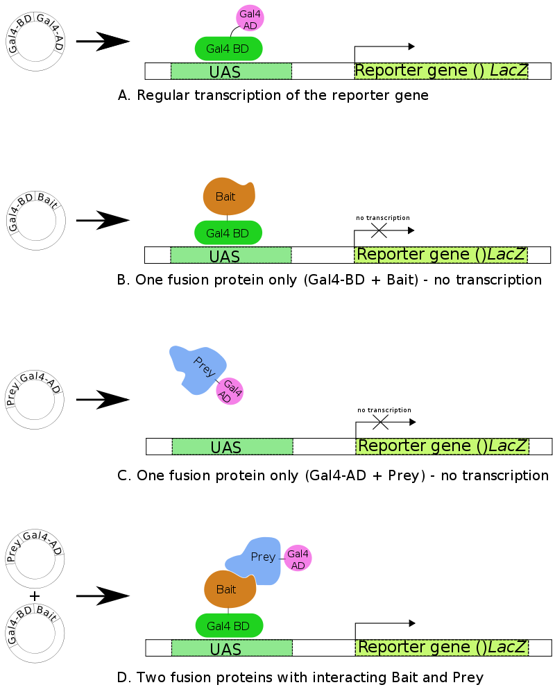

# Antes de gerar as redes

Precisamos obter os dados porque:

- Precisamos saber quais, quantos e qual a relação entre os elementos biológicos.

## Que dados são esses?

- Dados ômicos de genoma, transcriptoma, proteoma, metaboloma
- Anotação funcional de genes (EC number, domínios)
- Transcritos (Qualitativo e Quantitativo)
- Interação entre moléculas (Proteína-Proteína, Proteína-DNA)
- Dados de associação a doenças

## Podemos obter os dados por:

::: {.columns}
::: {.column width="33%"}
::: {.callout-note appearance="minimal" style="background-color: #005689; color: white; text-align: center; font-weight: bold; padding: 20px;"}
Experimentos
:::
:::
::: {.column width="33%"}
::: {.callout-note appearance="minimal" style="background-color: #00873e; color: white; text-align: center; font-weight: bold; padding: 20px;"}
Bancos de dados
:::
:::
::: {.column width="33%"}
::: {.callout-note appearance="minimal" style="background-color: #e67e15; color: white; text-align: center; font-weight: bold; padding: 20px;"}
Literatura
:::
:::
:::

# Pipeline de Obtenção e Análise

{fig-align="center"}

# DNA $\rightarrow$ Genes

::: {.columns}
::: {.column width="25%"}
**Sequenciamento**
Obtenção da sequência de DNA do organismo.
:::
::: {.column width="25%"}
**Montagem**
Reconstituição da molécula de DNA original.
:::
::: {.column width="25%"}
**Predição Gênica**
Busca pelas porções codificantes e elementos funcionais.
:::
::: {.column width="25%"}
**Anotação Funcional**
Designa a função dos genes identificados.
:::
:::

## RNA-seq *vs* Microarranjo (Técnico)

| Característica | Microarranjo | RNA-Seq |
| :-: | :-: | :-: |
| **Princípio** | Hibridização (indireto) | Sequenciamento direto (NGS) |
| **Conhecimento** | Requer genoma/sondas conhecidas | Não requer (descobre novos transcritos) |
| **Faixa Dinâmica** | Limitada (saturação) | Ampla (sem saturação) |
| **Tipo de Dado** | Intensidade de fluorescência | Contagens de reads |

## RNA-seq *vs* Microarranjo (Prática)

| Característica | Microarranjo | RNA-Seq |
| :-: | :-: | :-: |
| **Resolução** | Mede o que foi projetado | Resolução de nucleotídeo único |
| **Workflow** | Padronizado | Complexo (alinhamento, assembly) |
| **Aplicação Ideal** | Validação em larga escala | Descoberta *ab initio*; modelos |

# Interações Moleculares

## Co-Imunoprecipitação (Co-IP)

::: {.columns}
::: {.column width="50%"}
- Isola complexos proteicos nativos.
- Usa um anticorpo para "pescar" a proteína-isca e seus parceiros.
- Identifica interações estáveis.
:::
::: {.column width="50%"}

:::
:::

::: {.callout-warning}
**Limitação:** Epítopos ocultos podem impedir a captura do complexo inteiro.
:::

## Imunoprecipitação da cromatina (ChIP-seq)

::: {.columns}
::: {.column width="50%"}
- Mapeia interações Proteína-DNA em escala genômica.
- Fixação com formaldeído e fragmentação.
- Enriquecimento com anticorpos específicos.
- Sequenciamento massivo (NGS).
:::
::: {.column width="50%"}

:::
:::

## O Sistema de Duplo-Híbrido de Levedura (Y2H)

::: {.columns}
::: {.column width="50%"}
- Identifica interações proteína-proteína.
- Divide um fator de transcrição em:
  - **Isca (BD):** Domínio de Ligação ao DNA.
  - **Presa (AD):** Domínio de Ativação.
- Interação ativa gene repórter (crescimento/fluorescência).
:::
::: {.column width="50%"}

:::
:::

# Conservação e Bancos de Dados

## Interólogos e Coevolução

- **Interólogo:** Interação proteína-proteína conservada evolutivamente entre espécies.
- **Coevolução:** Proteínas que interagem tendem a evoluir juntas na superfície de contato.
- Permite inferir interações em novas espécies baseadas em organismos-modelo.

## Principais Bancos de Dados

::: {.columns}
::: {.column width="50%"}
- **KEGG:** Vias biológicas e metabólicas.
- **Gene Ontology (GO):** Funções de genes padronizadas.
- **STRING:** Interações proteína-proteína (conhecidas e preditas).
:::
::: {.column width="50%"}
- **MetaCyc:** Vias metabólicas elucidadas.
- **BioGRID:** Interações genéticas e proteicas curadas.
- **Reactome:** Vias e reações revisadas por pares.
:::
:::

::: {.callout-tip}
**Mineração de texto:** Extração automática de conhecimento da literatura científica para alimentar esses bancos.
:::
