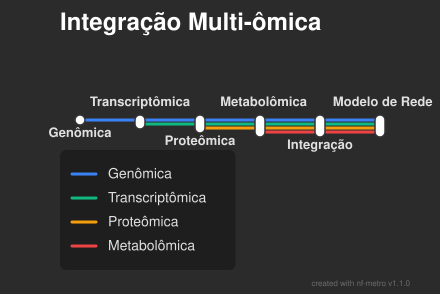

# Por que integrar dados?

- Grandes volumes de dados ômicos são gerados rapidamente, mas possuem alta dimensionalidade e ruído.
- A integração captura a complexidade biológica e mecanismos emergentes não visíveis em camadas isoladas.

::: {.callout-tip}
**Exemplo:** O RNA pode estar alto, mas a proteína baixa devido à regulação. Só a integração revela o quadro real.
:::

## Pipeline Multi-ômico

{fig-align="center"}

# Processamento de Dados

Etapa essencial onde erros se propagam rapidamente caso não sejam tratados.

1. **Controle de Qualidade (QC) e Limpeza:** Remoção de vieses técnicos e erros (ex: FASTX, TrimGalore).
2. **Quantificação e Mapeamento:** Alinhamento de reads ao genoma ou espectros a bancos de dados.
3. **Normalização:** Remoção de variabilidade sistemática técnica (ex: FPKM para RNA).
4. **Análise Estatística:** Diferenciação de sinal biológico real contra o ruído (redução de dimensão).

## Etapas por tipo de dado

| Dados Ômicos | Quantificação | Normalização | Análise |
| :-: | :-: | :-: | :-: |
| **DNA-Seq** | Mapeamento com genoma de referência | - | Variantes estruturais e polimorfismos |
| **RNA-Seq** | Mapeamento ciente de splicing | Intra e inter amostras | Transcritos diferenciais |
| **Proteômica (MS)** | Comparação de espectro com banco | Intra e inter amostras | Proteínas diferenciais |

# Integração de Dados

Após o processamento, obtemos listas de elementos relevantes que devem ser contextualizados.

- Ocorre a anotação através de vocabulários comuns (GO, KEGG).
- **Gene Set Analysis:** Responde "quais processos biológicos foram afetados?", conectando os achados às funções celulares globais.

## Estratégias de Integração

::: {.columns}
::: {.column width="33%"}
**Antecipada (Completa)**
Funde todos os dados em uma única matriz antes do modelo.
*Desafio:* Pode gerar ruído e perda de informação na transformação.
:::
::: {.column width="33%"}
**Tardia (Decisão)**
Cria modelos isolados e depois os combina.
*Desafio:* Ignora a sinergia e relações diretas entre as camadas ômicas.
:::
::: {.column width="33%"}
**Intermediária (Parcial)**
Aprende representações conjuntas (latentes) de todos os dados simultaneamente.
*Vantagem:* Modela a sinergia biológica de forma ideal.
:::
:::

## Métodos Avançados de Integração

- **Projeção de Rede:** Integra redes heterogêneas (ex: Rede Fármaco-Alvo projetada em Alvo-Doença).
- **Propagação de Informação:** Difusão de sinais em redes para priorização de nós.
- **Modelos Bayesianos:** Probabilidades explícitas entre camadas (Genótipo $\rightarrow$ Expressão $\rightarrow$ Fenótipo).
- **Fatoração de Matriz (NMF):** Extração de padrões latentes e agrupamentos através de aproximações.
