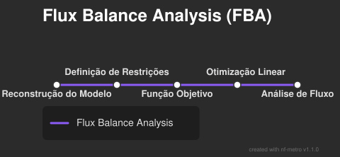

# Redes Metabólicas

Rede de metabólitos interligados por reações enzimáticas, mostrando o fluxo de material e o potencial celular.

- **Vértices:** Metabólitos e Enzimas (Grafo Bipartido).
- Utilizadas para engenharia de microrganismos (biotecnologia) e estudo de doenças metabólicas.

::: {.callout-warning}
**Cuidado:** Ao remover os vértices de enzimas (Grafo direcionado de metabólitos), "metabólitos moeda" (como ATP, H2O) podem criar caminhos espúrios se não forem filtrados.
:::

## Pipeline de Análise FBA

{fig-align="center"}

# Reconstrução Metabólica em 5 Estágios

## 1. Rascunho Inicial

- Usa-se o genoma anotado.
- Mapeia-se genes de enzimas (EC numbers, GO terms).
- Estabelecem-se as reações bioquímicas associadas (via KEGG, BRENDA, BiGG).

## 2. Curadoria Manual

- Correção de predições errôneas por homologia.
- Localização celular correta (citosol, mitocôndria).
- Balanceamento de carga e massa (adição de H2O, prótons).
- Inserção de reações espontâneas e transportadores de membrana.

::: {.callout-note}
**Relação Gene-Proteína-Reação (GPR):** Usa lógica (AND, OR) para mapear genes isoenzimáticos ou subunidades de complexos para reações.
:::

## A Reação de Biomassa

Representação matemática dos componentes celulares requeridos para o crescimento e duplicação da célula.

- Funciona como a "lista de compras" estequiométrica.
- Agrupa proteínas, RNA, DNA, lipídios da membrana e cofatores em 1 unidade de "Biomassa".

## 3. Conversão Matemática (Matriz)

Transformação da rede em uma **Matriz Estequiométrica (S)**.

- **Linhas:** Metabólitos.
- **Colunas:** Reações.
- Coeficientes negativos indicam consumo, e positivos indicam síntese.
- Incluem-se as reações de troca (troca com o ambiente celular).

## 4 e 5. Avaliação, FBA e Modularidade

- **FBA (Flux Balance Analysis):** Simula fluxos em estado estacionário ($S \cdot v = 0$).
- Avalia-se a topologia e fenotipagem, aplicando preenchimento de lacunas (GapFilling).
- Disponibiliza-se a rede em formatos padrão (SBML).

::: {.callout-tip}
**Modularidade:** A rede ativa ou desativa módulos conforme o ambiente (ex: Glicólise + Ciclo de Krebs com oxigênio; Fermentação sem oxigênio). Garante robustez celular.
:::
