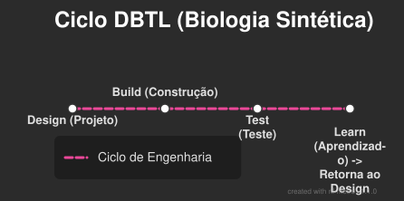

# O que é Biologia Sintética?

A engenharia da biologia: projetar e construir novos dispositivos e sistemas biológicos inexistentes na natureza, ou re-projetar sistemas biológicos já existentes.

- **Objetivo:** Tornar a engenharia biológica previsível, robusta e escalável.
- As ferramentas-chave são circuitos genéticos artificiais, chassis bacterianos e padronização biológica (biobricks).

::: {.callout-tip}
**Exemplo Histórico:** A produção de insulina humana utilizando bactérias engenheiradas (E. coli) foi um dos primeiros e mais emblemáticos sucessos da área.
:::

# O Ciclo DBTL na Engenharia Biológica

{fig-align="center"}

- O fluxo de trabalho iterativo acelera as descobertas. Falhas na etapa de Teste informam os modelos de Aprendizado (Learn), melhorando a próxima iteração de Design.

## Ferramentas da Biologia Sintética

- **Edição Genômica:** CRISPR/Cas9.
- **Montagem de DNA:** Métodos padronizados como Golden Gate e Gibson Assembly.
- **Peças Standard:** BioBricks, promotores calibrados, riboswitches.

# Por que a biologia é difícil de engenheirar?

Engenheiros lidam com circuitos elétricos previsíveis, mas células são sistemas complexos:

::: {.columns}
::: {.column width="50%"}
- **Ruído Estocástico:** Expressões gênicas variam naturalmente; células geneticamente idênticas podem ter flutuações de expressão.
- **Carga Celular (*Burden*):** O circuito consome ATP, nucleotídeos e ribossomos, roubando recursos de manutenção da célula hospedeira, levando a toxicidade.
:::
::: {.column width="50%"}
- **Interações Não Previstas (Crosstalk):** As vias metabólicas nativas podem reagir com moléculas introduzidas, alterando resultados.
- **Contexto Celular Espacial:** Diferente da matemática, importa *onde* a molécula é sintetizada e se possui transportadores.
:::
:::

# Aplicações e Futuro

A Biologia Sintética tem o potencial de remodelar processos industriais e de saúde globais:

- **Medicina:** Terapias celulares CAR-T, biossensores para diagnóstico e probióticos projetados para secretar remédios no trato gastrointestinal.
- **Química Verde:** Bioprodução do antimalárico artemisinina e fabricação de bioplásticos biodegradáveis.
- **Biorremediação:** Microrganismos modificados para detecção de toxinas no solo e processamento e degradação de microplásticos.

## Referências

- Nielsen, J. et al. (2017). *Systems Biology*.
- Endy, D. (2005). Foundations for engineering biology. *Nature*.
- Cameron, D. E. et al. (2014). A brief history of synthetic biology. *Nature Reviews Microbiology*.
